# Projects and dependencies analysis

This document provides a comprehensive overview of the projects and their dependencies in the context of upgrading to .NETCoreApp,Version=v10.0.

## Table of Contents

- [Executive Summary](#executive-Summary)
  - [Highlevel Metrics](#highlevel-metrics)
  - [Projects Compatibility](#projects-compatibility)
  - [Package Compatibility](#package-compatibility)
  - [API Compatibility](#api-compatibility)
- [Aggregate NuGet packages details](#aggregate-nuget-packages-details)
- [Top API Migration Challenges](#top-api-migration-challenges)
  - [Technologies and Features](#technologies-and-features)
  - [Most Frequent API Issues](#most-frequent-api-issues)
- [Projects Relationship Graph](#projects-relationship-graph)
- [Project Details](#project-details)

  - [F:\UnrealEngine_5.7.4\UE_5.7\Engine\Intermediate\Build\BuildRulesProjects\UE5ProgramRules\UE5ProgramRules.csproj](#f:unrealengine_574ue_57engineintermediatebuildbuildrulesprojectsue5programrulesue5programrulescsproj)
  - [F:\UnrealEngine_5.7.4\UE_5.7\Engine\Intermediate\Build\BuildRulesProjects\UE5Rules\UE5Rules.csproj](#f:unrealengine_574ue_57engineintermediatebuildbuildrulesprojectsue5rulesue5rulescsproj)
  - [F:\UnrealEngine_5.7.4\UE_5.7\Engine\Platforms\VisionOS\Source\Programs\AutomationTool\VisionOS.Automation.csproj](#f:unrealengine_574ue_57engineplatformsvisionossourceprogramsautomationtoolvisionosautomationcsproj)
  - [F:\UnrealEngine_5.7.4\UE_5.7\Engine\Plugins\ScriptPlugin\Source\ScriptGeneratorUbtPlugin\ScriptGeneratorUbtPlugin.ubtplugin.csproj](#f:unrealengine_574ue_57enginepluginsscriptpluginsourcescriptgeneratorubtpluginscriptgeneratorubtpluginubtplugincsproj)
  - [F:\UnrealEngine_5.7.4\UE_5.7\Engine\Source\Programs\AutomationTool\Android\Android.Automation.csproj](#f:unrealengine_574ue_57enginesourceprogramsautomationtoolandroidandroidautomationcsproj)
  - [F:\UnrealEngine_5.7.4\UE_5.7\Engine\Source\Programs\AutomationTool\Apple\Apple.Automation.csproj](#f:unrealengine_574ue_57enginesourceprogramsautomationtoolappleappleautomationcsproj)
  - [F:\UnrealEngine_5.7.4\UE_5.7\Engine\Source\Programs\AutomationTool\AutomationTool.csproj](#f:unrealengine_574ue_57enginesourceprogramsautomationtoolautomationtoolcsproj)
  - [F:\UnrealEngine_5.7.4\UE_5.7\Engine\Source\Programs\AutomationTool\AutomationUtils\AutomationUtils.Automation.csproj](#f:unrealengine_574ue_57enginesourceprogramsautomationtoolautomationutilsautomationutilsautomationcsproj)
  - [F:\UnrealEngine_5.7.4\UE_5.7\Engine\Source\Programs\AutomationTool\BuildGraph\BuildGraph.Automation.csproj](#f:unrealengine_574ue_57enginesourceprogramsautomationtoolbuildgraphbuildgraphautomationcsproj)
  - [F:\UnrealEngine_5.7.4\UE_5.7\Engine\Source\Programs\AutomationTool\CookedEditor\CookedEditor.Automation.csproj](#f:unrealengine_574ue_57enginesourceprogramsautomationtoolcookededitorcookededitorautomationcsproj)
  - [F:\UnrealEngine_5.7.4\UE_5.7\Engine\Source\Programs\AutomationTool\CrowdinLocalization\CrowdinLocalization.Automation.csproj](#f:unrealengine_574ue_57enginesourceprogramsautomationtoolcrowdinlocalizationcrowdinlocalizationautomationcsproj)
  - [F:\UnrealEngine_5.7.4\UE_5.7\Engine\Source\Programs\AutomationTool\Gauntlet\Gauntlet.Automation.csproj](#f:unrealengine_574ue_57enginesourceprogramsautomationtoolgauntletgauntletautomationcsproj)
  - [F:\UnrealEngine_5.7.4\UE_5.7\Engine\Source\Programs\AutomationTool\Insights\Insights.Automation.csproj](#f:unrealengine_574ue_57enginesourceprogramsautomationtoolinsightsinsightsautomationcsproj)
  - [F:\UnrealEngine_5.7.4\UE_5.7\Engine\Source\Programs\AutomationTool\IOS\IOS.Automation.csproj](#f:unrealengine_574ue_57enginesourceprogramsautomationtooliosiosautomationcsproj)
  - [F:\UnrealEngine_5.7.4\UE_5.7\Engine\Source\Programs\AutomationTool\Linux\Linux.Automation.csproj](#f:unrealengine_574ue_57enginesourceprogramsautomationtoollinuxlinuxautomationcsproj)
  - [F:\UnrealEngine_5.7.4\UE_5.7\Engine\Source\Programs\AutomationTool\LiveLinkHub\LiveLinkHub.Automation.csproj](#f:unrealengine_574ue_57enginesourceprogramsautomationtoollivelinkhublivelinkhubautomationcsproj)
  - [F:\UnrealEngine_5.7.4\UE_5.7\Engine\Source\Programs\AutomationTool\Localization\Localization.Automation.csproj](#f:unrealengine_574ue_57enginesourceprogramsautomationtoollocalizationlocalizationautomationcsproj)
  - [F:\UnrealEngine_5.7.4\UE_5.7\Engine\Source\Programs\AutomationTool\LowLevelTests\LowLevelTests.Automation.csproj](#f:unrealengine_574ue_57enginesourceprogramsautomationtoollowleveltestslowleveltestsautomationcsproj)
  - [F:\UnrealEngine_5.7.4\UE_5.7\Engine\Source\Programs\AutomationTool\Mac\Mac.Automation.csproj](#f:unrealengine_574ue_57enginesourceprogramsautomationtoolmacmacautomationcsproj)
  - [F:\UnrealEngine_5.7.4\UE_5.7\Engine\Source\Programs\AutomationTool\Mutable\Mutable.Automation.csproj](#f:unrealengine_574ue_57enginesourceprogramsautomationtoolmutablemutableautomationcsproj)
  - [F:\UnrealEngine_5.7.4\UE_5.7\Engine\Source\Programs\AutomationTool\OneSkyLocalization\OneSkyLocalization.Automation.csproj](#f:unrealengine_574ue_57enginesourceprogramsautomationtooloneskylocalizationoneskylocalizationautomationcsproj)
  - [F:\UnrealEngine_5.7.4\UE_5.7\Engine\Source\Programs\AutomationTool\Scripts\AutomationScripts.Automation.csproj](#f:unrealengine_574ue_57enginesourceprogramsautomationtoolscriptsautomationscriptsautomationcsproj)
  - [F:\UnrealEngine_5.7.4\UE_5.7\Engine\Source\Programs\AutomationTool\SmartlingLocalization\SmartlingLocalization.Automation.csproj](#f:unrealengine_574ue_57enginesourceprogramsautomationtoolsmartlinglocalizationsmartlinglocalizationautomationcsproj)
  - [F:\UnrealEngine_5.7.4\UE_5.7\Engine\Source\Programs\AutomationTool\SteamDeck\SteamDeck.Automation.csproj](#f:unrealengine_574ue_57enginesourceprogramsautomationtoolsteamdecksteamdeckautomationcsproj)
  - [F:\UnrealEngine_5.7.4\UE_5.7\Engine\Source\Programs\AutomationTool\Turnkey\Turnkey.Automation.csproj](#f:unrealengine_574ue_57enginesourceprogramsautomationtoolturnkeyturnkeyautomationcsproj)
  - [F:\UnrealEngine_5.7.4\UE_5.7\Engine\Source\Programs\AutomationTool\TVOS\TVOS.Automation.csproj](#f:unrealengine_574ue_57enginesourceprogramsautomationtooltvostvosautomationcsproj)
  - [F:\UnrealEngine_5.7.4\UE_5.7\Engine\Source\Programs\AutomationTool\Win\Win.Automation.csproj](#f:unrealengine_574ue_57enginesourceprogramsautomationtoolwinwinautomationcsproj)
  - [F:\UnrealEngine_5.7.4\UE_5.7\Engine\Source\Programs\AutomationTool\XLocLocalization\XLocLocalization.Automation.csproj](#f:unrealengine_574ue_57enginesourceprogramsautomationtoolxloclocalizationxloclocalizationautomationcsproj)
  - [F:\UnrealEngine_5.7.4\UE_5.7\Engine\Source\Programs\AutomationToolLauncher\AutomationToolLauncher.csproj](#f:unrealengine_574ue_57enginesourceprogramsautomationtoollauncherautomationtoollaunchercsproj)
  - [F:\UnrealEngine_5.7.4\UE_5.7\Engine\Source\Programs\Shared\EpicGames.AspNet\EpicGames.AspNet.csproj](#f:unrealengine_574ue_57enginesourceprogramssharedepicgamesaspnetepicgamesaspnetcsproj)
  - [F:\UnrealEngine_5.7.4\UE_5.7\Engine\Source\Programs\Shared\EpicGames.Build\EpicGames.Build.csproj](#f:unrealengine_574ue_57enginesourceprogramssharedepicgamesbuildepicgamesbuildcsproj)
  - [F:\UnrealEngine_5.7.4\UE_5.7\Engine\Source\Programs\Shared\EpicGames.BuildGraph.Tests\EpicGames.BuildGraph.Tests.csproj](#f:unrealengine_574ue_57enginesourceprogramssharedepicgamesbuildgraphtestsepicgamesbuildgraphtestscsproj)
  - [F:\UnrealEngine_5.7.4\UE_5.7\Engine\Source\Programs\Shared\EpicGames.BuildGraph\EpicGames.BuildGraph.csproj](#f:unrealengine_574ue_57enginesourceprogramssharedepicgamesbuildgraphepicgamesbuildgraphcsproj)
  - [F:\UnrealEngine_5.7.4\UE_5.7\Engine\Source\Programs\Shared\EpicGames.Core.Tests\EpicGames.Core.Tests.csproj](#f:unrealengine_574ue_57enginesourceprogramssharedepicgamescoretestsepicgamescoretestscsproj)
  - [F:\UnrealEngine_5.7.4\UE_5.7\Engine\Source\Programs\Shared\EpicGames.Core\EpicGames.Core.csproj](#f:unrealengine_574ue_57enginesourceprogramssharedepicgamescoreepicgamescorecsproj)
  - [F:\UnrealEngine_5.7.4\UE_5.7\Engine\Source\Programs\Shared\EpicGames.Horde.Tests\EpicGames.Horde.Tests.csproj](#f:unrealengine_574ue_57enginesourceprogramssharedepicgameshordetestsepicgameshordetestscsproj)
  - [F:\UnrealEngine_5.7.4\UE_5.7\Engine\Source\Programs\Shared\EpicGames.Horde\EpicGames.Horde.csproj](#f:unrealengine_574ue_57enginesourceprogramssharedepicgameshordeepicgameshordecsproj)
  - [F:\UnrealEngine_5.7.4\UE_5.7\Engine\Source\Programs\Shared\EpicGames.IoHash.Tests\EpicGames.IoHash.Tests.csproj](#f:unrealengine_574ue_57enginesourceprogramssharedepicgamesiohashtestsepicgamesiohashtestscsproj)
  - [F:\UnrealEngine_5.7.4\UE_5.7\Engine\Source\Programs\Shared\EpicGames.IoHash\EpicGames.IoHash.csproj](#f:unrealengine_574ue_57enginesourceprogramssharedepicgamesiohashepicgamesiohashcsproj)
  - [F:\UnrealEngine_5.7.4\UE_5.7\Engine\Source\Programs\Shared\EpicGames.MongoDB\EpicGames.MongoDB.csproj](#f:unrealengine_574ue_57enginesourceprogramssharedepicgamesmongodbepicgamesmongodbcsproj)
  - [F:\UnrealEngine_5.7.4\UE_5.7\Engine\Source\Programs\Shared\EpicGames.MsBuild\EpicGames.MsBuild.csproj](#f:unrealengine_574ue_57enginesourceprogramssharedepicgamesmsbuildepicgamesmsbuildcsproj)
  - [F:\UnrealEngine_5.7.4\UE_5.7\Engine\Source\Programs\Shared\EpicGames.OIDC\EpicGames.OIDC.csproj](#f:unrealengine_574ue_57enginesourceprogramssharedepicgamesoidcepicgamesoidccsproj)
  - [F:\UnrealEngine_5.7.4\UE_5.7\Engine\Source\Programs\Shared\EpicGames.Oodle\EpicGames.Oodle.csproj](#f:unrealengine_574ue_57enginesourceprogramssharedepicgamesoodleepicgamesoodlecsproj)
  - [F:\UnrealEngine_5.7.4\UE_5.7\Engine\Source\Programs\Shared\EpicGames.Perforce.Fixture\EpicGames.Perforce.Fixture.csproj](#f:unrealengine_574ue_57enginesourceprogramssharedepicgamesperforcefixtureepicgamesperforcefixturecsproj)
  - [F:\UnrealEngine_5.7.4\UE_5.7\Engine\Source\Programs\Shared\EpicGames.Perforce.Managed.Tests\EpicGames.Perforce.Managed.Tests.csproj](#f:unrealengine_574ue_57enginesourceprogramssharedepicgamesperforcemanagedtestsepicgamesperforcemanagedtestscsproj)
  - [F:\UnrealEngine_5.7.4\UE_5.7\Engine\Source\Programs\Shared\EpicGames.Perforce.Managed\EpicGames.Perforce.Managed.csproj](#f:unrealengine_574ue_57enginesourceprogramssharedepicgamesperforcemanagedepicgamesperforcemanagedcsproj)
  - [F:\UnrealEngine_5.7.4\UE_5.7\Engine\Source\Programs\Shared\EpicGames.Perforce.Tests\EpicGames.Perforce.Tests.csproj](#f:unrealengine_574ue_57enginesourceprogramssharedepicgamesperforcetestsepicgamesperforcetestscsproj)
  - [F:\UnrealEngine_5.7.4\UE_5.7\Engine\Source\Programs\Shared\EpicGames.Perforce\EpicGames.Perforce.csproj](#f:unrealengine_574ue_57enginesourceprogramssharedepicgamesperforceepicgamesperforcecsproj)
  - [F:\UnrealEngine_5.7.4\UE_5.7\Engine\Source\Programs\Shared\EpicGames.ProjectStore\EpicGames.ProjectStore.csproj](#f:unrealengine_574ue_57enginesourceprogramssharedepicgamesprojectstoreepicgamesprojectstorecsproj)
  - [F:\UnrealEngine_5.7.4\UE_5.7\Engine\Source\Programs\Shared\EpicGames.Redis.Tests\EpicGames.Redis.Tests.csproj](#f:unrealengine_574ue_57enginesourceprogramssharedepicgamesredistestsepicgamesredistestscsproj)
  - [F:\UnrealEngine_5.7.4\UE_5.7\Engine\Source\Programs\Shared\EpicGames.Redis\EpicGames.Redis.csproj](#f:unrealengine_574ue_57enginesourceprogramssharedepicgamesredisepicgamesrediscsproj)
  - [F:\UnrealEngine_5.7.4\UE_5.7\Engine\Source\Programs\Shared\EpicGames.ScriptBuild\EpicGames.ScriptBuild.csproj](#f:unrealengine_574ue_57enginesourceprogramssharedepicgamesscriptbuildepicgamesscriptbuildcsproj)
  - [F:\UnrealEngine_5.7.4\UE_5.7\Engine\Source\Programs\Shared\EpicGames.Serialization.Tests\EpicGames.Serialization.Tests.csproj](#f:unrealengine_574ue_57enginesourceprogramssharedepicgamesserializationtestsepicgamesserializationtestscsproj)
  - [F:\UnrealEngine_5.7.4\UE_5.7\Engine\Source\Programs\Shared\EpicGames.Serialization\EpicGames.Serialization.csproj](#f:unrealengine_574ue_57enginesourceprogramssharedepicgamesserializationepicgamesserializationcsproj)
  - [F:\UnrealEngine_5.7.4\UE_5.7\Engine\Source\Programs\Shared\EpicGames.Slack\EpicGames.Slack.csproj](#f:unrealengine_574ue_57enginesourceprogramssharedepicgamesslackepicgamesslackcsproj)
  - [F:\UnrealEngine_5.7.4\UE_5.7\Engine\Source\Programs\Shared\EpicGames.Tracing.Tests\EpicGames.Tracing.Tests.csproj](#f:unrealengine_574ue_57enginesourceprogramssharedepicgamestracingtestsepicgamestracingtestscsproj)
  - [F:\UnrealEngine_5.7.4\UE_5.7\Engine\Source\Programs\Shared\EpicGames.Tracing\EpicGames.Tracing.csproj](#f:unrealengine_574ue_57enginesourceprogramssharedepicgamestracingepicgamestracingcsproj)
  - [F:\UnrealEngine_5.7.4\UE_5.7\Engine\Source\Programs\Shared\EpicGames.UBA\EpicGames.UBA.csproj](#f:unrealengine_574ue_57enginesourceprogramssharedepicgamesubaepicgamesubacsproj)
  - [F:\UnrealEngine_5.7.4\UE_5.7\Engine\Source\Programs\Shared\EpicGames.UHT\EpicGames.UHT.csproj](#f:unrealengine_574ue_57enginesourceprogramssharedepicgamesuhtepicgamesuhtcsproj)
  - [F:\UnrealEngine_5.7.4\UE_5.7\Engine\Source\Programs\Shared\UnrealBuildTool.Tests\UnrealBuildTool.Tests.csproj](#f:unrealengine_574ue_57enginesourceprogramssharedunrealbuildtooltestsunrealbuildtooltestscsproj)
  - [F:\UnrealEngine_5.7.4\UE_5.7\Engine\Source\Programs\UnrealBuildTool\UnrealBuildTool.csproj](#f:unrealengine_574ue_57enginesourceprogramsunrealbuildtoolunrealbuildtoolcsproj)
  - [Intermediate\Build\BuildRulesProjects\Chess3DDemoModuleRules\Chess3DDemoModuleRules.csproj](#intermediatebuildbuildrulesprojectschess3ddemomoduleruleschess3ddemomodulerulescsproj)
  - [Intermediate\ProjectFiles\Chess3DDemo.vcxproj](#intermediateprojectfileschess3ddemovcxproj)
  - [Intermediate\ProjectFiles\DotNetPerforceLib.vcxproj](#intermediateprojectfilesdotnetperforcelibvcxproj)
  - [Intermediate\ProjectFiles\EventLoopUnitTests.vcxproj](#intermediateprojectfileseventloopunittestsvcxproj)
  - [Intermediate\ProjectFiles\IoStoreOnDemandTests.vcxproj](#intermediateprojectfilesiostoreondemandtestsvcxproj)
  - [Intermediate\ProjectFiles\LiveLinkHub.vcxproj](#intermediateprojectfileslivelinkhubvcxproj)
  - [Intermediate\ProjectFiles\UE5.vcxproj](#intermediateprojectfilesue5vcxproj)


## Executive Summary

### Highlevel Metrics

| Metric | Count | Status |
| :--- | :---: | :--- |
| Total Projects | 68 | 62 require upgrade |
| Total NuGet Packages | 68 | 27 need upgrade |
| Total Code Files | 4087 |  |
| Total Code Files with Incidents | 232 |  |
| Total Lines of Code | 649460 |  |
| Total Number of Issues | 1031 |  |
| Estimated LOC to modify | 920+ | at least 0.1% of codebase |

### Projects Compatibility

| Project | Target Framework | Difficulty | Package Issues | API Issues | Est. LOC Impact | Description |
| :--- | :---: | :---: | :---: | :---: | :---: | :--- |
| [F:\UnrealEngine_5.7.4\UE_5.7\Engine\Intermediate\Build\BuildRulesProjects\UE5ProgramRules\UE5ProgramRules.csproj](#f:unrealengine_574ue_57engineintermediatebuildbuildrulesprojectsue5programrulesue5programrulescsproj) | net8.0 | 🟢 Low | 0 | 0 |  | ClassLibrary, Sdk Style = True |
| [F:\UnrealEngine_5.7.4\UE_5.7\Engine\Intermediate\Build\BuildRulesProjects\UE5Rules\UE5Rules.csproj](#f:unrealengine_574ue_57engineintermediatebuildbuildrulesprojectsue5rulesue5rulescsproj) | net8.0 | 🟢 Low | 0 | 0 |  | ClassLibrary, Sdk Style = True |
| [F:\UnrealEngine_5.7.4\UE_5.7\Engine\Platforms\VisionOS\Source\Programs\AutomationTool\VisionOS.Automation.csproj](#f:unrealengine_574ue_57engineplatformsvisionossourceprogramsautomationtoolvisionosautomationcsproj) | net8.0 | 🟢 Low | 0 | 0 |  | ClassLibrary, Sdk Style = True |
| [F:\UnrealEngine_5.7.4\UE_5.7\Engine\Plugins\ScriptPlugin\Source\ScriptGeneratorUbtPlugin\ScriptGeneratorUbtPlugin.ubtplugin.csproj](#f:unrealengine_574ue_57enginepluginsscriptpluginsourcescriptgeneratorubtpluginscriptgeneratorubtpluginubtplugincsproj) | net8.0 | 🟢 Low | 0 | 0 |  | ClassLibrary, Sdk Style = True |
| [F:\UnrealEngine_5.7.4\UE_5.7\Engine\Source\Programs\AutomationTool\Android\Android.Automation.csproj](#f:unrealengine_574ue_57enginesourceprogramsautomationtoolandroidandroidautomationcsproj) | net8.0 | 🟢 Low | 0 | 1 | 1+ | ClassLibrary, Sdk Style = True |
| [F:\UnrealEngine_5.7.4\UE_5.7\Engine\Source\Programs\AutomationTool\Apple\Apple.Automation.csproj](#f:unrealengine_574ue_57enginesourceprogramsautomationtoolappleappleautomationcsproj) | net8.0 | 🟢 Low | 2 | 17 | 17+ | ClassLibrary, Sdk Style = True |
| [F:\UnrealEngine_5.7.4\UE_5.7\Engine\Source\Programs\AutomationTool\AutomationTool.csproj](#f:unrealengine_574ue_57enginesourceprogramsautomationtoolautomationtoolcsproj) | net8.0-windows10.0.19041 | 🟢 Low | 1 | 1 | 1+ | DotNetCoreApp, Sdk Style = True |
| [F:\UnrealEngine_5.7.4\UE_5.7\Engine\Source\Programs\AutomationTool\AutomationUtils\AutomationUtils.Automation.csproj](#f:unrealengine_574ue_57enginesourceprogramsautomationtoolautomationutilsautomationutilsautomationcsproj) | net8.0 | 🟢 Low | 6 | 64 | 64+ | ClassLibrary, Sdk Style = True |
| [F:\UnrealEngine_5.7.4\UE_5.7\Engine\Source\Programs\AutomationTool\BuildGraph\BuildGraph.Automation.csproj](#f:unrealengine_574ue_57enginesourceprogramsautomationtoolbuildgraphbuildgraphautomationcsproj) | net8.0 | 🟢 Low | 0 | 51 | 51+ | ClassLibrary, Sdk Style = True |
| [F:\UnrealEngine_5.7.4\UE_5.7\Engine\Source\Programs\AutomationTool\CookedEditor\CookedEditor.Automation.csproj](#f:unrealengine_574ue_57enginesourceprogramsautomationtoolcookededitorcookededitorautomationcsproj) | net8.0 | 🟢 Low | 0 | 0 |  | ClassLibrary, Sdk Style = True |
| [F:\UnrealEngine_5.7.4\UE_5.7\Engine\Source\Programs\AutomationTool\CrowdinLocalization\CrowdinLocalization.Automation.csproj](#f:unrealengine_574ue_57enginesourceprogramsautomationtoolcrowdinlocalizationcrowdinlocalizationautomationcsproj) | net8.0 | 🟢 Low | 0 | 8 | 8+ | ClassLibrary, Sdk Style = True |
| [F:\UnrealEngine_5.7.4\UE_5.7\Engine\Source\Programs\AutomationTool\Gauntlet\Gauntlet.Automation.csproj](#f:unrealengine_574ue_57enginesourceprogramsautomationtoolgauntletgauntletautomationcsproj) | net8.0 | 🟢 Low | 1 | 51 | 51+ | ClassLibrary, Sdk Style = True |
| [F:\UnrealEngine_5.7.4\UE_5.7\Engine\Source\Programs\AutomationTool\Insights\Insights.Automation.csproj](#f:unrealengine_574ue_57enginesourceprogramsautomationtoolinsightsinsightsautomationcsproj) | net8.0 | 🟢 Low | 0 | 0 |  | ClassLibrary, Sdk Style = True |
| [F:\UnrealEngine_5.7.4\UE_5.7\Engine\Source\Programs\AutomationTool\IOS\IOS.Automation.csproj](#f:unrealengine_574ue_57enginesourceprogramsautomationtooliosiosautomationcsproj) | net8.0 | 🟢 Low | 1 | 4 | 4+ | ClassLibrary, Sdk Style = True |
| [F:\UnrealEngine_5.7.4\UE_5.7\Engine\Source\Programs\AutomationTool\Linux\Linux.Automation.csproj](#f:unrealengine_574ue_57enginesourceprogramsautomationtoollinuxlinuxautomationcsproj) | net8.0 | 🟢 Low | 0 | 0 |  | ClassLibrary, Sdk Style = True |
| [F:\UnrealEngine_5.7.4\UE_5.7\Engine\Source\Programs\AutomationTool\LiveLinkHub\LiveLinkHub.Automation.csproj](#f:unrealengine_574ue_57enginesourceprogramsautomationtoollivelinkhublivelinkhubautomationcsproj) | net8.0 | 🟢 Low | 0 | 0 |  | ClassLibrary, Sdk Style = True |
| [F:\UnrealEngine_5.7.4\UE_5.7\Engine\Source\Programs\AutomationTool\Localization\Localization.Automation.csproj](#f:unrealengine_574ue_57enginesourceprogramsautomationtoollocalizationlocalizationautomationcsproj) | net8.0 | 🟢 Low | 0 | 0 |  | ClassLibrary, Sdk Style = True |
| [F:\UnrealEngine_5.7.4\UE_5.7\Engine\Source\Programs\AutomationTool\LowLevelTests\LowLevelTests.Automation.csproj](#f:unrealengine_574ue_57enginesourceprogramsautomationtoollowleveltestslowleveltestsautomationcsproj) | net8.0 | 🟢 Low | 0 | 0 |  | ClassLibrary, Sdk Style = True |
| [F:\UnrealEngine_5.7.4\UE_5.7\Engine\Source\Programs\AutomationTool\Mac\Mac.Automation.csproj](#f:unrealengine_574ue_57enginesourceprogramsautomationtoolmacmacautomationcsproj) | net8.0 | 🟢 Low | 0 | 1 | 1+ | ClassLibrary, Sdk Style = True |
| [F:\UnrealEngine_5.7.4\UE_5.7\Engine\Source\Programs\AutomationTool\Mutable\Mutable.Automation.csproj](#f:unrealengine_574ue_57enginesourceprogramsautomationtoolmutablemutableautomationcsproj) | net8.0 | 🟢 Low | 0 | 0 |  | ClassLibrary, Sdk Style = True |
| [F:\UnrealEngine_5.7.4\UE_5.7\Engine\Source\Programs\AutomationTool\OneSkyLocalization\OneSkyLocalization.Automation.csproj](#f:unrealengine_574ue_57enginesourceprogramsautomationtooloneskylocalizationoneskylocalizationautomationcsproj) | net8.0 | 🟢 Low | 0 | 0 |  | ClassLibrary, Sdk Style = True |
| [F:\UnrealEngine_5.7.4\UE_5.7\Engine\Source\Programs\AutomationTool\Scripts\AutomationScripts.Automation.csproj](#f:unrealengine_574ue_57enginesourceprogramsautomationtoolscriptsautomationscriptsautomationcsproj) | net8.0 | 🟢 Low | 0 | 24 | 24+ | ClassLibrary, Sdk Style = True |
| [F:\UnrealEngine_5.7.4\UE_5.7\Engine\Source\Programs\AutomationTool\SmartlingLocalization\SmartlingLocalization.Automation.csproj](#f:unrealengine_574ue_57enginesourceprogramsautomationtoolsmartlinglocalizationsmartlinglocalizationautomationcsproj) | net8.0 | 🟢 Low | 0 | 7 | 7+ | ClassLibrary, Sdk Style = True |
| [F:\UnrealEngine_5.7.4\UE_5.7\Engine\Source\Programs\AutomationTool\SteamDeck\SteamDeck.Automation.csproj](#f:unrealengine_574ue_57enginesourceprogramsautomationtoolsteamdecksteamdeckautomationcsproj) | net8.0 | 🟢 Low | 0 | 1 | 1+ | ClassLibrary, Sdk Style = True |
| [F:\UnrealEngine_5.7.4\UE_5.7\Engine\Source\Programs\AutomationTool\Turnkey\Turnkey.Automation.csproj](#f:unrealengine_574ue_57enginesourceprogramsautomationtoolturnkeyturnkeyautomationcsproj) | net8.0 | 🟢 Low | 1 | 10 | 10+ | ClassLibrary, Sdk Style = True |
| [F:\UnrealEngine_5.7.4\UE_5.7\Engine\Source\Programs\AutomationTool\TVOS\TVOS.Automation.csproj](#f:unrealengine_574ue_57enginesourceprogramsautomationtooltvostvosautomationcsproj) | net8.0 | 🟢 Low | 0 | 0 |  | ClassLibrary, Sdk Style = True |
| [F:\UnrealEngine_5.7.4\UE_5.7\Engine\Source\Programs\AutomationTool\Win\Win.Automation.csproj](#f:unrealengine_574ue_57enginesourceprogramsautomationtoolwinwinautomationcsproj) | net8.0 | 🟢 Low | 0 | 1 | 1+ | ClassLibrary, Sdk Style = True |
| [F:\UnrealEngine_5.7.4\UE_5.7\Engine\Source\Programs\AutomationTool\XLocLocalization\XLocLocalization.Automation.csproj](#f:unrealengine_574ue_57enginesourceprogramsautomationtoolxloclocalizationxloclocalizationautomationcsproj) | net8.0 | 🟢 Low | 0 | 56 | 56+ | ClassLibrary, Sdk Style = True |
| [F:\UnrealEngine_5.7.4\UE_5.7\Engine\Source\Programs\AutomationToolLauncher\AutomationToolLauncher.csproj](#f:unrealengine_574ue_57enginesourceprogramsautomationtoollauncherautomationtoollaunchercsproj) | net6.0 | 🟢 Low | 0 | 0 |  | DotNetCoreApp, Sdk Style = True |
| [F:\UnrealEngine_5.7.4\UE_5.7\Engine\Source\Programs\Shared\EpicGames.AspNet\EpicGames.AspNet.csproj](#f:unrealengine_574ue_57enginesourceprogramssharedepicgamesaspnetepicgamesaspnetcsproj) | net8.0 | 🟢 Low | 1 | 0 |  | AspNetCore, Sdk Style = True |
| [F:\UnrealEngine_5.7.4\UE_5.7\Engine\Source\Programs\Shared\EpicGames.Build\EpicGames.Build.csproj](#f:unrealengine_574ue_57enginesourceprogramssharedepicgamesbuildepicgamesbuildcsproj) | net8.0 | 🟢 Low | 2 | 8 | 8+ | ClassLibrary, Sdk Style = True |
| [F:\UnrealEngine_5.7.4\UE_5.7\Engine\Source\Programs\Shared\EpicGames.BuildGraph.Tests\EpicGames.BuildGraph.Tests.csproj](#f:unrealengine_574ue_57enginesourceprogramssharedepicgamesbuildgraphtestsepicgamesbuildgraphtestscsproj) | net8.0 | 🟢 Low | 1 | 0 |  | DotNetCoreApp, Sdk Style = True |
| [F:\UnrealEngine_5.7.4\UE_5.7\Engine\Source\Programs\Shared\EpicGames.BuildGraph\EpicGames.BuildGraph.csproj](#f:unrealengine_574ue_57enginesourceprogramssharedepicgamesbuildgraphepicgamesbuildgraphcsproj) | net8.0 | 🟢 Low | 0 | 0 |  | ClassLibrary, Sdk Style = True |
| [F:\UnrealEngine_5.7.4\UE_5.7\Engine\Source\Programs\Shared\EpicGames.Core.Tests\EpicGames.Core.Tests.csproj](#f:unrealengine_574ue_57enginesourceprogramssharedepicgamescoretestsepicgamescoretestscsproj) | net8.0 | 🟢 Low | 0 | 5 | 5+ | DotNetCoreApp, Sdk Style = True |
| [F:\UnrealEngine_5.7.4\UE_5.7\Engine\Source\Programs\Shared\EpicGames.Core\EpicGames.Core.csproj](#f:unrealengine_574ue_57enginesourceprogramssharedepicgamescoreepicgamescorecsproj) | net8.0 | 🟢 Low | 7 | 71 | 71+ | ClassLibrary, Sdk Style = True |
| [F:\UnrealEngine_5.7.4\UE_5.7\Engine\Source\Programs\Shared\EpicGames.Horde.Tests\EpicGames.Horde.Tests.csproj](#f:unrealengine_574ue_57enginesourceprogramssharedepicgameshordetestsepicgameshordetestscsproj) | net8.0 | 🟢 Low | 0 | 39 | 39+ | DotNetCoreApp, Sdk Style = True |
| [F:\UnrealEngine_5.7.4\UE_5.7\Engine\Source\Programs\Shared\EpicGames.Horde\EpicGames.Horde.csproj](#f:unrealengine_574ue_57enginesourceprogramssharedepicgameshordeepicgameshordecsproj) | net8.0 | 🟢 Low | 4 | 267 | 267+ | ClassLibrary, Sdk Style = True |
| [F:\UnrealEngine_5.7.4\UE_5.7\Engine\Source\Programs\Shared\EpicGames.IoHash.Tests\EpicGames.IoHash.Tests.csproj](#f:unrealengine_574ue_57enginesourceprogramssharedepicgamesiohashtestsepicgamesiohashtestscsproj) | net8.0 | 🟢 Low | 0 | 0 |  | DotNetCoreApp, Sdk Style = True |
| [F:\UnrealEngine_5.7.4\UE_5.7\Engine\Source\Programs\Shared\EpicGames.IoHash\EpicGames.IoHash.csproj](#f:unrealengine_574ue_57enginesourceprogramssharedepicgamesiohashepicgamesiohashcsproj) | net8.0 | 🟢 Low | 1 | 0 |  | ClassLibrary, Sdk Style = True |
| [F:\UnrealEngine_5.7.4\UE_5.7\Engine\Source\Programs\Shared\EpicGames.MongoDB\EpicGames.MongoDB.csproj](#f:unrealengine_574ue_57enginesourceprogramssharedepicgamesmongodbepicgamesmongodbcsproj) | net8.0 | 🟢 Low | 0 | 0 |  | ClassLibrary, Sdk Style = True |
| [F:\UnrealEngine_5.7.4\UE_5.7\Engine\Source\Programs\Shared\EpicGames.MsBuild\EpicGames.MsBuild.csproj](#f:unrealengine_574ue_57enginesourceprogramssharedepicgamesmsbuildepicgamesmsbuildcsproj) | net8.0 | 🟢 Low | 1 | 3 | 3+ | ClassLibrary, Sdk Style = True |
| [F:\UnrealEngine_5.7.4\UE_5.7\Engine\Source\Programs\Shared\EpicGames.OIDC\EpicGames.OIDC.csproj](#f:unrealengine_574ue_57enginesourceprogramssharedepicgamesoidcepicgamesoidccsproj) | net8.0 | 🟢 Low | 4 | 42 | 42+ | ClassLibrary, Sdk Style = True |
| [F:\UnrealEngine_5.7.4\UE_5.7\Engine\Source\Programs\Shared\EpicGames.Oodle\EpicGames.Oodle.csproj](#f:unrealengine_574ue_57enginesourceprogramssharedepicgamesoodleepicgamesoodlecsproj) | net8.0 | 🟢 Low | 0 | 1 | 1+ | ClassLibrary, Sdk Style = True |
| [F:\UnrealEngine_5.7.4\UE_5.7\Engine\Source\Programs\Shared\EpicGames.Perforce.Fixture\EpicGames.Perforce.Fixture.csproj](#f:unrealengine_574ue_57enginesourceprogramssharedepicgamesperforcefixtureepicgamesperforcefixturecsproj) | net8.0 | 🟢 Low | 2 | 6 | 6+ | DotNetCoreApp, Sdk Style = True |
| [F:\UnrealEngine_5.7.4\UE_5.7\Engine\Source\Programs\Shared\EpicGames.Perforce.Managed.Tests\EpicGames.Perforce.Managed.Tests.csproj](#f:unrealengine_574ue_57enginesourceprogramssharedepicgamesperforcemanagedtestsepicgamesperforcemanagedtestscsproj) | net8.0 | 🟢 Low | 0 | 2 | 2+ | DotNetCoreApp, Sdk Style = True |
| [F:\UnrealEngine_5.7.4\UE_5.7\Engine\Source\Programs\Shared\EpicGames.Perforce.Managed\EpicGames.Perforce.Managed.csproj](#f:unrealengine_574ue_57enginesourceprogramssharedepicgamesperforcemanagedepicgamesperforcemanagedcsproj) | net8.0 | 🟢 Low | 0 | 7 | 7+ | ClassLibrary, Sdk Style = True |
| [F:\UnrealEngine_5.7.4\UE_5.7\Engine\Source\Programs\Shared\EpicGames.Perforce.Tests\EpicGames.Perforce.Tests.csproj](#f:unrealengine_574ue_57enginesourceprogramssharedepicgamesperforcetestsepicgamesperforcetestscsproj) | net8.0 | 🟢 Low | 0 | 0 |  | DotNetCoreApp, Sdk Style = True |
| [F:\UnrealEngine_5.7.4\UE_5.7\Engine\Source\Programs\Shared\EpicGames.Perforce\EpicGames.Perforce.csproj](#f:unrealengine_574ue_57enginesourceprogramssharedepicgamesperforceepicgamesperforcecsproj) | net8.0 | 🟢 Low | 0 | 23 | 23+ | ClassLibrary, Sdk Style = True |
| [F:\UnrealEngine_5.7.4\UE_5.7\Engine\Source\Programs\Shared\EpicGames.ProjectStore\EpicGames.ProjectStore.csproj](#f:unrealengine_574ue_57enginesourceprogramssharedepicgamesprojectstoreepicgamesprojectstorecsproj) | net8.0 | 🟢 Low | 0 | 12 | 12+ | ClassLibrary, Sdk Style = True |
| [F:\UnrealEngine_5.7.4\UE_5.7\Engine\Source\Programs\Shared\EpicGames.Redis.Tests\EpicGames.Redis.Tests.csproj](#f:unrealengine_574ue_57enginesourceprogramssharedepicgamesredistestsepicgamesredistestscsproj) | net8.0 | 🟢 Low | 0 | 0 |  | DotNetCoreApp, Sdk Style = True |
| [F:\UnrealEngine_5.7.4\UE_5.7\Engine\Source\Programs\Shared\EpicGames.Redis\EpicGames.Redis.csproj](#f:unrealengine_574ue_57enginesourceprogramssharedepicgamesredisepicgamesrediscsproj) | net8.0 | 🟢 Low | 0 | 0 |  | ClassLibrary, Sdk Style = True |
| [F:\UnrealEngine_5.7.4\UE_5.7\Engine\Source\Programs\Shared\EpicGames.ScriptBuild\EpicGames.ScriptBuild.csproj](#f:unrealengine_574ue_57enginesourceprogramssharedepicgamesscriptbuildepicgamesscriptbuildcsproj) | net8.0 | 🟢 Low | 0 | 0 |  | ClassLibrary, Sdk Style = True |
| [F:\UnrealEngine_5.7.4\UE_5.7\Engine\Source\Programs\Shared\EpicGames.Serialization.Tests\EpicGames.Serialization.Tests.csproj](#f:unrealengine_574ue_57enginesourceprogramssharedepicgamesserializationtestsepicgamesserializationtestscsproj) | net8.0 | 🟢 Low | 0 | 0 |  | DotNetCoreApp, Sdk Style = True |
| [F:\UnrealEngine_5.7.4\UE_5.7\Engine\Source\Programs\Shared\EpicGames.Serialization\EpicGames.Serialization.csproj](#f:unrealengine_574ue_57enginesourceprogramssharedepicgamesserializationepicgamesserializationcsproj) | net8.0 | 🟢 Low | 1 | 10 | 10+ | ClassLibrary, Sdk Style = True |
| [F:\UnrealEngine_5.7.4\UE_5.7\Engine\Source\Programs\Shared\EpicGames.Slack\EpicGames.Slack.csproj](#f:unrealengine_574ue_57enginesourceprogramssharedepicgamesslackepicgamesslackcsproj) | net8.0 | 🟢 Low | 1 | 22 | 22+ | ClassLibrary, Sdk Style = True |
| [F:\UnrealEngine_5.7.4\UE_5.7\Engine\Source\Programs\Shared\EpicGames.Tracing.Tests\EpicGames.Tracing.Tests.csproj](#f:unrealengine_574ue_57enginesourceprogramssharedepicgamestracingtestsepicgamestracingtestscsproj) | net8.0 | 🟢 Low | 0 | 0 |  | DotNetCoreApp, Sdk Style = True |
| [F:\UnrealEngine_5.7.4\UE_5.7\Engine\Source\Programs\Shared\EpicGames.Tracing\EpicGames.Tracing.csproj](#f:unrealengine_574ue_57enginesourceprogramssharedepicgamestracingepicgamestracingcsproj) | net8.0 | 🟢 Low | 0 | 0 |  | ClassLibrary, Sdk Style = True |
| [F:\UnrealEngine_5.7.4\UE_5.7\Engine\Source\Programs\Shared\EpicGames.UBA\EpicGames.UBA.csproj](#f:unrealengine_574ue_57enginesourceprogramssharedepicgamesubaepicgamesubacsproj) | net8.0 | 🟢 Low | 1 | 0 |  | ClassLibrary, Sdk Style = True |
| [F:\UnrealEngine_5.7.4\UE_5.7\Engine\Source\Programs\Shared\EpicGames.UHT\EpicGames.UHT.csproj](#f:unrealengine_574ue_57enginesourceprogramssharedepicgamesuhtepicgamesuhtcsproj) | net8.0 | 🟢 Low | 0 | 7 | 7+ | ClassLibrary, Sdk Style = True |
| [F:\UnrealEngine_5.7.4\UE_5.7\Engine\Source\Programs\Shared\UnrealBuildTool.Tests\UnrealBuildTool.Tests.csproj](#f:unrealengine_574ue_57enginesourceprogramssharedunrealbuildtooltestsunrealbuildtooltestscsproj) | net8.0 | 🟢 Low | 0 | 0 |  | DotNetCoreApp, Sdk Style = True |
| [F:\UnrealEngine_5.7.4\UE_5.7\Engine\Source\Programs\UnrealBuildTool\UnrealBuildTool.csproj](#f:unrealengine_574ue_57enginesourceprogramsunrealbuildtoolunrealbuildtoolcsproj) | net8.0 | 🟢 Low | 9 | 98 | 98+ | DotNetCoreApp, Sdk Style = True |
| [Intermediate\Build\BuildRulesProjects\Chess3DDemoModuleRules\Chess3DDemoModuleRules.csproj](#intermediatebuildbuildrulesprojectschess3ddemomoduleruleschess3ddemomodulerulescsproj) | net8.0 | 🟢 Low | 0 | 0 |  | ClassLibrary, Sdk Style = True |
| [Intermediate\ProjectFiles\Chess3DDemo.vcxproj](#intermediateprojectfileschess3ddemovcxproj) |  | ✅ None | 0 | 0 |  | ClassicDotNetApp, Sdk Style = False |
| [Intermediate\ProjectFiles\DotNetPerforceLib.vcxproj](#intermediateprojectfilesdotnetperforcelibvcxproj) |  | ✅ None | 0 | 0 |  | ClassicDotNetApp, Sdk Style = False |
| [Intermediate\ProjectFiles\EventLoopUnitTests.vcxproj](#intermediateprojectfileseventloopunittestsvcxproj) |  | ✅ None | 0 | 0 |  | ClassicDotNetApp, Sdk Style = False |
| [Intermediate\ProjectFiles\IoStoreOnDemandTests.vcxproj](#intermediateprojectfilesiostoreondemandtestsvcxproj) |  | ✅ None | 0 | 0 |  | ClassicDotNetApp, Sdk Style = False |
| [Intermediate\ProjectFiles\LiveLinkHub.vcxproj](#intermediateprojectfileslivelinkhubvcxproj) |  | ✅ None | 0 | 0 |  | ClassicDotNetApp, Sdk Style = False |
| [Intermediate\ProjectFiles\UE5.vcxproj](#intermediateprojectfilesue5vcxproj) |  | ✅ None | 0 | 0 |  | ClassicDotNetApp, Sdk Style = False |

### Package Compatibility

| Status | Count | Percentage |
| :--- | :---: | :---: |
| ✅ Compatible | 41 | 60.3% |
| ⚠️ Incompatible | 3 | 4.4% |
| 🔄 Upgrade Recommended | 24 | 35.3% |
| ***Total NuGet Packages*** | ***68*** | ***100%*** |

### API Compatibility

| Category | Count | Impact |
| :--- | :---: | :--- |
| 🔴 Binary Incompatible | 45 | High - Require code changes |
| 🟡 Source Incompatible | 208 | Medium - Needs re-compilation and potential conflicting API error fixing |
| 🔵 Behavioral change | 667 | Low - Behavioral changes that may require testing at runtime |
| ✅ Compatible | 461217 |  |
| ***Total APIs Analyzed*** | ***462137*** |  |

## Aggregate NuGet packages details

| Package | Current Version | Suggested Version | Projects | Description |
| :--- | :---: | :---: | :--- | :--- |
| Appium.WebDriver | 8.0.0 |  | [Gauntlet.Automation.csproj](#f:unrealengine_574ue_57enginesourceprogramsautomationtoolgauntletgauntletautomationcsproj) | ✅Compatible |
| AWSSDK.S3 | 3.3.113.2 |  | [AutomationScripts.Automation.csproj](#f:unrealengine_574ue_57enginesourceprogramsautomationtoolscriptsautomationscriptsautomationcsproj) | ✅Compatible |
| AWSSDK.SecurityToken | 3.7.501.14 |  | [AutomationTool.csproj](#f:unrealengine_574ue_57enginesourceprogramsautomationtoolautomationtoolcsproj) | ✅Compatible |
| BitFaster.Caching | 2.4.1 |  | [EpicGames.Horde.csproj](#f:unrealengine_574ue_57enginesourceprogramssharedepicgameshordeepicgameshordecsproj) | ✅Compatible |
| Blake3 | 1.1.0 |  | [EpicGames.IoHash.csproj](#f:unrealengine_574ue_57enginesourceprogramssharedepicgamesiohashepicgamesiohashcsproj) | ✅Compatible |
| coverlet.collector | 6.0.4 |  | [EpicGames.BuildGraph.Tests.csproj](#f:unrealengine_574ue_57enginesourceprogramssharedepicgamesbuildgraphtestsepicgamesbuildgraphtestscsproj)<br/>[EpicGames.Core.Tests.csproj](#f:unrealengine_574ue_57enginesourceprogramssharedepicgamescoretestsepicgamescoretestscsproj)<br/>[EpicGames.Horde.Tests.csproj](#f:unrealengine_574ue_57enginesourceprogramssharedepicgameshordetestsepicgameshordetestscsproj)<br/>[EpicGames.IoHash.Tests.csproj](#f:unrealengine_574ue_57enginesourceprogramssharedepicgamesiohashtestsepicgamesiohashtestscsproj)<br/>[EpicGames.Perforce.Fixture.csproj](#f:unrealengine_574ue_57enginesourceprogramssharedepicgamesperforcefixtureepicgamesperforcefixturecsproj)<br/>[EpicGames.Perforce.Managed.Tests.csproj](#f:unrealengine_574ue_57enginesourceprogramssharedepicgamesperforcemanagedtestsepicgamesperforcemanagedtestscsproj)<br/>[EpicGames.Perforce.Tests.csproj](#f:unrealengine_574ue_57enginesourceprogramssharedepicgamesperforcetestsepicgamesperforcetestscsproj)<br/>[EpicGames.Redis.Tests.csproj](#f:unrealengine_574ue_57enginesourceprogramssharedepicgamesredistestsepicgamesredistestscsproj)<br/>[EpicGames.Serialization.Tests.csproj](#f:unrealengine_574ue_57enginesourceprogramssharedepicgamesserializationtestsepicgamesserializationtestscsproj)<br/>[EpicGames.Tracing.Tests.csproj](#f:unrealengine_574ue_57enginesourceprogramssharedepicgamestracingtestsepicgamestracingtestscsproj)<br/>[UnrealBuildTool.Tests.csproj](#f:unrealengine_574ue_57enginesourceprogramssharedunrealbuildtooltestsunrealbuildtooltestscsproj) | ✅Compatible |
| Dapper | 2.1.66 |  | [EpicGames.Horde.csproj](#f:unrealengine_574ue_57enginesourceprogramssharedepicgameshordeepicgameshordecsproj) | ✅Compatible |
| Google.Apis.Drive.v3 | 1.33.1.1232 |  | [AutomationUtils.Automation.csproj](#f:unrealengine_574ue_57enginesourceprogramsautomationtoolautomationutilsautomationutilsautomationcsproj)<br/>[Turnkey.Automation.csproj](#f:unrealengine_574ue_57enginesourceprogramsautomationtoolturnkeyturnkeyautomationcsproj) | ✅Compatible |
| Google.Apis.Sheets.v4 | 1.33.1.1240 |  | [AutomationUtils.Automation.csproj](#f:unrealengine_574ue_57enginesourceprogramsautomationtoolautomationutilsautomationutilsautomationcsproj) | ✅Compatible |
| Google.Protobuf | 3.25.8 |  | [EpicGames.Horde.csproj](#f:unrealengine_574ue_57enginesourceprogramssharedepicgameshordeepicgameshordecsproj)<br/>[EpicGames.Redis.csproj](#f:unrealengine_574ue_57enginesourceprogramssharedepicgamesredisepicgamesrediscsproj) | ✅Compatible |
| Grpc.Net.Client | 2.59.0 |  | [EpicGames.Horde.csproj](#f:unrealengine_574ue_57enginesourceprogramssharedepicgameshordeepicgameshordecsproj) | ✅Compatible |
| Grpc.Tools | 2.59.0 |  | [EpicGames.Horde.csproj](#f:unrealengine_574ue_57enginesourceprogramssharedepicgameshordeepicgameshordecsproj) | ✅Compatible |
| IdentityModel.OidcClient | 6.0.0 |  | [EpicGames.OIDC.csproj](#f:unrealengine_574ue_57enginesourceprogramssharedepicgamesoidcepicgamesoidccsproj) | ✅Compatible |
| JetBrains.Annotations | 2024.3.0 |  | [EpicGames.Core.csproj](#f:unrealengine_574ue_57enginesourceprogramssharedepicgamescoreepicgamescorecsproj) | ✅Compatible |
| K4os.Compression.LZ4 | 1.2.16 |  | [EpicGames.Horde.csproj](#f:unrealengine_574ue_57enginesourceprogramssharedepicgameshordeepicgameshordecsproj) | ✅Compatible |
| Magick.NET-Q16-HDRI-AnyCPU | 14.9.1 | 14.12.0 | [AutomationTool.csproj](#f:unrealengine_574ue_57enginesourceprogramsautomationtoolautomationtoolcsproj)<br/>[AutomationUtils.Automation.csproj](#f:unrealengine_574ue_57enginesourceprogramsautomationtoolautomationutilsautomationutilsautomationcsproj)<br/>[Gauntlet.Automation.csproj](#f:unrealengine_574ue_57enginesourceprogramsautomationtoolgauntletgauntletautomationcsproj) | NuGet package contains security vulnerability |
| Microsoft.Build | 17.11.48 |  | [AutomationTool.csproj](#f:unrealengine_574ue_57enginesourceprogramsautomationtoolautomationtoolcsproj)<br/>[EpicGames.MsBuild.csproj](#f:unrealengine_574ue_57enginesourceprogramssharedepicgamesmsbuildepicgamesmsbuildcsproj) | ✅Compatible |
| Microsoft.Build.Locator | 1.9.1 |  | [AutomationTool.csproj](#f:unrealengine_574ue_57enginesourceprogramsautomationtoolautomationtoolcsproj)<br/>[EpicGames.MsBuild.csproj](#f:unrealengine_574ue_57enginesourceprogramssharedepicgamesmsbuildepicgamesmsbuildcsproj) | ✅Compatible |
| Microsoft.CodeAnalysis.CSharp | 4.13.0 |  | [UnrealBuildTool.csproj](#f:unrealengine_574ue_57enginesourceprogramsunrealbuildtoolunrealbuildtoolcsproj) | ✅Compatible |
| Microsoft.CSharp | 4.7.0 |  | [Android.Automation.csproj](#f:unrealengine_574ue_57enginesourceprogramsautomationtoolandroidandroidautomationcsproj)<br/>[Apple.Automation.csproj](#f:unrealengine_574ue_57enginesourceprogramsautomationtoolappleappleautomationcsproj)<br/>[AutomationScripts.Automation.csproj](#f:unrealengine_574ue_57enginesourceprogramsautomationtoolscriptsautomationscriptsautomationcsproj)<br/>[BuildGraph.Automation.csproj](#f:unrealengine_574ue_57enginesourceprogramsautomationtoolbuildgraphbuildgraphautomationcsproj)<br/>[CookedEditor.Automation.csproj](#f:unrealengine_574ue_57enginesourceprogramsautomationtoolcookededitorcookededitorautomationcsproj)<br/>[CrowdinLocalization.Automation.csproj](#f:unrealengine_574ue_57enginesourceprogramsautomationtoolcrowdinlocalizationcrowdinlocalizationautomationcsproj)<br/>[EpicGames.AspNet.csproj](#f:unrealengine_574ue_57enginesourceprogramssharedepicgamesaspnetepicgamesaspnetcsproj)<br/>[EpicGames.Build.csproj](#f:unrealengine_574ue_57enginesourceprogramssharedepicgamesbuildepicgamesbuildcsproj)<br/>[EpicGames.UBA.csproj](#f:unrealengine_574ue_57enginesourceprogramssharedepicgamesubaepicgamesubacsproj)<br/>[EpicGames.UHT.csproj](#f:unrealengine_574ue_57enginesourceprogramssharedepicgamesuhtepicgamesuhtcsproj)<br/>[Gauntlet.Automation.csproj](#f:unrealengine_574ue_57enginesourceprogramsautomationtoolgauntletgauntletautomationcsproj)<br/>[IOS.Automation.csproj](#f:unrealengine_574ue_57enginesourceprogramsautomationtooliosiosautomationcsproj)<br/>[Linux.Automation.csproj](#f:unrealengine_574ue_57enginesourceprogramsautomationtoollinuxlinuxautomationcsproj)<br/>[LowLevelTests.Automation.csproj](#f:unrealengine_574ue_57enginesourceprogramsautomationtoollowleveltestslowleveltestsautomationcsproj)<br/>[Mac.Automation.csproj](#f:unrealengine_574ue_57enginesourceprogramsautomationtoolmacmacautomationcsproj)<br/>[OneSkyLocalization.Automation.csproj](#f:unrealengine_574ue_57enginesourceprogramsautomationtooloneskylocalizationoneskylocalizationautomationcsproj)<br/>[ScriptGeneratorUbtPlugin.ubtplugin.csproj](#f:unrealengine_574ue_57enginepluginsscriptpluginsourcescriptgeneratorubtpluginscriptgeneratorubtpluginubtplugincsproj)<br/>[SmartlingLocalization.Automation.csproj](#f:unrealengine_574ue_57enginesourceprogramsautomationtoolsmartlinglocalizationsmartlinglocalizationautomationcsproj)<br/>[SteamDeck.Automation.csproj](#f:unrealengine_574ue_57enginesourceprogramsautomationtoolsteamdecksteamdeckautomationcsproj)<br/>[Turnkey.Automation.csproj](#f:unrealengine_574ue_57enginesourceprogramsautomationtoolturnkeyturnkeyautomationcsproj)<br/>[TVOS.Automation.csproj](#f:unrealengine_574ue_57enginesourceprogramsautomationtooltvostvosautomationcsproj)<br/>[VisionOS.Automation.csproj](#f:unrealengine_574ue_57engineplatformsvisionossourceprogramsautomationtoolvisionosautomationcsproj)<br/>[Win.Automation.csproj](#f:unrealengine_574ue_57enginesourceprogramsautomationtoolwinwinautomationcsproj)<br/>[XLocLocalization.Automation.csproj](#f:unrealengine_574ue_57enginesourceprogramsautomationtoolxloclocalizationxloclocalizationautomationcsproj) | ✅Compatible |
| Microsoft.Data.Sqlite | 8.0.20 | 10.0.6 | [EpicGames.Horde.csproj](#f:unrealengine_574ue_57enginesourceprogramssharedepicgameshordeepicgameshordecsproj) | NuGet package upgrade is recommended |
| Microsoft.Extensions.Caching.Abstractions | 8.0.0 | 10.0.6 | [EpicGames.Horde.csproj](#f:unrealengine_574ue_57enginesourceprogramssharedepicgameshordeepicgameshordecsproj) | NuGet package upgrade is recommended |
| Microsoft.Extensions.Caching.Memory | 8.0.1 | 10.0.6 | [EpicGames.Horde.csproj](#f:unrealengine_574ue_57enginesourceprogramssharedepicgameshordeepicgameshordecsproj) | NuGet package upgrade is recommended |
| Microsoft.Extensions.Configuration | 8.0.0 | 10.0.6 | [EpicGames.Core.csproj](#f:unrealengine_574ue_57enginesourceprogramssharedepicgamescoreepicgamescorecsproj) | NuGet package upgrade is recommended |
| Microsoft.Extensions.Configuration.Binder | 8.0.2 | 10.0.6 | [EpicGames.OIDC.csproj](#f:unrealengine_574ue_57enginesourceprogramssharedepicgamesoidcepicgamesoidccsproj) | NuGet package upgrade is recommended |
| Microsoft.Extensions.Configuration.Json | 8.0.1 | 10.0.6 | [EpicGames.OIDC.csproj](#f:unrealengine_574ue_57enginesourceprogramssharedepicgamesoidcepicgamesoidccsproj) | NuGet package upgrade is recommended |
| Microsoft.Extensions.FileSystemGlobbing | 8.0.0 | 10.0.6 | [EpicGames.Build.csproj](#f:unrealengine_574ue_57enginesourceprogramssharedepicgamesbuildepicgamesbuildcsproj) | NuGet package upgrade is recommended |
| Microsoft.Extensions.Http.Polly | 8.0.20 | 10.0.6 | [EpicGames.Core.csproj](#f:unrealengine_574ue_57enginesourceprogramssharedepicgamescoreepicgamescorecsproj) | NuGet package upgrade is recommended |
| Microsoft.Extensions.Logging | 8.0.1 | 10.0.6 | [EpicGames.UBA.csproj](#f:unrealengine_574ue_57enginesourceprogramssharedepicgamesubaepicgamesubacsproj) | NuGet package upgrade is recommended |
| Microsoft.Extensions.Logging.Abstractions | 8.0.3 | 10.0.6 | [EpicGames.Slack.csproj](#f:unrealengine_574ue_57enginesourceprogramssharedepicgamesslackepicgamesslackcsproj) | NuGet package upgrade is recommended |
| Microsoft.Extensions.Logging.Console | 8.0.1 | 10.0.6 | [EpicGames.Core.csproj](#f:unrealengine_574ue_57enginesourceprogramssharedepicgamescoreepicgamescorecsproj)<br/>[EpicGames.Perforce.Fixture.csproj](#f:unrealengine_574ue_57enginesourceprogramssharedepicgamesperforcefixtureepicgamesperforcefixturecsproj)<br/>[UnrealBuildTool.csproj](#f:unrealengine_574ue_57enginesourceprogramsunrealbuildtoolunrealbuildtoolcsproj) | NuGet package upgrade is recommended |
| Microsoft.Extensions.ObjectPool | 8.0.20 | 10.0.6 | [EpicGames.Core.csproj](#f:unrealengine_574ue_57enginesourceprogramssharedepicgamescoreepicgamescorecsproj) | NuGet package upgrade is recommended |
| Microsoft.Extensions.Options | 8.0.2 | 10.0.6 | [EpicGames.OIDC.csproj](#f:unrealengine_574ue_57enginesourceprogramssharedepicgamesoidcepicgamesoidccsproj) | NuGet package upgrade is recommended |
| Microsoft.IdentityModel.Tokens | 6.36.0 |  | [Apple.Automation.csproj](#f:unrealengine_574ue_57enginesourceprogramsautomationtoolappleappleautomationcsproj) | ⚠️NuGet package is deprecated |
| Microsoft.NET.Test.Sdk | 17.14.1 |  | [EpicGames.BuildGraph.Tests.csproj](#f:unrealengine_574ue_57enginesourceprogramssharedepicgamesbuildgraphtestsepicgamesbuildgraphtestscsproj)<br/>[EpicGames.Core.Tests.csproj](#f:unrealengine_574ue_57enginesourceprogramssharedepicgamescoretestsepicgamescoretestscsproj)<br/>[EpicGames.Horde.Tests.csproj](#f:unrealengine_574ue_57enginesourceprogramssharedepicgameshordetestsepicgameshordetestscsproj)<br/>[EpicGames.IoHash.Tests.csproj](#f:unrealengine_574ue_57enginesourceprogramssharedepicgamesiohashtestsepicgamesiohashtestscsproj)<br/>[EpicGames.Perforce.Fixture.csproj](#f:unrealengine_574ue_57enginesourceprogramssharedepicgamesperforcefixtureepicgamesperforcefixturecsproj)<br/>[EpicGames.Perforce.Managed.Tests.csproj](#f:unrealengine_574ue_57enginesourceprogramssharedepicgamesperforcemanagedtestsepicgamesperforcemanagedtestscsproj)<br/>[EpicGames.Perforce.Tests.csproj](#f:unrealengine_574ue_57enginesourceprogramssharedepicgamesperforcetestsepicgamesperforcetestscsproj)<br/>[EpicGames.Redis.Tests.csproj](#f:unrealengine_574ue_57enginesourceprogramssharedepicgamesredistestsepicgamesredistestscsproj)<br/>[EpicGames.Serialization.Tests.csproj](#f:unrealengine_574ue_57enginesourceprogramssharedepicgamesserializationtestsepicgamesserializationtestscsproj)<br/>[EpicGames.Tracing.Tests.csproj](#f:unrealengine_574ue_57enginesourceprogramssharedepicgamestracingtestsepicgamestracingtestscsproj)<br/>[UnrealBuildTool.Tests.csproj](#f:unrealengine_574ue_57enginesourceprogramssharedunrealbuildtooltestsunrealbuildtooltestscsproj) | ✅Compatible |
| Microsoft.VisualStudio.OLE.Interop | 17.14.40260 |  | [AutomationScripts.Automation.csproj](#f:unrealengine_574ue_57enginesourceprogramsautomationtoolscriptsautomationscriptsautomationcsproj) | ✅Compatible |
| Microsoft.VisualStudio.Setup.Configuration.Interop | 3.14.2075 |  | [UnrealBuildTool.csproj](#f:unrealengine_574ue_57enginesourceprogramsunrealbuildtoolunrealbuildtoolcsproj) | ✅Compatible |
| Microsoft.VisualStudio.Threading.Analyzers | 17.14.15 |  | [EpicGames.Horde.csproj](#f:unrealengine_574ue_57enginesourceprogramssharedepicgameshordeepicgameshordecsproj) | ✅Compatible |
| Microsoft.Win32.Registry | 5.0.0 |  | [UnrealBuildTool.csproj](#f:unrealengine_574ue_57enginesourceprogramsunrealbuildtoolunrealbuildtoolcsproj) | NuGet package functionality is included with framework reference |
| MongoDB.Driver | 2.19.2 |  | [EpicGames.MongoDB.csproj](#f:unrealengine_574ue_57enginesourceprogramssharedepicgamesmongodbepicgamesmongodbcsproj) | ✅Compatible |
| MSTest.TestAdapter | 3.6.4 |  | [EpicGames.BuildGraph.Tests.csproj](#f:unrealengine_574ue_57enginesourceprogramssharedepicgamesbuildgraphtestsepicgamesbuildgraphtestscsproj)<br/>[EpicGames.Core.Tests.csproj](#f:unrealengine_574ue_57enginesourceprogramssharedepicgamescoretestsepicgamescoretestscsproj)<br/>[EpicGames.Horde.Tests.csproj](#f:unrealengine_574ue_57enginesourceprogramssharedepicgameshordetestsepicgameshordetestscsproj)<br/>[EpicGames.IoHash.Tests.csproj](#f:unrealengine_574ue_57enginesourceprogramssharedepicgamesiohashtestsepicgamesiohashtestscsproj)<br/>[EpicGames.Perforce.Fixture.csproj](#f:unrealengine_574ue_57enginesourceprogramssharedepicgamesperforcefixtureepicgamesperforcefixturecsproj)<br/>[EpicGames.Perforce.Managed.Tests.csproj](#f:unrealengine_574ue_57enginesourceprogramssharedepicgamesperforcemanagedtestsepicgamesperforcemanagedtestscsproj)<br/>[EpicGames.Perforce.Tests.csproj](#f:unrealengine_574ue_57enginesourceprogramssharedepicgamesperforcetestsepicgamesperforcetestscsproj)<br/>[EpicGames.Redis.Tests.csproj](#f:unrealengine_574ue_57enginesourceprogramssharedepicgamesredistestsepicgamesredistestscsproj)<br/>[EpicGames.Serialization.Tests.csproj](#f:unrealengine_574ue_57enginesourceprogramssharedepicgamesserializationtestsepicgamesserializationtestscsproj)<br/>[EpicGames.Tracing.Tests.csproj](#f:unrealengine_574ue_57enginesourceprogramssharedepicgamestracingtestsepicgamestracingtestscsproj)<br/>[UnrealBuildTool.Tests.csproj](#f:unrealengine_574ue_57enginesourceprogramssharedunrealbuildtooltestsunrealbuildtooltestscsproj) | ✅Compatible |
| MSTest.TestFramework | 3.6.4 |  | [EpicGames.BuildGraph.Tests.csproj](#f:unrealengine_574ue_57enginesourceprogramssharedepicgamesbuildgraphtestsepicgamesbuildgraphtestscsproj)<br/>[EpicGames.Core.Tests.csproj](#f:unrealengine_574ue_57enginesourceprogramssharedepicgamescoretestsepicgamescoretestscsproj)<br/>[EpicGames.Horde.Tests.csproj](#f:unrealengine_574ue_57enginesourceprogramssharedepicgameshordetestsepicgameshordetestscsproj)<br/>[EpicGames.IoHash.Tests.csproj](#f:unrealengine_574ue_57enginesourceprogramssharedepicgamesiohashtestsepicgamesiohashtestscsproj)<br/>[EpicGames.Perforce.Fixture.csproj](#f:unrealengine_574ue_57enginesourceprogramssharedepicgamesperforcefixtureepicgamesperforcefixturecsproj)<br/>[EpicGames.Perforce.Managed.Tests.csproj](#f:unrealengine_574ue_57enginesourceprogramssharedepicgamesperforcemanagedtestsepicgamesperforcemanagedtestscsproj)<br/>[EpicGames.Perforce.Tests.csproj](#f:unrealengine_574ue_57enginesourceprogramssharedepicgamesperforcetestsepicgamesperforcetestscsproj)<br/>[EpicGames.Redis.Tests.csproj](#f:unrealengine_574ue_57enginesourceprogramssharedepicgamesredistestsepicgamesredistestscsproj)<br/>[EpicGames.Serialization.Tests.csproj](#f:unrealengine_574ue_57enginesourceprogramssharedepicgamesserializationtestsepicgamesserializationtestscsproj)<br/>[EpicGames.Tracing.Tests.csproj](#f:unrealengine_574ue_57enginesourceprogramssharedepicgamestracingtestsepicgamestracingtestscsproj)<br/>[UnrealBuildTool.Tests.csproj](#f:unrealengine_574ue_57enginesourceprogramssharedunrealbuildtooltestsunrealbuildtooltestscsproj) | ✅Compatible |
| MySql.Data | 6.10.9 |  | [Gauntlet.Automation.csproj](#f:unrealengine_574ue_57enginesourceprogramsautomationtoolgauntletgauntletautomationcsproj)<br/>[LowLevelTests.Automation.csproj](#f:unrealengine_574ue_57enginesourceprogramsautomationtoollowleveltestslowleveltestsautomationcsproj) | ✅Compatible |
| Newtonsoft.Json | 13.0.4 |  | [AutomationTool.csproj](#f:unrealengine_574ue_57enginesourceprogramsautomationtoolautomationtoolcsproj)<br/>[UnrealBuildTool.csproj](#f:unrealengine_574ue_57enginesourceprogramsunrealbuildtoolunrealbuildtoolcsproj) | ✅Compatible |
| OpenTelemetry | 1.8.1 |  | [EpicGames.Perforce.Managed.csproj](#f:unrealengine_574ue_57enginesourceprogramssharedepicgamesperforcemanagedepicgamesperforcemanagedcsproj) | ✅Compatible |
| OpenTracing | 0.12.1 |  | [EpicGames.Core.csproj](#f:unrealengine_574ue_57enginesourceprogramssharedepicgamescoreepicgamescorecsproj)<br/>[UnrealBuildTool.csproj](#f:unrealengine_574ue_57enginesourceprogramsunrealbuildtoolunrealbuildtoolcsproj) | ⚠️NuGet package is deprecated |
| Portable.BouncyCastle | 1.8.10 |  | [Apple.Automation.csproj](#f:unrealengine_574ue_57enginesourceprogramsautomationtoolappleappleautomationcsproj)<br/>[IOS.Automation.csproj](#f:unrealengine_574ue_57enginesourceprogramsautomationtooliosiosautomationcsproj) | ✅Compatible |
| protobuf-net | 3.2.56 |  | [EpicGames.Redis.csproj](#f:unrealengine_574ue_57enginesourceprogramssharedepicgamesredisepicgamesrediscsproj) | ✅Compatible |
| StackExchange.Redis | 2.8.58 |  | [EpicGames.Redis.csproj](#f:unrealengine_574ue_57enginesourceprogramssharedepicgamesredisepicgamesrediscsproj) | ✅Compatible |
| System.CodeDom | 8.0.0 | 10.0.6 | [UnrealBuildTool.csproj](#f:unrealengine_574ue_57enginesourceprogramsunrealbuildtoolunrealbuildtoolcsproj) | NuGet package upgrade is recommended |
| System.Drawing.Common | 8.0.20 | 10.0.6 | [AutomationUtils.Automation.csproj](#f:unrealengine_574ue_57enginesourceprogramsautomationtoolautomationutilsautomationutilsautomationcsproj)<br/>[EpicGames.MsBuild.csproj](#f:unrealengine_574ue_57enginesourceprogramssharedepicgamesmsbuildepicgamesmsbuildcsproj) | NuGet package upgrade is recommended |
| System.IdentityModel.Tokens.Jwt | 6.36.0 |  | [Apple.Automation.csproj](#f:unrealengine_574ue_57enginesourceprogramsautomationtoolappleappleautomationcsproj) | ⚠️NuGet package is deprecated |
| System.IO.FileSystem.AccessControl | 4.7.0 |  | [Turnkey.Automation.csproj](#f:unrealengine_574ue_57enginesourceprogramsautomationtoolturnkeyturnkeyautomationcsproj) | NuGet package functionality is included with framework reference |
| System.IO.Hashing | 8.0.0 | 10.0.6 | [EpicGames.Serialization.csproj](#f:unrealengine_574ue_57enginesourceprogramssharedepicgamesserializationepicgamesserializationcsproj) | NuGet package upgrade is recommended |
| System.IO.Pipelines | 8.0.0 | 10.0.6 | [EpicGames.Horde.csproj](#f:unrealengine_574ue_57enginesourceprogramssharedepicgameshordeepicgameshordecsproj) | NuGet package upgrade is recommended |
| System.Linq.Async | 6.0.3 |  | [EpicGames.Horde.csproj](#f:unrealengine_574ue_57enginesourceprogramssharedepicgameshordeepicgameshordecsproj)<br/>[EpicGames.Horde.Tests.csproj](#f:unrealengine_574ue_57enginesourceprogramssharedepicgameshordetestsepicgameshordetestscsproj)<br/>[EpicGames.Perforce.csproj](#f:unrealengine_574ue_57enginesourceprogramssharedepicgamesperforceepicgamesperforcecsproj) | ✅Compatible |
| System.Management | 8.0.0 | 10.0.6 | [UnrealBuildTool.csproj](#f:unrealengine_574ue_57enginesourceprogramsunrealbuildtoolunrealbuildtoolcsproj) | NuGet package upgrade is recommended |
| System.Memory | 4.6.3 |  | [EpicGames.Core.csproj](#f:unrealengine_574ue_57enginesourceprogramssharedepicgamescoreepicgamescorecsproj)<br/>[EpicGames.IoHash.csproj](#f:unrealengine_574ue_57enginesourceprogramssharedepicgamesiohashepicgamesiohashcsproj) | NuGet package functionality is included with framework reference |
| System.Net.Http | 4.3.4 |  | [AutomationUtils.Automation.csproj](#f:unrealengine_574ue_57enginesourceprogramsautomationtoolautomationutilsautomationutilsautomationcsproj) | NuGet package functionality is included with framework reference |
| System.Resources.Extensions | 4.7.1 | 10.0.6 | [IOS.Automation.csproj](#f:unrealengine_574ue_57enginesourceprogramsautomationtooliosiosautomationcsproj) | NuGet package upgrade is recommended |
| System.Security.Cryptography.Csp | 4.3.0 |  | [UnrealBuildTool.csproj](#f:unrealengine_574ue_57enginesourceprogramsunrealbuildtoolunrealbuildtoolcsproj) | NuGet package functionality is included with framework reference |
| System.Security.Permissions | 8.0.0 | 10.0.6 | [AutomationUtils.Automation.csproj](#f:unrealengine_574ue_57enginesourceprogramsautomationtoolautomationutilsautomationutilsautomationcsproj)<br/>[EpicGames.Build.csproj](#f:unrealengine_574ue_57enginesourceprogramssharedepicgamesbuildepicgamesbuildcsproj)<br/>[UnrealBuildTool.csproj](#f:unrealengine_574ue_57enginesourceprogramsunrealbuildtoolunrealbuildtoolcsproj) | NuGet package upgrade is recommended |
| System.ServiceModel.Http | 4.10.3 |  | [XLocLocalization.Automation.csproj](#f:unrealengine_574ue_57enginesourceprogramsautomationtoolxloclocalizationxloclocalizationautomationcsproj) | ✅Compatible |
| System.ServiceProcess.ServiceController | 8.0.1 | 10.0.6 | [UnrealBuildTool.csproj](#f:unrealengine_574ue_57enginesourceprogramsunrealbuildtoolunrealbuildtoolcsproj) | NuGet package upgrade is recommended |
| System.Text.Encoding.CodePages | 8.0.0 | 10.0.6 | [AutomationUtils.Automation.csproj](#f:unrealengine_574ue_57enginesourceprogramsautomationtoolautomationutilsautomationutilsautomationcsproj)<br/>[UnrealBuildTool.csproj](#f:unrealengine_574ue_57enginesourceprogramsunrealbuildtoolunrealbuildtoolcsproj) | NuGet package upgrade is recommended |
| System.Text.Json | 8.0.6 | 10.0.6 | [EpicGames.AspNet.csproj](#f:unrealengine_574ue_57enginesourceprogramssharedepicgamesaspnetepicgamesaspnetcsproj)<br/>[EpicGames.BuildGraph.Tests.csproj](#f:unrealengine_574ue_57enginesourceprogramssharedepicgamesbuildgraphtestsepicgamesbuildgraphtestscsproj)<br/>[EpicGames.Core.csproj](#f:unrealengine_574ue_57enginesourceprogramssharedepicgamescoreepicgamescorecsproj)<br/>[EpicGames.OIDC.csproj](#f:unrealengine_574ue_57enginesourceprogramssharedepicgamesoidcepicgamesoidccsproj)<br/>[EpicGames.Perforce.Fixture.csproj](#f:unrealengine_574ue_57enginesourceprogramssharedepicgamesperforcefixtureepicgamesperforcefixturecsproj) | NuGet package upgrade is recommended |
| System.Text.RegularExpressions | 4.3.1 |  | [AutomationUtils.Automation.csproj](#f:unrealengine_574ue_57enginesourceprogramsautomationtoolautomationutilsautomationutilsautomationcsproj) | NuGet package functionality is included with framework reference |
| ZstdSharp.Port | 0.8.6 |  | [EpicGames.Horde.csproj](#f:unrealengine_574ue_57enginesourceprogramssharedepicgameshordeepicgameshordecsproj) | ✅Compatible |

## Top API Migration Challenges

### Technologies and Features

| Technology | Issues | Percentage | Migration Path |
| :--- | :---: | :---: | :--- |
| WCF Client APIs | 51 | 5.5% | WCF client-side APIs for building service clients that communicate with WCF services. These APIs are available as exact equivalents via NuGet packages - add System.ServiceModel.* NuGet packages (System.ServiceModel.Http, System.ServiceModel.Primitives, System.ServiceModel.NetTcp, etc.) |
| System Management (WMI) | 19 | 2.1% | Windows Management Instrumentation (WMI) APIs for system administration and monitoring that are available via NuGet package System.Management. These APIs provide access to Windows system information but are Windows-only; consider cross-platform alternatives for new code. |
| IdentityModel & Claims-based Security | 9 | 1.0% | Windows Identity Foundation (WIF), SAML, and claims-based authentication APIs that have been replaced by modern identity libraries. WIF was the original identity framework for .NET Framework. Migrate to Microsoft.IdentityModel.* packages (modern identity stack). |
| GDI+ / System.Drawing | 4 | 0.4% | System.Drawing APIs for 2D graphics, imaging, and printing that are available via NuGet package System.Drawing.Common. Note: Not recommended for server scenarios due to Windows dependencies; consider cross-platform alternatives like SkiaSharp or ImageSharp for new code. |

### Most Frequent API Issues

| API | Count | Percentage | Category |
| :--- | :---: | :---: | :--- |
| T:System.Uri | 354 | 38.5% | Behavioral Change |
| T:System.Net.Http.HttpContent | 91 | 9.9% | Behavioral Change |
| M:System.TimeSpan.FromSeconds(System.Double) | 58 | 6.3% | Source Incompatible |
| T:System.Text.Json.JsonDocument | 44 | 4.8% | Behavioral Change |
| M:System.Environment.SetEnvironmentVariable(System.String,System.String) | 43 | 4.7% | Behavioral Change |
| M:System.Uri.#ctor(System.String) | 39 | 4.2% | Behavioral Change |
| T:System.Linq.AsyncEnumerable | 36 | 3.9% | Binary Incompatible |
| M:System.TimeSpan.FromMinutes(System.Double) | 22 | 2.4% | Source Incompatible |
| T:System.Xml.Serialization.XmlSerializer | 17 | 1.8% | Behavioral Change |
| M:System.TimeSpan.FromDays(System.Double) | 14 | 1.5% | Source Incompatible |
| P:System.Diagnostics.ProcessStartInfo.EnvironmentVariables | 13 | 1.4% | Behavioral Change |
| M:Microsoft.Extensions.Logging.ConsoleLoggerExtensions.AddConsole(Microsoft.Extensions.Logging.ILoggingBuilder) | 12 | 1.3% | Behavioral Change |
| M:System.IO.BinaryReader.ReadString | 10 | 1.1% | Behavioral Change |
| T:System.ServiceModel.EndpointAddress | 10 | 1.1% | Source Incompatible |
| P:System.Environment.OSVersion | 7 | 0.8% | Behavioral Change |
| M:System.Uri.#ctor(System.Uri,System.String) | 6 | 0.7% | Behavioral Change |
| M:System.TimeSpan.FromHours(System.Double) | 6 | 0.7% | Source Incompatible |
| T:System.ServiceProcess.ServiceControllerStatus | 6 | 0.7% | Source Incompatible |
| T:System.ServiceModel.TransferMode | 6 | 0.7% | Source Incompatible |
| P:System.ServiceModel.HttpBindingBase.ReaderQuotas | 5 | 0.5% | Source Incompatible |
| P:System.Management.ManagementBaseObject.Item(System.String) | 4 | 0.4% | Source Incompatible |
| M:System.Uri.TryCreate(System.String,System.UriKind,System.Uri@) | 4 | 0.4% | Behavioral Change |
| T:System.Drawing.Bitmap | 4 | 0.4% | Source Incompatible |
| T:System.ServiceModel.Channels.Binding | 4 | 0.4% | Source Incompatible |
| M:System.Net.WebRequest.Create(System.Uri) | 3 | 0.3% | Source Incompatible |
| E:System.AppDomain.ProcessExit | 3 | 0.3% | Behavioral Change |
| M:System.Uri.#ctor(System.String,System.UriKind) | 3 | 0.3% | Behavioral Change |
| M:System.Net.Http.HttpContent.ReadAsStreamAsync | 3 | 0.3% | Behavioral Change |
| M:System.TimeSpan.FromMilliseconds(System.Double) | 3 | 0.3% | Source Incompatible |
| M:System.Security.Cryptography.X509Certificates.X509Certificate2.#ctor(System.Byte[]) | 3 | 0.3% | Source Incompatible |
| M:System.ValueType.Equals(System.Object) | 2 | 0.2% | Behavioral Change |
| T:System.Management.ManagementObject | 2 | 0.2% | Source Incompatible |
| M:System.Management.ManagementObject.#ctor(System.String) | 2 | 0.2% | Source Incompatible |
| M:Microsoft.Extensions.DependencyInjection.HttpClientFactoryServiceCollectionExtensions.AddHttpClient(Microsoft.Extensions.DependencyInjection.IServiceCollection) | 2 | 0.2% | Behavioral Change |
| M:Microsoft.Extensions.FileSystemGlobbing.MatcherExtensions.Match(Microsoft.Extensions.FileSystemGlobbing.Matcher,System.String,System.Collections.Generic.IEnumerable{System.String}) | 2 | 0.2% | Behavioral Change |
| M:System.Net.Http.HttpClientHandler.SendAsync(System.Net.Http.HttpRequestMessage,System.Threading.CancellationToken) | 2 | 0.2% | Behavioral Change |
| M:System.Net.Http.HttpContent.ReadAsStreamAsync(System.Threading.CancellationToken) | 2 | 0.2% | Behavioral Change |
| T:System.IO.Hashing.Crc32 | 2 | 0.2% | Source Incompatible |
| M:System.IO.Hashing.Crc32.HashToUInt32(System.ReadOnlySpan{System.Byte}) | 2 | 0.2% | Source Incompatible |
| T:System.Management.ManagementBaseObject | 2 | 0.2% | Source Incompatible |
| T:System.Management.ManagementObjectCollection | 2 | 0.2% | Source Incompatible |
| M:System.Management.ManagementObjectSearcher.Get | 2 | 0.2% | Source Incompatible |
| T:System.Management.ManagementObjectSearcher | 2 | 0.2% | Source Incompatible |
| M:System.Management.ManagementObjectSearcher.#ctor(System.String) | 2 | 0.2% | Source Incompatible |
| M:System.Security.Cryptography.X509Certificates.X509Certificate2.#ctor(System.Byte[],System.String) | 2 | 0.2% | Source Incompatible |
| F:System.ServiceProcess.ServiceControllerStatus.Running | 2 | 0.2% | Source Incompatible |
| P:System.ServiceProcess.ServiceController.Status | 2 | 0.2% | Source Incompatible |
| T:System.ServiceProcess.ServiceController | 2 | 0.2% | Source Incompatible |
| M:System.Security.Cryptography.X509Certificates.X509Certificate2.#ctor(System.String,System.String) | 2 | 0.2% | Source Incompatible |
| M:System.ServiceModel.EndpointAddress.#ctor(System.Uri,System.ServiceModel.Channels.AddressHeader[]) | 2 | 0.2% | Source Incompatible |

## Projects Relationship Graph

Legend:
📦 SDK-style project
⚙️ Classic project

```mermaid
flowchart LR
    P1["<b>📦&nbsp;Chess3DDemoModuleRules.csproj</b><br/><small>net8.0</small>"]
    P2["<b>⚙️&nbsp;Chess3DDemo.vcxproj</b><br/><small></small>"]
    P3["<b>⚙️&nbsp;DotNetPerforceLib.vcxproj</b><br/><small></small>"]
    P4["<b>⚙️&nbsp;EventLoopUnitTests.vcxproj</b><br/><small></small>"]
    P5["<b>⚙️&nbsp;IoStoreOnDemandTests.vcxproj</b><br/><small></small>"]
    P6["<b>⚙️&nbsp;LiveLinkHub.vcxproj</b><br/><small></small>"]
    P7["<b>⚙️&nbsp;UE5.vcxproj</b><br/><small></small>"]
    P8["<b>📦&nbsp;UE5ProgramRules.csproj</b><br/><small>net8.0</small>"]
    P9["<b>📦&nbsp;UE5Rules.csproj</b><br/><small>net8.0</small>"]
    P10["<b>📦&nbsp;VisionOS.Automation.csproj</b><br/><small>net8.0</small>"]
    P11["<b>📦&nbsp;ScriptGeneratorUbtPlugin.ubtplugin.csproj</b><br/><small>net8.0</small>"]
    P12["<b>📦&nbsp;AutomationToolLauncher.csproj</b><br/><small>net6.0</small>"]
    P13["<b>📦&nbsp;Android.Automation.csproj</b><br/><small>net8.0</small>"]
    P14["<b>📦&nbsp;Apple.Automation.csproj</b><br/><small>net8.0</small>"]
    P15["<b>📦&nbsp;AutomationTool.csproj</b><br/><small>net8.0-windows10.0.19041</small>"]
    P16["<b>📦&nbsp;AutomationUtils.Automation.csproj</b><br/><small>net8.0</small>"]
    P17["<b>📦&nbsp;BuildGraph.Automation.csproj</b><br/><small>net8.0</small>"]
    P18["<b>📦&nbsp;CookedEditor.Automation.csproj</b><br/><small>net8.0</small>"]
    P19["<b>📦&nbsp;CrowdinLocalization.Automation.csproj</b><br/><small>net8.0</small>"]
    P20["<b>📦&nbsp;Gauntlet.Automation.csproj</b><br/><small>net8.0</small>"]
    P21["<b>📦&nbsp;Insights.Automation.csproj</b><br/><small>net8.0</small>"]
    P22["<b>📦&nbsp;IOS.Automation.csproj</b><br/><small>net8.0</small>"]
    P23["<b>📦&nbsp;Linux.Automation.csproj</b><br/><small>net8.0</small>"]
    P24["<b>📦&nbsp;LiveLinkHub.Automation.csproj</b><br/><small>net8.0</small>"]
    P25["<b>📦&nbsp;Localization.Automation.csproj</b><br/><small>net8.0</small>"]
    P26["<b>📦&nbsp;LowLevelTests.Automation.csproj</b><br/><small>net8.0</small>"]
    P27["<b>📦&nbsp;Mac.Automation.csproj</b><br/><small>net8.0</small>"]
    P28["<b>📦&nbsp;Mutable.Automation.csproj</b><br/><small>net8.0</small>"]
    P29["<b>📦&nbsp;OneSkyLocalization.Automation.csproj</b><br/><small>net8.0</small>"]
    P30["<b>📦&nbsp;AutomationScripts.Automation.csproj</b><br/><small>net8.0</small>"]
    P31["<b>📦&nbsp;SmartlingLocalization.Automation.csproj</b><br/><small>net8.0</small>"]
    P32["<b>📦&nbsp;SteamDeck.Automation.csproj</b><br/><small>net8.0</small>"]
    P33["<b>📦&nbsp;Turnkey.Automation.csproj</b><br/><small>net8.0</small>"]
    P34["<b>📦&nbsp;TVOS.Automation.csproj</b><br/><small>net8.0</small>"]
    P35["<b>📦&nbsp;Win.Automation.csproj</b><br/><small>net8.0</small>"]
    P36["<b>📦&nbsp;XLocLocalization.Automation.csproj</b><br/><small>net8.0</small>"]
    P37["<b>📦&nbsp;EpicGames.AspNet.csproj</b><br/><small>net8.0</small>"]
    P38["<b>📦&nbsp;EpicGames.BuildGraph.Tests.csproj</b><br/><small>net8.0</small>"]
    P39["<b>📦&nbsp;EpicGames.BuildGraph.csproj</b><br/><small>net8.0</small>"]
    P40["<b>📦&nbsp;EpicGames.Build.csproj</b><br/><small>net8.0</small>"]
    P41["<b>📦&nbsp;EpicGames.Core.Tests.csproj</b><br/><small>net8.0</small>"]
    P42["<b>📦&nbsp;EpicGames.Core.csproj</b><br/><small>net8.0</small>"]
    P43["<b>📦&nbsp;EpicGames.Horde.Tests.csproj</b><br/><small>net8.0</small>"]
    P44["<b>📦&nbsp;EpicGames.Horde.csproj</b><br/><small>net8.0</small>"]
    P45["<b>📦&nbsp;EpicGames.IoHash.Tests.csproj</b><br/><small>net8.0</small>"]
    P46["<b>📦&nbsp;EpicGames.IoHash.csproj</b><br/><small>net8.0</small>"]
    P47["<b>📦&nbsp;EpicGames.MongoDB.csproj</b><br/><small>net8.0</small>"]
    P48["<b>📦&nbsp;EpicGames.MsBuild.csproj</b><br/><small>net8.0</small>"]
    P49["<b>📦&nbsp;EpicGames.OIDC.csproj</b><br/><small>net8.0</small>"]
    P50["<b>📦&nbsp;EpicGames.Oodle.csproj</b><br/><small>net8.0</small>"]
    P51["<b>📦&nbsp;EpicGames.Perforce.Fixture.csproj</b><br/><small>net8.0</small>"]
    P52["<b>📦&nbsp;EpicGames.Perforce.Managed.Tests.csproj</b><br/><small>net8.0</small>"]
    P53["<b>📦&nbsp;EpicGames.Perforce.Managed.csproj</b><br/><small>net8.0</small>"]
    P54["<b>📦&nbsp;EpicGames.Perforce.Tests.csproj</b><br/><small>net8.0</small>"]
    P55["<b>📦&nbsp;EpicGames.Perforce.csproj</b><br/><small>net8.0</small>"]
    P56["<b>📦&nbsp;EpicGames.ProjectStore.csproj</b><br/><small>net8.0</small>"]
    P57["<b>📦&nbsp;EpicGames.Redis.Tests.csproj</b><br/><small>net8.0</small>"]
    P58["<b>📦&nbsp;EpicGames.Redis.csproj</b><br/><small>net8.0</small>"]
    P59["<b>📦&nbsp;EpicGames.ScriptBuild.csproj</b><br/><small>net8.0</small>"]
    P60["<b>📦&nbsp;EpicGames.Serialization.Tests.csproj</b><br/><small>net8.0</small>"]
    P61["<b>📦&nbsp;EpicGames.Serialization.csproj</b><br/><small>net8.0</small>"]
    P62["<b>📦&nbsp;EpicGames.Slack.csproj</b><br/><small>net8.0</small>"]
    P63["<b>📦&nbsp;EpicGames.Tracing.Tests.csproj</b><br/><small>net8.0</small>"]
    P64["<b>📦&nbsp;EpicGames.Tracing.csproj</b><br/><small>net8.0</small>"]
    P65["<b>📦&nbsp;EpicGames.UBA.csproj</b><br/><small>net8.0</small>"]
    P66["<b>📦&nbsp;EpicGames.UHT.csproj</b><br/><small>net8.0</small>"]
    P67["<b>📦&nbsp;UnrealBuildTool.Tests.csproj</b><br/><small>net8.0</small>"]
    P68["<b>📦&nbsp;UnrealBuildTool.csproj</b><br/><small>net8.0</small>"]
    P1 --> P68
    P1 --> P40
    P1 --> P8
    P1 --> P9
    P8 --> P68
    P8 --> P40
    P8 --> P9
    P9 --> P68
    P9 --> P40
    P10 --> P22
    P10 --> P30
    P10 --> P16
    P10 --> P42
    P10 --> P68
    P13 --> P42
    P13 --> P16
    P13 --> P30
    P13 --> P68
    P14 --> P42
    P14 --> P16
    P14 --> P68
    P15 --> P16
    P15 --> P22
    P15 --> P18
    P15 --> P30
    P15 --> P19
    P15 --> P31
    P15 --> P27
    P15 --> P33
    P15 --> P24
    P15 --> P35
    P15 --> P28
    P15 --> P21
    P15 --> P23
    P15 --> P32
    P15 --> P26
    P15 --> P29
    P15 --> P14
    P15 --> P40
    P15 --> P68
    P15 --> P42
    P15 --> P25
    P15 --> P36
    P15 --> P10
    P15 --> P17
    P15 --> P20
    P15 --> P13
    P15 --> P34
    P16 --> P44
    P16 --> P56
    P16 --> P42
    P16 --> P40
    P16 --> P55
    P16 --> P68
    P17 --> P56
    P17 --> P39
    P17 --> P42
    P17 --> P16
    P17 --> P68
    P18 --> P42
    P18 --> P16
    P18 --> P27
    P18 --> P30
    P18 --> P68
    P18 --> P35
    P18 --> P23
    P19 --> P42
    P19 --> P25
    P19 --> P16
    P19 --> P68
    P20 --> P44
    P20 --> P29
    P20 --> P42
    P20 --> P25
    P20 --> P16
    P20 --> P36
    P20 --> P30
    P20 --> P13
    P20 --> P68
    P21 --> P20
    P21 --> P42
    P21 --> P16
    P21 --> P30
    P21 --> P68
    P22 --> P42
    P22 --> P16
    P22 --> P14
    P22 --> P68
    P23 --> P32
    P23 --> P42
    P23 --> P16
    P23 --> P68
    P24 --> P42
    P24 --> P16
    P24 --> P68
    P24 --> P18
    P25 --> P42
    P25 --> P16
    P25 --> P68
    P26 --> P16
    P26 --> P42
    P26 --> P30
    P26 --> P20
    P26 --> P68
    P27 --> P42
    P27 --> P16
    P27 --> P14
    P27 --> P68
    P28 --> P20
    P29 --> P42
    P29 --> P25
    P29 --> P16
    P29 --> P68
    P30 --> P56
    P30 --> P42
    P30 --> P40
    P30 --> P25
    P30 --> P16
    P30 --> P68
    P31 --> P42
    P31 --> P25
    P31 --> P16
    P31 --> P68
    P32 --> P42
    P32 --> P16
    P32 --> P68
    P33 --> P20
    P33 --> P42
    P33 --> P40
    P33 --> P16
    P33 --> P68
    P34 --> P42
    P34 --> P16
    P34 --> P22
    P34 --> P68
    P35 --> P17
    P35 --> P32
    P35 --> P42
    P35 --> P16
    P35 --> P68
    P36 --> P42
    P36 --> P25
    P36 --> P16
    P36 --> P68
    P37 --> P42
    P37 --> P61
    P38 --> P39
    P39 --> P42
    P39 --> P61
    P40 --> P42
    P40 --> P48
    P40 --> P46
    P41 --> P42
    P43 --> P44
    P43 --> P42
    P44 --> P49
    P44 --> P42
    P44 --> P61
    P44 --> P50
    P44 --> P46
    P45 --> P46
    P46 --> P42
    P48 --> P42
    P51 --> P53
    P52 --> P51
    P52 --> P53
    P53 --> P42
    P53 --> P55
    P53 --> P61
    P53 --> P46
    P54 --> P53
    P55 --> P42
    P56 --> P44
    P56 --> P42
    P56 --> P40
    P57 --> P58
    P58 --> P42
    P58 --> P61
    P60 --> P61
    P60 --> P46
    P61 --> P50
    P61 --> P46
    P63 --> P64
    P66 --> P42
    P66 --> P40
    P67 --> P44
    P67 --> P68
    P68 --> P44
    P68 --> P40
    P68 --> P46
    P68 --> P42
    P68 --> P49
    P68 --> P61
    P68 --> P66
    P68 --> P65
    click P1 "#intermediatebuildbuildrulesprojectschess3ddemomoduleruleschess3ddemomodulerulescsproj"
    click P2 "#intermediateprojectfileschess3ddemovcxproj"
    click P3 "#intermediateprojectfilesdotnetperforcelibvcxproj"
    click P4 "#intermediateprojectfileseventloopunittestsvcxproj"
    click P5 "#intermediateprojectfilesiostoreondemandtestsvcxproj"
    click P6 "#intermediateprojectfileslivelinkhubvcxproj"
    click P7 "#intermediateprojectfilesue5vcxproj"
    click P8 "#f:unrealengine_574ue_57engineintermediatebuildbuildrulesprojectsue5programrulesue5programrulescsproj"
    click P9 "#f:unrealengine_574ue_57engineintermediatebuildbuildrulesprojectsue5rulesue5rulescsproj"
    click P10 "#f:unrealengine_574ue_57engineplatformsvisionossourceprogramsautomationtoolvisionosautomationcsproj"
    click P11 "#f:unrealengine_574ue_57enginepluginsscriptpluginsourcescriptgeneratorubtpluginscriptgeneratorubtpluginubtplugincsproj"
    click P12 "#f:unrealengine_574ue_57enginesourceprogramsautomationtoollauncherautomationtoollaunchercsproj"
    click P13 "#f:unrealengine_574ue_57enginesourceprogramsautomationtoolandroidandroidautomationcsproj"
    click P14 "#f:unrealengine_574ue_57enginesourceprogramsautomationtoolappleappleautomationcsproj"
    click P15 "#f:unrealengine_574ue_57enginesourceprogramsautomationtoolautomationtoolcsproj"
    click P16 "#f:unrealengine_574ue_57enginesourceprogramsautomationtoolautomationutilsautomationutilsautomationcsproj"
    click P17 "#f:unrealengine_574ue_57enginesourceprogramsautomationtoolbuildgraphbuildgraphautomationcsproj"
    click P18 "#f:unrealengine_574ue_57enginesourceprogramsautomationtoolcookededitorcookededitorautomationcsproj"
    click P19 "#f:unrealengine_574ue_57enginesourceprogramsautomationtoolcrowdinlocalizationcrowdinlocalizationautomationcsproj"
    click P20 "#f:unrealengine_574ue_57enginesourceprogramsautomationtoolgauntletgauntletautomationcsproj"
    click P21 "#f:unrealengine_574ue_57enginesourceprogramsautomationtoolinsightsinsightsautomationcsproj"
    click P22 "#f:unrealengine_574ue_57enginesourceprogramsautomationtooliosiosautomationcsproj"
    click P23 "#f:unrealengine_574ue_57enginesourceprogramsautomationtoollinuxlinuxautomationcsproj"
    click P24 "#f:unrealengine_574ue_57enginesourceprogramsautomationtoollivelinkhublivelinkhubautomationcsproj"
    click P25 "#f:unrealengine_574ue_57enginesourceprogramsautomationtoollocalizationlocalizationautomationcsproj"
    click P26 "#f:unrealengine_574ue_57enginesourceprogramsautomationtoollowleveltestslowleveltestsautomationcsproj"
    click P27 "#f:unrealengine_574ue_57enginesourceprogramsautomationtoolmacmacautomationcsproj"
    click P28 "#f:unrealengine_574ue_57enginesourceprogramsautomationtoolmutablemutableautomationcsproj"
    click P29 "#f:unrealengine_574ue_57enginesourceprogramsautomationtooloneskylocalizationoneskylocalizationautomationcsproj"
    click P30 "#f:unrealengine_574ue_57enginesourceprogramsautomationtoolscriptsautomationscriptsautomationcsproj"
    click P31 "#f:unrealengine_574ue_57enginesourceprogramsautomationtoolsmartlinglocalizationsmartlinglocalizationautomationcsproj"
    click P32 "#f:unrealengine_574ue_57enginesourceprogramsautomationtoolsteamdecksteamdeckautomationcsproj"
    click P33 "#f:unrealengine_574ue_57enginesourceprogramsautomationtoolturnkeyturnkeyautomationcsproj"
    click P34 "#f:unrealengine_574ue_57enginesourceprogramsautomationtooltvostvosautomationcsproj"
    click P35 "#f:unrealengine_574ue_57enginesourceprogramsautomationtoolwinwinautomationcsproj"
    click P36 "#f:unrealengine_574ue_57enginesourceprogramsautomationtoolxloclocalizationxloclocalizationautomationcsproj"
    click P37 "#f:unrealengine_574ue_57enginesourceprogramssharedepicgamesaspnetepicgamesaspnetcsproj"
    click P38 "#f:unrealengine_574ue_57enginesourceprogramssharedepicgamesbuildgraphtestsepicgamesbuildgraphtestscsproj"
    click P39 "#f:unrealengine_574ue_57enginesourceprogramssharedepicgamesbuildgraphepicgamesbuildgraphcsproj"
    click P40 "#f:unrealengine_574ue_57enginesourceprogramssharedepicgamesbuildepicgamesbuildcsproj"
    click P41 "#f:unrealengine_574ue_57enginesourceprogramssharedepicgamescoretestsepicgamescoretestscsproj"
    click P42 "#f:unrealengine_574ue_57enginesourceprogramssharedepicgamescoreepicgamescorecsproj"
    click P43 "#f:unrealengine_574ue_57enginesourceprogramssharedepicgameshordetestsepicgameshordetestscsproj"
    click P44 "#f:unrealengine_574ue_57enginesourceprogramssharedepicgameshordeepicgameshordecsproj"
    click P45 "#f:unrealengine_574ue_57enginesourceprogramssharedepicgamesiohashtestsepicgamesiohashtestscsproj"
    click P46 "#f:unrealengine_574ue_57enginesourceprogramssharedepicgamesiohashepicgamesiohashcsproj"
    click P47 "#f:unrealengine_574ue_57enginesourceprogramssharedepicgamesmongodbepicgamesmongodbcsproj"
    click P48 "#f:unrealengine_574ue_57enginesourceprogramssharedepicgamesmsbuildepicgamesmsbuildcsproj"
    click P49 "#f:unrealengine_574ue_57enginesourceprogramssharedepicgamesoidcepicgamesoidccsproj"
    click P50 "#f:unrealengine_574ue_57enginesourceprogramssharedepicgamesoodleepicgamesoodlecsproj"
    click P51 "#f:unrealengine_574ue_57enginesourceprogramssharedepicgamesperforcefixtureepicgamesperforcefixturecsproj"
    click P52 "#f:unrealengine_574ue_57enginesourceprogramssharedepicgamesperforcemanagedtestsepicgamesperforcemanagedtestscsproj"
    click P53 "#f:unrealengine_574ue_57enginesourceprogramssharedepicgamesperforcemanagedepicgamesperforcemanagedcsproj"
    click P54 "#f:unrealengine_574ue_57enginesourceprogramssharedepicgamesperforcetestsepicgamesperforcetestscsproj"
    click P55 "#f:unrealengine_574ue_57enginesourceprogramssharedepicgamesperforceepicgamesperforcecsproj"
    click P56 "#f:unrealengine_574ue_57enginesourceprogramssharedepicgamesprojectstoreepicgamesprojectstorecsproj"
    click P57 "#f:unrealengine_574ue_57enginesourceprogramssharedepicgamesredistestsepicgamesredistestscsproj"
    click P58 "#f:unrealengine_574ue_57enginesourceprogramssharedepicgamesredisepicgamesrediscsproj"
    click P59 "#f:unrealengine_574ue_57enginesourceprogramssharedepicgamesscriptbuildepicgamesscriptbuildcsproj"
    click P60 "#f:unrealengine_574ue_57enginesourceprogramssharedepicgamesserializationtestsepicgamesserializationtestscsproj"
    click P61 "#f:unrealengine_574ue_57enginesourceprogramssharedepicgamesserializationepicgamesserializationcsproj"
    click P62 "#f:unrealengine_574ue_57enginesourceprogramssharedepicgamesslackepicgamesslackcsproj"
    click P63 "#f:unrealengine_574ue_57enginesourceprogramssharedepicgamestracingtestsepicgamestracingtestscsproj"
    click P64 "#f:unrealengine_574ue_57enginesourceprogramssharedepicgamestracingepicgamestracingcsproj"
    click P65 "#f:unrealengine_574ue_57enginesourceprogramssharedepicgamesubaepicgamesubacsproj"
    click P66 "#f:unrealengine_574ue_57enginesourceprogramssharedepicgamesuhtepicgamesuhtcsproj"
    click P67 "#f:unrealengine_574ue_57enginesourceprogramssharedunrealbuildtooltestsunrealbuildtooltestscsproj"
    click P68 "#f:unrealengine_574ue_57enginesourceprogramsunrealbuildtoolunrealbuildtoolcsproj"

```

## Project Details

<a id="f:unrealengine_574ue_57engineintermediatebuildbuildrulesprojectsue5programrulesue5programrulescsproj"></a>
### F:\UnrealEngine_5.7.4\UE_5.7\Engine\Intermediate\Build\BuildRulesProjects\UE5ProgramRules\UE5ProgramRules.csproj

#### Project Info

- **Current Target Framework:** net8.0
- **Proposed Target Framework:** net10.0
- **SDK-style**: True
- **Project Kind:** ClassLibrary
- **Dependencies**: 3
- **Dependants**: 1
- **Number of Files**: 8
- **Number of Files with Incidents**: 1
- **Lines of Code**: 427
- **Estimated LOC to modify**: 0+ (at least 0.0% of the project)

#### Dependency Graph

Legend:
📦 SDK-style project
⚙️ Classic project

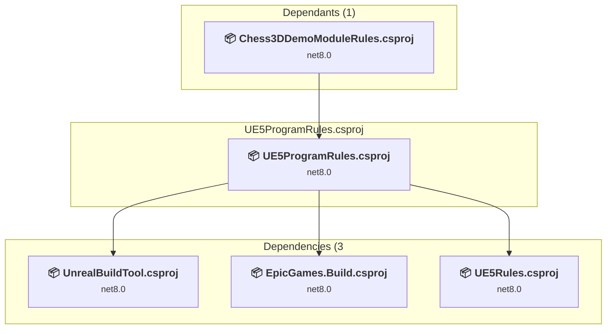

### API Compatibility

| Category | Count | Impact |
| :--- | :---: | :--- |
| 🔴 Binary Incompatible | 0 | High - Require code changes |
| 🟡 Source Incompatible | 0 | Medium - Needs re-compilation and potential conflicting API error fixing |
| 🔵 Behavioral change | 0 | Low - Behavioral changes that may require testing at runtime |
| ✅ Compatible | 434 |  |
| ***Total APIs Analyzed*** | ***434*** |  |

#### Project Package References

| Package | Type | Current Version | Suggested Version | Description |
| :--- | :---: | :---: | :---: | :--- |

<a id="f:unrealengine_574ue_57engineintermediatebuildbuildrulesprojectsue5rulesue5rulescsproj"></a>
### F:\UnrealEngine_5.7.4\UE_5.7\Engine\Intermediate\Build\BuildRulesProjects\UE5Rules\UE5Rules.csproj

#### Project Info

- **Current Target Framework:** net8.0
- **Proposed Target Framework:** net10.0
- **SDK-style**: True
- **Project Kind:** ClassLibrary
- **Dependencies**: 2
- **Dependants**: 2
- **Number of Files**: 2331
- **Number of Files with Incidents**: 1
- **Lines of Code**: 96102
- **Estimated LOC to modify**: 0+ (at least 0.0% of the project)

#### Dependency Graph

Legend:
📦 SDK-style project
⚙️ Classic project

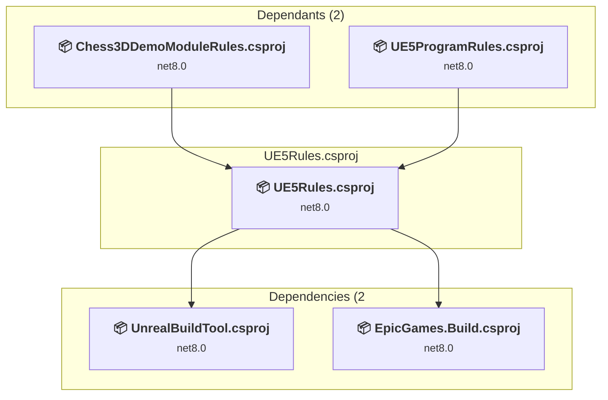

### API Compatibility

| Category | Count | Impact |
| :--- | :---: | :--- |
| 🔴 Binary Incompatible | 0 | High - Require code changes |
| 🟡 Source Incompatible | 0 | Medium - Needs re-compilation and potential conflicting API error fixing |
| 🔵 Behavioral change | 0 | Low - Behavioral changes that may require testing at runtime |
| ✅ Compatible | 74218 |  |
| ***Total APIs Analyzed*** | ***74218*** |  |

#### Project Package References

| Package | Type | Current Version | Suggested Version | Description |
| :--- | :---: | :---: | :---: | :--- |

<a id="f:unrealengine_574ue_57engineplatformsvisionossourceprogramsautomationtoolvisionosautomationcsproj"></a>
### F:\UnrealEngine_5.7.4\UE_5.7\Engine\Platforms\VisionOS\Source\Programs\AutomationTool\VisionOS.Automation.csproj

#### Project Info

- **Current Target Framework:** net8.0
- **Proposed Target Framework:** net10.0
- **SDK-style**: True
- **Project Kind:** ClassLibrary
- **Dependencies**: 5
- **Dependants**: 1
- **Number of Files**: 4
- **Number of Files with Incidents**: 1
- **Lines of Code**: 233
- **Estimated LOC to modify**: 0+ (at least 0.0% of the project)

#### Dependency Graph

Legend:
📦 SDK-style project
⚙️ Classic project

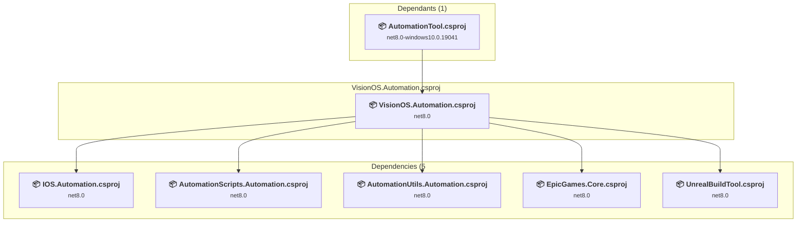

### API Compatibility

| Category | Count | Impact |
| :--- | :---: | :--- |
| 🔴 Binary Incompatible | 0 | High - Require code changes |
| 🟡 Source Incompatible | 0 | Medium - Needs re-compilation and potential conflicting API error fixing |
| 🔵 Behavioral change | 0 | Low - Behavioral changes that may require testing at runtime |
| ✅ Compatible | 140 |  |
| ***Total APIs Analyzed*** | ***140*** |  |

#### Project Package References

| Package | Type | Current Version | Suggested Version | Description |
| :--- | :---: | :---: | :---: | :--- |
| Microsoft.CSharp | Explicit | 4.7.0 |  | ✅Compatible |

<a id="f:unrealengine_574ue_57enginepluginsscriptpluginsourcescriptgeneratorubtpluginscriptgeneratorubtpluginubtplugincsproj"></a>
### F:\UnrealEngine_5.7.4\UE_5.7\Engine\Plugins\ScriptPlugin\Source\ScriptGeneratorUbtPlugin\ScriptGeneratorUbtPlugin.ubtplugin.csproj

#### Project Info

- **Current Target Framework:** net8.0
- **Proposed Target Framework:** net10.0
- **SDK-style**: True
- **Project Kind:** ClassLibrary
- **Dependencies**: 0
- **Dependants**: 0
- **Number of Files**: 4
- **Number of Files with Incidents**: 1
- **Lines of Code**: 965
- **Estimated LOC to modify**: 0+ (at least 0.0% of the project)

#### Dependency Graph

Legend:
📦 SDK-style project
⚙️ Classic project

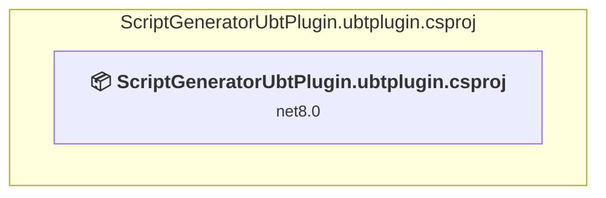

### API Compatibility

| Category | Count | Impact |
| :--- | :---: | :--- |
| 🔴 Binary Incompatible | 0 | High - Require code changes |
| 🟡 Source Incompatible | 0 | Medium - Needs re-compilation and potential conflicting API error fixing |
| 🔵 Behavioral change | 0 | Low - Behavioral changes that may require testing at runtime |
| ✅ Compatible | 1586 |  |
| ***Total APIs Analyzed*** | ***1586*** |  |

#### Project Package References

| Package | Type | Current Version | Suggested Version | Description |
| :--- | :---: | :---: | :---: | :--- |
| Microsoft.CSharp | Explicit | 4.7.0 |  | ✅Compatible |

<a id="f:unrealengine_574ue_57enginesourceprogramsautomationtoolandroidandroidautomationcsproj"></a>
### F:\UnrealEngine_5.7.4\UE_5.7\Engine\Source\Programs\AutomationTool\Android\Android.Automation.csproj

#### Project Info

- **Current Target Framework:** net8.0
- **Proposed Target Framework:** net10.0
- **SDK-style**: True
- **Project Kind:** ClassLibrary
- **Dependencies**: 4
- **Dependants**: 2
- **Number of Files**: 4
- **Number of Files with Incidents**: 2
- **Lines of Code**: 7665
- **Estimated LOC to modify**: 1+ (at least 0.0% of the project)

#### Dependency Graph

Legend:
📦 SDK-style project
⚙️ Classic project

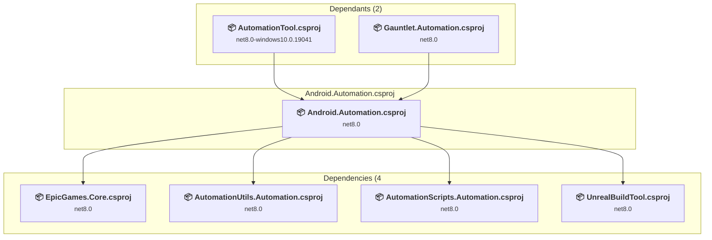

### API Compatibility

| Category | Count | Impact |
| :--- | :---: | :--- |
| 🔴 Binary Incompatible | 0 | High - Require code changes |
| 🟡 Source Incompatible | 0 | Medium - Needs re-compilation and potential conflicting API error fixing |
| 🔵 Behavioral change | 1 | Low - Behavioral changes that may require testing at runtime |
| ✅ Compatible | 5287 |  |
| ***Total APIs Analyzed*** | ***5288*** |  |

#### Project Package References

| Package | Type | Current Version | Suggested Version | Description |
| :--- | :---: | :---: | :---: | :--- |
| Microsoft.CSharp | Explicit | 4.7.0 |  | ✅Compatible |

<a id="f:unrealengine_574ue_57enginesourceprogramsautomationtoolappleappleautomationcsproj"></a>
### F:\UnrealEngine_5.7.4\UE_5.7\Engine\Source\Programs\AutomationTool\Apple\Apple.Automation.csproj

#### Project Info

- **Current Target Framework:** net8.0
- **Proposed Target Framework:** net10.0
- **SDK-style**: True
- **Project Kind:** ClassLibrary
- **Dependencies**: 3
- **Dependants**: 3
- **Number of Files**: 4
- **Number of Files with Incidents**: 2
- **Lines of Code**: 1125
- **Estimated LOC to modify**: 17+ (at least 1.5% of the project)

#### Dependency Graph

Legend:
📦 SDK-style project
⚙️ Classic project

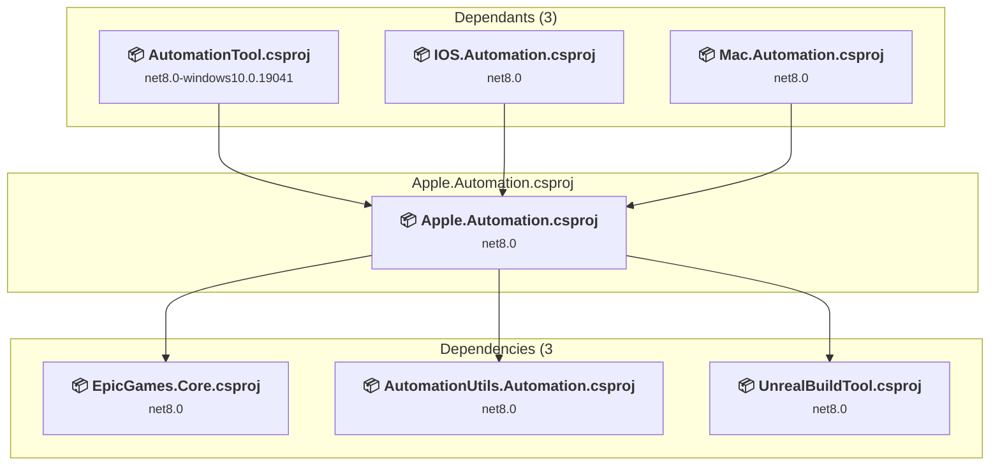

### API Compatibility

| Category | Count | Impact |
| :--- | :---: | :--- |
| 🔴 Binary Incompatible | 9 | High - Require code changes |
| 🟡 Source Incompatible | 0 | Medium - Needs re-compilation and potential conflicting API error fixing |
| 🔵 Behavioral change | 8 | Low - Behavioral changes that may require testing at runtime |
| ✅ Compatible | 729 |  |
| ***Total APIs Analyzed*** | ***746*** |  |

#### Project Package References

| Package | Type | Current Version | Suggested Version | Description |
| :--- | :---: | :---: | :---: | :--- |
| Microsoft.CSharp | Explicit | 4.7.0 |  | ✅Compatible |
| Microsoft.IdentityModel.Tokens | Explicit | 6.36.0 |  | ⚠️NuGet package is deprecated |
| Portable.BouncyCastle | Explicit | 1.8.10 |  | ✅Compatible |
| System.IdentityModel.Tokens.Jwt | Explicit | 6.36.0 |  | ⚠️NuGet package is deprecated |

#### Project Technologies and Features

| Technology | Issues | Percentage | Migration Path |
| :--- | :---: | :---: | :--- |
| IdentityModel & Claims-based Security | 9 | 52.9% | Windows Identity Foundation (WIF), SAML, and claims-based authentication APIs that have been replaced by modern identity libraries. WIF was the original identity framework for .NET Framework. Migrate to Microsoft.IdentityModel.* packages (modern identity stack). |

<a id="f:unrealengine_574ue_57enginesourceprogramsautomationtoolautomationtoolcsproj"></a>
### F:\UnrealEngine_5.7.4\UE_5.7\Engine\Source\Programs\AutomationTool\AutomationTool.csproj

#### Project Info

- **Current Target Framework:** net8.0-windows10.0.19041
- **Proposed Target Framework:** net10.0--windows10.0.19041
- **SDK-style**: True
- **Project Kind:** DotNetCoreApp
- **Dependencies**: 27
- **Dependants**: 0
- **Number of Files**: 6
- **Number of Files with Incidents**: 2
- **Lines of Code**: 570
- **Estimated LOC to modify**: 1+ (at least 0.2% of the project)

#### Dependency Graph

Legend:
📦 SDK-style project
⚙️ Classic project

```mermaid
flowchart TB
    subgraph current["AutomationTool.csproj"]
        MAIN["<b>📦&nbsp;AutomationTool.csproj</b><br/><small>net8.0-windows10.0.19041</small>"]
        click MAIN "#f:unrealengine_574ue_57enginesourceprogramsautomationtoolautomationtoolcsproj"
    end
    subgraph downstream["Dependencies (27"]
        P16["<b>📦&nbsp;AutomationUtils.Automation.csproj</b><br/><small>net8.0</small>"]
        P22["<b>📦&nbsp;IOS.Automation.csproj</b><br/><small>net8.0</small>"]
        P18["<b>📦&nbsp;CookedEditor.Automation.csproj</b><br/><small>net8.0</small>"]
        P30["<b>📦&nbsp;AutomationScripts.Automation.csproj</b><br/><small>net8.0</small>"]
        P19["<b>📦&nbsp;CrowdinLocalization.Automation.csproj</b><br/><small>net8.0</small>"]
        P31["<b>📦&nbsp;SmartlingLocalization.Automation.csproj</b><br/><small>net8.0</small>"]
        P27["<b>📦&nbsp;Mac.Automation.csproj</b><br/><small>net8.0</small>"]
        P33["<b>📦&nbsp;Turnkey.Automation.csproj</b><br/><small>net8.0</small>"]
        P24["<b>📦&nbsp;LiveLinkHub.Automation.csproj</b><br/><small>net8.0</small>"]
        P35["<b>📦&nbsp;Win.Automation.csproj</b><br/><small>net8.0</small>"]
        P28["<b>📦&nbsp;Mutable.Automation.csproj</b><br/><small>net8.0</small>"]
        P21["<b>📦&nbsp;Insights.Automation.csproj</b><br/><small>net8.0</small>"]
        P23["<b>📦&nbsp;Linux.Automation.csproj</b><br/><small>net8.0</small>"]
        P32["<b>📦&nbsp;SteamDeck.Automation.csproj</b><br/><small>net8.0</small>"]
        P26["<b>📦&nbsp;LowLevelTests.Automation.csproj</b><br/><small>net8.0</small>"]
        P29["<b>📦&nbsp;OneSkyLocalization.Automation.csproj</b><br/><small>net8.0</small>"]
        P14["<b>📦&nbsp;Apple.Automation.csproj</b><br/><small>net8.0</small>"]
        P40["<b>📦&nbsp;EpicGames.Build.csproj</b><br/><small>net8.0</small>"]
        P68["<b>📦&nbsp;UnrealBuildTool.csproj</b><br/><small>net8.0</small>"]
        P42["<b>📦&nbsp;EpicGames.Core.csproj</b><br/><small>net8.0</small>"]
        P25["<b>📦&nbsp;Localization.Automation.csproj</b><br/><small>net8.0</small>"]
        P36["<b>📦&nbsp;XLocLocalization.Automation.csproj</b><br/><small>net8.0</small>"]
        P10["<b>📦&nbsp;VisionOS.Automation.csproj</b><br/><small>net8.0</small>"]
        P17["<b>📦&nbsp;BuildGraph.Automation.csproj</b><br/><small>net8.0</small>"]
        P20["<b>📦&nbsp;Gauntlet.Automation.csproj</b><br/><small>net8.0</small>"]
        P13["<b>📦&nbsp;Android.Automation.csproj</b><br/><small>net8.0</small>"]
        P34["<b>📦&nbsp;TVOS.Automation.csproj</b><br/><small>net8.0</small>"]
        click P16 "#f:unrealengine_574ue_57enginesourceprogramsautomationtoolautomationutilsautomationutilsautomationcsproj"
        click P22 "#f:unrealengine_574ue_57enginesourceprogramsautomationtooliosiosautomationcsproj"
        click P18 "#f:unrealengine_574ue_57enginesourceprogramsautomationtoolcookededitorcookededitorautomationcsproj"
        click P30 "#f:unrealengine_574ue_57enginesourceprogramsautomationtoolscriptsautomationscriptsautomationcsproj"
        click P19 "#f:unrealengine_574ue_57enginesourceprogramsautomationtoolcrowdinlocalizationcrowdinlocalizationautomationcsproj"
        click P31 "#f:unrealengine_574ue_57enginesourceprogramsautomationtoolsmartlinglocalizationsmartlinglocalizationautomationcsproj"
        click P27 "#f:unrealengine_574ue_57enginesourceprogramsautomationtoolmacmacautomationcsproj"
        click P33 "#f:unrealengine_574ue_57enginesourceprogramsautomationtoolturnkeyturnkeyautomationcsproj"
        click P24 "#f:unrealengine_574ue_57enginesourceprogramsautomationtoollivelinkhublivelinkhubautomationcsproj"
        click P35 "#f:unrealengine_574ue_57enginesourceprogramsautomationtoolwinwinautomationcsproj"
        click P28 "#f:unrealengine_574ue_57enginesourceprogramsautomationtoolmutablemutableautomationcsproj"
        click P21 "#f:unrealengine_574ue_57enginesourceprogramsautomationtoolinsightsinsightsautomationcsproj"
        click P23 "#f:unrealengine_574ue_57enginesourceprogramsautomationtoollinuxlinuxautomationcsproj"
        click P32 "#f:unrealengine_574ue_57enginesourceprogramsautomationtoolsteamdecksteamdeckautomationcsproj"
        click P26 "#f:unrealengine_574ue_57enginesourceprogramsautomationtoollowleveltestslowleveltestsautomationcsproj"
        click P29 "#f:unrealengine_574ue_57enginesourceprogramsautomationtooloneskylocalizationoneskylocalizationautomationcsproj"
        click P14 "#f:unrealengine_574ue_57enginesourceprogramsautomationtoolappleappleautomationcsproj"
        click P40 "#f:unrealengine_574ue_57enginesourceprogramssharedepicgamesbuildepicgamesbuildcsproj"
        click P68 "#f:unrealengine_574ue_57enginesourceprogramsunrealbuildtoolunrealbuildtoolcsproj"
        click P42 "#f:unrealengine_574ue_57enginesourceprogramssharedepicgamescoreepicgamescorecsproj"
        click P25 "#f:unrealengine_574ue_57enginesourceprogramsautomationtoollocalizationlocalizationautomationcsproj"
        click P36 "#f:unrealengine_574ue_57enginesourceprogramsautomationtoolxloclocalizationxloclocalizationautomationcsproj"
        click P10 "#f:unrealengine_574ue_57engineplatformsvisionossourceprogramsautomationtoolvisionosautomationcsproj"
        click P17 "#f:unrealengine_574ue_57enginesourceprogramsautomationtoolbuildgraphbuildgraphautomationcsproj"
        click P20 "#f:unrealengine_574ue_57enginesourceprogramsautomationtoolgauntletgauntletautomationcsproj"
        click P13 "#f:unrealengine_574ue_57enginesourceprogramsautomationtoolandroidandroidautomationcsproj"
        click P34 "#f:unrealengine_574ue_57enginesourceprogramsautomationtooltvostvosautomationcsproj"
    end
    MAIN --> P16
    MAIN --> P22
    MAIN --> P18
    MAIN --> P30
    MAIN --> P19
    MAIN --> P31
    MAIN --> P27
    MAIN --> P33
    MAIN --> P24
    MAIN --> P35
    MAIN --> P28
    MAIN --> P21
    MAIN --> P23
    MAIN --> P32
    MAIN --> P26
    MAIN --> P29
    MAIN --> P14
    MAIN --> P40
    MAIN --> P68
    MAIN --> P42
    MAIN --> P25
    MAIN --> P36
    MAIN --> P10
    MAIN --> P17
    MAIN --> P20
    MAIN --> P13
    MAIN --> P34

```

### API Compatibility

| Category | Count | Impact |
| :--- | :---: | :--- |
| 🔴 Binary Incompatible | 0 | High - Require code changes |
| 🟡 Source Incompatible | 0 | Medium - Needs re-compilation and potential conflicting API error fixing |
| 🔵 Behavioral change | 1 | Low - Behavioral changes that may require testing at runtime |
| ✅ Compatible | 513 |  |
| ***Total APIs Analyzed*** | ***514*** |  |

#### Project Package References

| Package | Type | Current Version | Suggested Version | Description |
| :--- | :---: | :---: | :---: | :--- |
| AWSSDK.SecurityToken | Explicit | 3.7.501.14 |  | ✅Compatible |
| Magick.NET-Q16-HDRI-AnyCPU | Explicit | 14.9.1 | 14.12.0 | NuGet package contains security vulnerability |
| Microsoft.Build | Explicit | 17.11.48 |  | ✅Compatible |
| Microsoft.Build.Locator | Explicit | 1.9.1 |  | ✅Compatible |
| Newtonsoft.Json | Explicit | 13.0.4 |  | ✅Compatible |

<a id="f:unrealengine_574ue_57enginesourceprogramsautomationtoolautomationutilsautomationutilsautomationcsproj"></a>
### F:\UnrealEngine_5.7.4\UE_5.7\Engine\Source\Programs\AutomationTool\AutomationUtils\AutomationUtils.Automation.csproj

#### Project Info

- **Current Target Framework:** net8.0
- **Proposed Target Framework:** net10.0
- **SDK-style**: True
- **Project Kind:** ClassLibrary
- **Dependencies**: 6
- **Dependants**: 23
- **Number of Files**: 67
- **Number of Files with Incidents**: 12
- **Lines of Code**: 31093
- **Estimated LOC to modify**: 64+ (at least 0.2% of the project)

#### Dependency Graph

Legend:
📦 SDK-style project
⚙️ Classic project

```mermaid
flowchart TB
    subgraph upstream["Dependants (23)"]
        P10["<b>📦&nbsp;VisionOS.Automation.csproj</b><br/><small>net8.0</small>"]
        P13["<b>📦&nbsp;Android.Automation.csproj</b><br/><small>net8.0</small>"]
        P14["<b>📦&nbsp;Apple.Automation.csproj</b><br/><small>net8.0</small>"]
        P15["<b>📦&nbsp;AutomationTool.csproj</b><br/><small>net8.0-windows10.0.19041</small>"]
        P17["<b>📦&nbsp;BuildGraph.Automation.csproj</b><br/><small>net8.0</small>"]
        P18["<b>📦&nbsp;CookedEditor.Automation.csproj</b><br/><small>net8.0</small>"]
        P19["<b>📦&nbsp;CrowdinLocalization.Automation.csproj</b><br/><small>net8.0</small>"]
        P20["<b>📦&nbsp;Gauntlet.Automation.csproj</b><br/><small>net8.0</small>"]
        P21["<b>📦&nbsp;Insights.Automation.csproj</b><br/><small>net8.0</small>"]
        P22["<b>📦&nbsp;IOS.Automation.csproj</b><br/><small>net8.0</small>"]
        P23["<b>📦&nbsp;Linux.Automation.csproj</b><br/><small>net8.0</small>"]
        P24["<b>📦&nbsp;LiveLinkHub.Automation.csproj</b><br/><small>net8.0</small>"]
        P25["<b>📦&nbsp;Localization.Automation.csproj</b><br/><small>net8.0</small>"]
        P26["<b>📦&nbsp;LowLevelTests.Automation.csproj</b><br/><small>net8.0</small>"]
        P27["<b>📦&nbsp;Mac.Automation.csproj</b><br/><small>net8.0</small>"]
        P29["<b>📦&nbsp;OneSkyLocalization.Automation.csproj</b><br/><small>net8.0</small>"]
        P30["<b>📦&nbsp;AutomationScripts.Automation.csproj</b><br/><small>net8.0</small>"]
        P31["<b>📦&nbsp;SmartlingLocalization.Automation.csproj</b><br/><small>net8.0</small>"]
        P32["<b>📦&nbsp;SteamDeck.Automation.csproj</b><br/><small>net8.0</small>"]
        P33["<b>📦&nbsp;Turnkey.Automation.csproj</b><br/><small>net8.0</small>"]
        P34["<b>📦&nbsp;TVOS.Automation.csproj</b><br/><small>net8.0</small>"]
        P35["<b>📦&nbsp;Win.Automation.csproj</b><br/><small>net8.0</small>"]
        P36["<b>📦&nbsp;XLocLocalization.Automation.csproj</b><br/><small>net8.0</small>"]
        click P10 "#f:unrealengine_574ue_57engineplatformsvisionossourceprogramsautomationtoolvisionosautomationcsproj"
        click P13 "#f:unrealengine_574ue_57enginesourceprogramsautomationtoolandroidandroidautomationcsproj"
        click P14 "#f:unrealengine_574ue_57enginesourceprogramsautomationtoolappleappleautomationcsproj"
        click P15 "#f:unrealengine_574ue_57enginesourceprogramsautomationtoolautomationtoolcsproj"
        click P17 "#f:unrealengine_574ue_57enginesourceprogramsautomationtoolbuildgraphbuildgraphautomationcsproj"
        click P18 "#f:unrealengine_574ue_57enginesourceprogramsautomationtoolcookededitorcookededitorautomationcsproj"
        click P19 "#f:unrealengine_574ue_57enginesourceprogramsautomationtoolcrowdinlocalizationcrowdinlocalizationautomationcsproj"
        click P20 "#f:unrealengine_574ue_57enginesourceprogramsautomationtoolgauntletgauntletautomationcsproj"
        click P21 "#f:unrealengine_574ue_57enginesourceprogramsautomationtoolinsightsinsightsautomationcsproj"
        click P22 "#f:unrealengine_574ue_57enginesourceprogramsautomationtooliosiosautomationcsproj"
        click P23 "#f:unrealengine_574ue_57enginesourceprogramsautomationtoollinuxlinuxautomationcsproj"
        click P24 "#f:unrealengine_574ue_57enginesourceprogramsautomationtoollivelinkhublivelinkhubautomationcsproj"
        click P25 "#f:unrealengine_574ue_57enginesourceprogramsautomationtoollocalizationlocalizationautomationcsproj"
        click P26 "#f:unrealengine_574ue_57enginesourceprogramsautomationtoollowleveltestslowleveltestsautomationcsproj"
        click P27 "#f:unrealengine_574ue_57enginesourceprogramsautomationtoolmacmacautomationcsproj"
        click P29 "#f:unrealengine_574ue_57enginesourceprogramsautomationtooloneskylocalizationoneskylocalizationautomationcsproj"
        click P30 "#f:unrealengine_574ue_57enginesourceprogramsautomationtoolscriptsautomationscriptsautomationcsproj"
        click P31 "#f:unrealengine_574ue_57enginesourceprogramsautomationtoolsmartlinglocalizationsmartlinglocalizationautomationcsproj"
        click P32 "#f:unrealengine_574ue_57enginesourceprogramsautomationtoolsteamdecksteamdeckautomationcsproj"
        click P33 "#f:unrealengine_574ue_57enginesourceprogramsautomationtoolturnkeyturnkeyautomationcsproj"
        click P34 "#f:unrealengine_574ue_57enginesourceprogramsautomationtooltvostvosautomationcsproj"
        click P35 "#f:unrealengine_574ue_57enginesourceprogramsautomationtoolwinwinautomationcsproj"
        click P36 "#f:unrealengine_574ue_57enginesourceprogramsautomationtoolxloclocalizationxloclocalizationautomationcsproj"
    end
    subgraph current["AutomationUtils.Automation.csproj"]
        MAIN["<b>📦&nbsp;AutomationUtils.Automation.csproj</b><br/><small>net8.0</small>"]
        click MAIN "#f:unrealengine_574ue_57enginesourceprogramsautomationtoolautomationutilsautomationutilsautomationcsproj"
    end
    subgraph downstream["Dependencies (6"]
        P44["<b>📦&nbsp;EpicGames.Horde.csproj</b><br/><small>net8.0</small>"]
        P56["<b>📦&nbsp;EpicGames.ProjectStore.csproj</b><br/><small>net8.0</small>"]
        P42["<b>📦&nbsp;EpicGames.Core.csproj</b><br/><small>net8.0</small>"]
        P40["<b>📦&nbsp;EpicGames.Build.csproj</b><br/><small>net8.0</small>"]
        P55["<b>📦&nbsp;EpicGames.Perforce.csproj</b><br/><small>net8.0</small>"]
        P68["<b>📦&nbsp;UnrealBuildTool.csproj</b><br/><small>net8.0</small>"]
        click P44 "#f:unrealengine_574ue_57enginesourceprogramssharedepicgameshordeepicgameshordecsproj"
        click P56 "#f:unrealengine_574ue_57enginesourceprogramssharedepicgamesprojectstoreepicgamesprojectstorecsproj"
        click P42 "#f:unrealengine_574ue_57enginesourceprogramssharedepicgamescoreepicgamescorecsproj"
        click P40 "#f:unrealengine_574ue_57enginesourceprogramssharedepicgamesbuildepicgamesbuildcsproj"
        click P55 "#f:unrealengine_574ue_57enginesourceprogramssharedepicgamesperforceepicgamesperforcecsproj"
        click P68 "#f:unrealengine_574ue_57enginesourceprogramsunrealbuildtoolunrealbuildtoolcsproj"
    end
    P10 --> MAIN
    P13 --> MAIN
    P14 --> MAIN
    P15 --> MAIN
    P17 --> MAIN
    P18 --> MAIN
    P19 --> MAIN
    P20 --> MAIN
    P21 --> MAIN
    P22 --> MAIN
    P23 --> MAIN
    P24 --> MAIN
    P25 --> MAIN
    P26 --> MAIN
    P27 --> MAIN
    P29 --> MAIN
    P30 --> MAIN
    P31 --> MAIN
    P32 --> MAIN
    P33 --> MAIN
    P34 --> MAIN
    P35 --> MAIN
    P36 --> MAIN
    MAIN --> P44
    MAIN --> P56
    MAIN --> P42
    MAIN --> P40
    MAIN --> P55
    MAIN --> P68

```

### API Compatibility

| Category | Count | Impact |
| :--- | :---: | :--- |
| 🔴 Binary Incompatible | 0 | High - Require code changes |
| 🟡 Source Incompatible | 13 | Medium - Needs re-compilation and potential conflicting API error fixing |
| 🔵 Behavioral change | 51 | Low - Behavioral changes that may require testing at runtime |
| ✅ Compatible | 23527 |  |
| ***Total APIs Analyzed*** | ***23591*** |  |

#### Project Package References

| Package | Type | Current Version | Suggested Version | Description |
| :--- | :---: | :---: | :---: | :--- |
| Google.Apis.Drive.v3 | Explicit | 1.33.1.1232 |  | ✅Compatible |
| Google.Apis.Sheets.v4 | Explicit | 1.33.1.1240 |  | ✅Compatible |
| Magick.NET-Q16-HDRI-AnyCPU | Explicit | 14.9.1 |  | ✅Compatible |
| System.Drawing.Common | Explicit | 8.0.20 | 10.0.6 | NuGet package upgrade is recommended |
| System.Net.Http | Explicit | 4.3.4 |  | NuGet package functionality is included with framework reference |
| System.Security.Permissions | Explicit | 8.0.0 | 10.0.6 | NuGet package upgrade is recommended |
| System.Text.Encoding.CodePages | Explicit | 8.0.0 | 10.0.6 | NuGet package upgrade is recommended |
| System.Text.RegularExpressions | Explicit | 4.3.1 |  | NuGet package functionality is included with framework reference |

#### Project Technologies and Features

| Technology | Issues | Percentage | Migration Path |
| :--- | :---: | :---: | :--- |
| System Management (WMI) | 7 | 10.9% | Windows Management Instrumentation (WMI) APIs for system administration and monitoring that are available via NuGet package System.Management. These APIs provide access to Windows system information but are Windows-only; consider cross-platform alternatives for new code. |

<a id="f:unrealengine_574ue_57enginesourceprogramsautomationtoolbuildgraphbuildgraphautomationcsproj"></a>
### F:\UnrealEngine_5.7.4\UE_5.7\Engine\Source\Programs\AutomationTool\BuildGraph\BuildGraph.Automation.csproj

#### Project Info

- **Current Target Framework:** net8.0
- **Proposed Target Framework:** net10.0
- **SDK-style**: True
- **Project Kind:** ClassLibrary
- **Dependencies**: 5
- **Dependants**: 2
- **Number of Files**: 81
- **Number of Files with Incidents**: 15
- **Lines of Code**: 23845
- **Estimated LOC to modify**: 51+ (at least 0.2% of the project)

#### Dependency Graph

Legend:
📦 SDK-style project
⚙️ Classic project

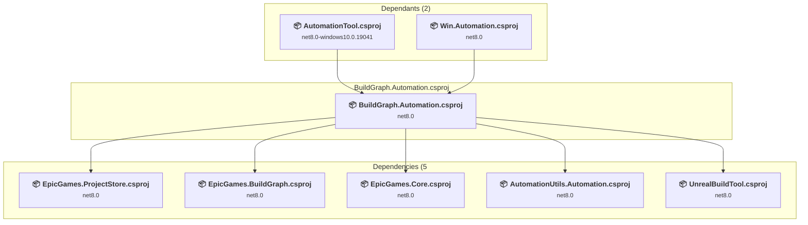

### API Compatibility

| Category | Count | Impact |
| :--- | :---: | :--- |
| 🔴 Binary Incompatible | 2 | High - Require code changes |
| 🟡 Source Incompatible | 16 | Medium - Needs re-compilation and potential conflicting API error fixing |
| 🔵 Behavioral change | 33 | Low - Behavioral changes that may require testing at runtime |
| ✅ Compatible | 18661 |  |
| ***Total APIs Analyzed*** | ***18712*** |  |

#### Project Package References

| Package | Type | Current Version | Suggested Version | Description |
| :--- | :---: | :---: | :---: | :--- |
| Microsoft.CSharp | Explicit | 4.7.0 |  | ✅Compatible |

<a id="f:unrealengine_574ue_57enginesourceprogramsautomationtoolcookededitorcookededitorautomationcsproj"></a>
### F:\UnrealEngine_5.7.4\UE_5.7\Engine\Source\Programs\AutomationTool\CookedEditor\CookedEditor.Automation.csproj

#### Project Info

- **Current Target Framework:** net8.0
- **Proposed Target Framework:** net10.0
- **SDK-style**: True
- **Project Kind:** ClassLibrary
- **Dependencies**: 7
- **Dependants**: 2
- **Number of Files**: 4
- **Number of Files with Incidents**: 1
- **Lines of Code**: 1465
- **Estimated LOC to modify**: 0+ (at least 0.0% of the project)

#### Dependency Graph

Legend:
📦 SDK-style project
⚙️ Classic project

```mermaid
flowchart TB
    subgraph upstream["Dependants (2)"]
        P15["<b>📦&nbsp;AutomationTool.csproj</b><br/><small>net8.0-windows10.0.19041</small>"]
        P24["<b>📦&nbsp;LiveLinkHub.Automation.csproj</b><br/><small>net8.0</small>"]
        click P15 "#f:unrealengine_574ue_57enginesourceprogramsautomationtoolautomationtoolcsproj"
        click P24 "#f:unrealengine_574ue_57enginesourceprogramsautomationtoollivelinkhublivelinkhubautomationcsproj"
    end
    subgraph current["CookedEditor.Automation.csproj"]
        MAIN["<b>📦&nbsp;CookedEditor.Automation.csproj</b><br/><small>net8.0</small>"]
        click MAIN "#f:unrealengine_574ue_57enginesourceprogramsautomationtoolcookededitorcookededitorautomationcsproj"
    end
    subgraph downstream["Dependencies (7"]
        P42["<b>📦&nbsp;EpicGames.Core.csproj</b><br/><small>net8.0</small>"]
        P16["<b>📦&nbsp;AutomationUtils.Automation.csproj</b><br/><small>net8.0</small>"]
        P27["<b>📦&nbsp;Mac.Automation.csproj</b><br/><small>net8.0</small>"]
        P30["<b>📦&nbsp;AutomationScripts.Automation.csproj</b><br/><small>net8.0</small>"]
        P68["<b>📦&nbsp;UnrealBuildTool.csproj</b><br/><small>net8.0</small>"]
        P35["<b>📦&nbsp;Win.Automation.csproj</b><br/><small>net8.0</small>"]
        P23["<b>📦&nbsp;Linux.Automation.csproj</b><br/><small>net8.0</small>"]
        click P42 "#f:unrealengine_574ue_57enginesourceprogramssharedepicgamescoreepicgamescorecsproj"
        click P16 "#f:unrealengine_574ue_57enginesourceprogramsautomationtoolautomationutilsautomationutilsautomationcsproj"
        click P27 "#f:unrealengine_574ue_57enginesourceprogramsautomationtoolmacmacautomationcsproj"
        click P30 "#f:unrealengine_574ue_57enginesourceprogramsautomationtoolscriptsautomationscriptsautomationcsproj"
        click P68 "#f:unrealengine_574ue_57enginesourceprogramsunrealbuildtoolunrealbuildtoolcsproj"
        click P35 "#f:unrealengine_574ue_57enginesourceprogramsautomationtoolwinwinautomationcsproj"
        click P23 "#f:unrealengine_574ue_57enginesourceprogramsautomationtoollinuxlinuxautomationcsproj"
    end
    P15 --> MAIN
    P24 --> MAIN
    MAIN --> P42
    MAIN --> P16
    MAIN --> P27
    MAIN --> P30
    MAIN --> P68
    MAIN --> P35
    MAIN --> P23

```

### API Compatibility

| Category | Count | Impact |
| :--- | :---: | :--- |
| 🔴 Binary Incompatible | 0 | High - Require code changes |
| 🟡 Source Incompatible | 0 | Medium - Needs re-compilation and potential conflicting API error fixing |
| 🔵 Behavioral change | 0 | Low - Behavioral changes that may require testing at runtime |
| ✅ Compatible | 1336 |  |
| ***Total APIs Analyzed*** | ***1336*** |  |

#### Project Package References

| Package | Type | Current Version | Suggested Version | Description |
| :--- | :---: | :---: | :---: | :--- |
| Microsoft.CSharp | Explicit | 4.7.0 |  | ✅Compatible |

<a id="f:unrealengine_574ue_57enginesourceprogramsautomationtoolcrowdinlocalizationcrowdinlocalizationautomationcsproj"></a>
### F:\UnrealEngine_5.7.4\UE_5.7\Engine\Source\Programs\AutomationTool\CrowdinLocalization\CrowdinLocalization.Automation.csproj

#### Project Info

- **Current Target Framework:** net8.0
- **Proposed Target Framework:** net10.0
- **SDK-style**: True
- **Project Kind:** ClassLibrary
- **Dependencies**: 4
- **Dependants**: 1
- **Number of Files**: 2
- **Number of Files with Incidents**: 2
- **Lines of Code**: 541
- **Estimated LOC to modify**: 8+ (at least 1.5% of the project)

#### Dependency Graph

Legend:
📦 SDK-style project
⚙️ Classic project

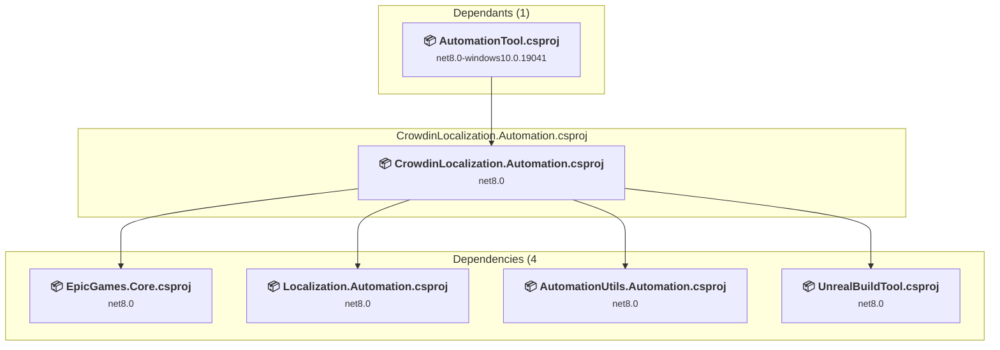

### API Compatibility

| Category | Count | Impact |
| :--- | :---: | :--- |
| 🔴 Binary Incompatible | 0 | High - Require code changes |
| 🟡 Source Incompatible | 1 | Medium - Needs re-compilation and potential conflicting API error fixing |
| 🔵 Behavioral change | 7 | Low - Behavioral changes that may require testing at runtime |
| ✅ Compatible | 621 |  |
| ***Total APIs Analyzed*** | ***629*** |  |

#### Project Package References

| Package | Type | Current Version | Suggested Version | Description |
| :--- | :---: | :---: | :---: | :--- |
| Microsoft.CSharp | Explicit | 4.7.0 |  | ✅Compatible |

<a id="f:unrealengine_574ue_57enginesourceprogramsautomationtoolgauntletgauntletautomationcsproj"></a>
### F:\UnrealEngine_5.7.4\UE_5.7\Engine\Source\Programs\AutomationTool\Gauntlet\Gauntlet.Automation.csproj

#### Project Info

- **Current Target Framework:** net8.0
- **Proposed Target Framework:** net10.0
- **SDK-style**: True
- **Project Kind:** ClassLibrary
- **Dependencies**: 9
- **Dependants**: 5
- **Number of Files**: 158
- **Number of Files with Incidents**: 13
- **Lines of Code**: 48018
- **Estimated LOC to modify**: 51+ (at least 0.1% of the project)

#### Dependency Graph

Legend:
📦 SDK-style project
⚙️ Classic project

```mermaid
flowchart TB
    subgraph upstream["Dependants (5)"]
        P15["<b>📦&nbsp;AutomationTool.csproj</b><br/><small>net8.0-windows10.0.19041</small>"]
        P21["<b>📦&nbsp;Insights.Automation.csproj</b><br/><small>net8.0</small>"]
        P26["<b>📦&nbsp;LowLevelTests.Automation.csproj</b><br/><small>net8.0</small>"]
        P28["<b>📦&nbsp;Mutable.Automation.csproj</b><br/><small>net8.0</small>"]
        P33["<b>📦&nbsp;Turnkey.Automation.csproj</b><br/><small>net8.0</small>"]
        click P15 "#f:unrealengine_574ue_57enginesourceprogramsautomationtoolautomationtoolcsproj"
        click P21 "#f:unrealengine_574ue_57enginesourceprogramsautomationtoolinsightsinsightsautomationcsproj"
        click P26 "#f:unrealengine_574ue_57enginesourceprogramsautomationtoollowleveltestslowleveltestsautomationcsproj"
        click P28 "#f:unrealengine_574ue_57enginesourceprogramsautomationtoolmutablemutableautomationcsproj"
        click P33 "#f:unrealengine_574ue_57enginesourceprogramsautomationtoolturnkeyturnkeyautomationcsproj"
    end
    subgraph current["Gauntlet.Automation.csproj"]
        MAIN["<b>📦&nbsp;Gauntlet.Automation.csproj</b><br/><small>net8.0</small>"]
        click MAIN "#f:unrealengine_574ue_57enginesourceprogramsautomationtoolgauntletgauntletautomationcsproj"
    end
    subgraph downstream["Dependencies (9"]
        P44["<b>📦&nbsp;EpicGames.Horde.csproj</b><br/><small>net8.0</small>"]
        P29["<b>📦&nbsp;OneSkyLocalization.Automation.csproj</b><br/><small>net8.0</small>"]
        P42["<b>📦&nbsp;EpicGames.Core.csproj</b><br/><small>net8.0</small>"]
        P25["<b>📦&nbsp;Localization.Automation.csproj</b><br/><small>net8.0</small>"]
        P16["<b>📦&nbsp;AutomationUtils.Automation.csproj</b><br/><small>net8.0</small>"]
        P36["<b>📦&nbsp;XLocLocalization.Automation.csproj</b><br/><small>net8.0</small>"]
        P30["<b>📦&nbsp;AutomationScripts.Automation.csproj</b><br/><small>net8.0</small>"]
        P13["<b>📦&nbsp;Android.Automation.csproj</b><br/><small>net8.0</small>"]
        P68["<b>📦&nbsp;UnrealBuildTool.csproj</b><br/><small>net8.0</small>"]
        click P44 "#f:unrealengine_574ue_57enginesourceprogramssharedepicgameshordeepicgameshordecsproj"
        click P29 "#f:unrealengine_574ue_57enginesourceprogramsautomationtooloneskylocalizationoneskylocalizationautomationcsproj"
        click P42 "#f:unrealengine_574ue_57enginesourceprogramssharedepicgamescoreepicgamescorecsproj"
        click P25 "#f:unrealengine_574ue_57enginesourceprogramsautomationtoollocalizationlocalizationautomationcsproj"
        click P16 "#f:unrealengine_574ue_57enginesourceprogramsautomationtoolautomationutilsautomationutilsautomationcsproj"
        click P36 "#f:unrealengine_574ue_57enginesourceprogramsautomationtoolxloclocalizationxloclocalizationautomationcsproj"
        click P30 "#f:unrealengine_574ue_57enginesourceprogramsautomationtoolscriptsautomationscriptsautomationcsproj"
        click P13 "#f:unrealengine_574ue_57enginesourceprogramsautomationtoolandroidandroidautomationcsproj"
        click P68 "#f:unrealengine_574ue_57enginesourceprogramsunrealbuildtoolunrealbuildtoolcsproj"
    end
    P15 --> MAIN
    P21 --> MAIN
    P26 --> MAIN
    P28 --> MAIN
    P33 --> MAIN
    MAIN --> P44
    MAIN --> P29
    MAIN --> P42
    MAIN --> P25
    MAIN --> P16
    MAIN --> P36
    MAIN --> P30
    MAIN --> P13
    MAIN --> P68

```

### API Compatibility

| Category | Count | Impact |
| :--- | :---: | :--- |
| 🔴 Binary Incompatible | 0 | High - Require code changes |
| 🟡 Source Incompatible | 11 | Medium - Needs re-compilation and potential conflicting API error fixing |
| 🔵 Behavioral change | 40 | Low - Behavioral changes that may require testing at runtime |
| ✅ Compatible | 34361 |  |
| ***Total APIs Analyzed*** | ***34412*** |  |

#### Project Package References

| Package | Type | Current Version | Suggested Version | Description |
| :--- | :---: | :---: | :---: | :--- |
| Appium.WebDriver | Explicit | 8.0.0 |  | ✅Compatible |
| Magick.NET-Q16-HDRI-AnyCPU | Explicit | 14.9.1 |  | ✅Compatible |
| Microsoft.CSharp | Explicit | 4.7.0 |  | ✅Compatible |
| MySql.Data | Explicit | 6.10.9 |  | ✅Compatible |

#### Project Technologies and Features

| Technology | Issues | Percentage | Migration Path |
| :--- | :---: | :---: | :--- |
| System Management (WMI) | 6 | 11.8% | Windows Management Instrumentation (WMI) APIs for system administration and monitoring that are available via NuGet package System.Management. These APIs provide access to Windows system information but are Windows-only; consider cross-platform alternatives for new code. |

<a id="f:unrealengine_574ue_57enginesourceprogramsautomationtoolinsightsinsightsautomationcsproj"></a>
### F:\UnrealEngine_5.7.4\UE_5.7\Engine\Source\Programs\AutomationTool\Insights\Insights.Automation.csproj

#### Project Info

- **Current Target Framework:** net8.0
- **Proposed Target Framework:** net10.0
- **SDK-style**: True
- **Project Kind:** ClassLibrary
- **Dependencies**: 5
- **Dependants**: 1
- **Number of Files**: 5
- **Number of Files with Incidents**: 1
- **Lines of Code**: 1114
- **Estimated LOC to modify**: 0+ (at least 0.0% of the project)

#### Dependency Graph

Legend:
📦 SDK-style project
⚙️ Classic project

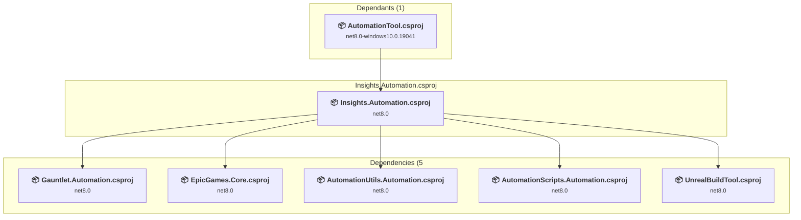

### API Compatibility

| Category | Count | Impact |
| :--- | :---: | :--- |
| 🔴 Binary Incompatible | 0 | High - Require code changes |
| 🟡 Source Incompatible | 0 | Medium - Needs re-compilation and potential conflicting API error fixing |
| 🔵 Behavioral change | 0 | Low - Behavioral changes that may require testing at runtime |
| ✅ Compatible | 1067 |  |
| ***Total APIs Analyzed*** | ***1067*** |  |

#### Project Package References

| Package | Type | Current Version | Suggested Version | Description |
| :--- | :---: | :---: | :---: | :--- |

<a id="f:unrealengine_574ue_57enginesourceprogramsautomationtooliosiosautomationcsproj"></a>
### F:\UnrealEngine_5.7.4\UE_5.7\Engine\Source\Programs\AutomationTool\IOS\IOS.Automation.csproj

#### Project Info

- **Current Target Framework:** net8.0
- **Proposed Target Framework:** net10.0
- **SDK-style**: True
- **Project Kind:** ClassLibrary
- **Dependencies**: 4
- **Dependants**: 3
- **Number of Files**: 8
- **Number of Files with Incidents**: 2
- **Lines of Code**: 3134
- **Estimated LOC to modify**: 4+ (at least 0.1% of the project)

#### Dependency Graph

Legend:
📦 SDK-style project
⚙️ Classic project

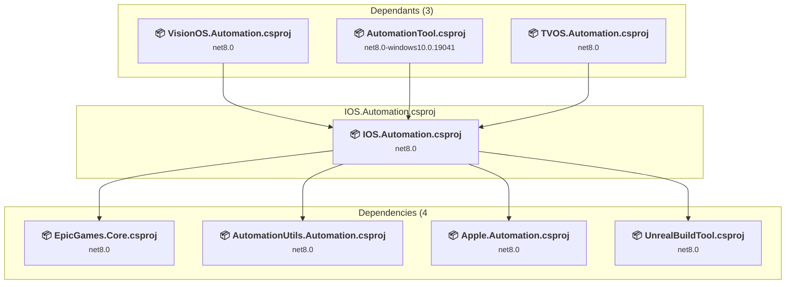

### API Compatibility

| Category | Count | Impact |
| :--- | :---: | :--- |
| 🔴 Binary Incompatible | 0 | High - Require code changes |
| 🟡 Source Incompatible | 4 | Medium - Needs re-compilation and potential conflicting API error fixing |
| 🔵 Behavioral change | 0 | Low - Behavioral changes that may require testing at runtime |
| ✅ Compatible | 2691 |  |
| ***Total APIs Analyzed*** | ***2695*** |  |

#### Project Package References

| Package | Type | Current Version | Suggested Version | Description |
| :--- | :---: | :---: | :---: | :--- |
| Microsoft.CSharp | Explicit | 4.7.0 |  | ✅Compatible |
| Portable.BouncyCastle | Explicit | 1.8.10 |  | ✅Compatible |
| System.Resources.Extensions | Explicit | 4.7.1 | 10.0.6 | NuGet package upgrade is recommended |

#### Project Technologies and Features

| Technology | Issues | Percentage | Migration Path |
| :--- | :---: | :---: | :--- |
| GDI+ / System.Drawing | 4 | 100.0% | System.Drawing APIs for 2D graphics, imaging, and printing that are available via NuGet package System.Drawing.Common. Note: Not recommended for server scenarios due to Windows dependencies; consider cross-platform alternatives like SkiaSharp or ImageSharp for new code. |

<a id="f:unrealengine_574ue_57enginesourceprogramsautomationtoollinuxlinuxautomationcsproj"></a>
### F:\UnrealEngine_5.7.4\UE_5.7\Engine\Source\Programs\AutomationTool\Linux\Linux.Automation.csproj

#### Project Info

- **Current Target Framework:** net8.0
- **Proposed Target Framework:** net10.0
- **SDK-style**: True
- **Project Kind:** ClassLibrary
- **Dependencies**: 4
- **Dependants**: 2
- **Number of Files**: 3
- **Number of Files with Incidents**: 1
- **Lines of Code**: 495
- **Estimated LOC to modify**: 0+ (at least 0.0% of the project)

#### Dependency Graph

Legend:
📦 SDK-style project
⚙️ Classic project

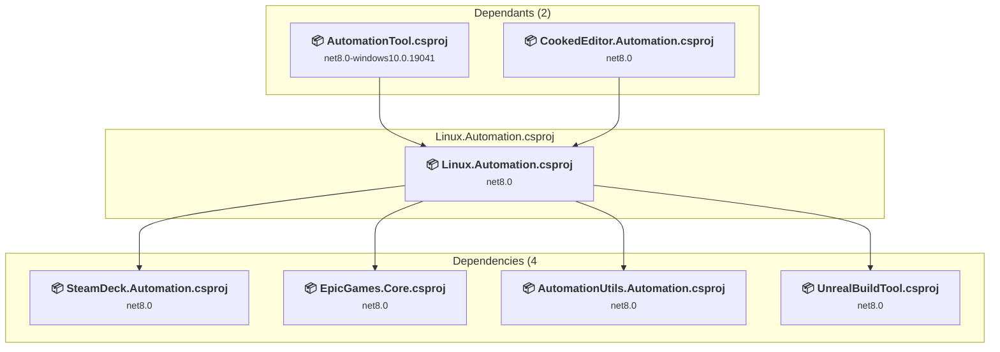

### API Compatibility

| Category | Count | Impact |
| :--- | :---: | :--- |
| 🔴 Binary Incompatible | 0 | High - Require code changes |
| 🟡 Source Incompatible | 0 | Medium - Needs re-compilation and potential conflicting API error fixing |
| 🔵 Behavioral change | 0 | Low - Behavioral changes that may require testing at runtime |
| ✅ Compatible | 393 |  |
| ***Total APIs Analyzed*** | ***393*** |  |

#### Project Package References

| Package | Type | Current Version | Suggested Version | Description |
| :--- | :---: | :---: | :---: | :--- |
| Microsoft.CSharp | Explicit | 4.7.0 |  | ✅Compatible |

<a id="f:unrealengine_574ue_57enginesourceprogramsautomationtoollivelinkhublivelinkhubautomationcsproj"></a>
### F:\UnrealEngine_5.7.4\UE_5.7\Engine\Source\Programs\AutomationTool\LiveLinkHub\LiveLinkHub.Automation.csproj

#### Project Info

- **Current Target Framework:** net8.0
- **Proposed Target Framework:** net10.0
- **SDK-style**: True
- **Project Kind:** ClassLibrary
- **Dependencies**: 4
- **Dependants**: 1
- **Number of Files**: 2
- **Number of Files with Incidents**: 1
- **Lines of Code**: 136
- **Estimated LOC to modify**: 0+ (at least 0.0% of the project)

#### Dependency Graph

Legend:
📦 SDK-style project
⚙️ Classic project

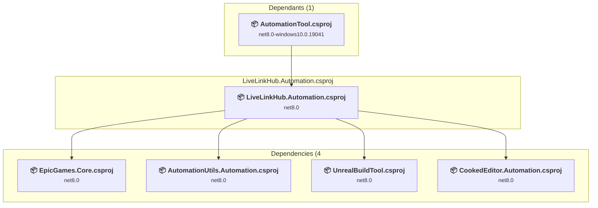

### API Compatibility

| Category | Count | Impact |
| :--- | :---: | :--- |
| 🔴 Binary Incompatible | 0 | High - Require code changes |
| 🟡 Source Incompatible | 0 | Medium - Needs re-compilation and potential conflicting API error fixing |
| 🔵 Behavioral change | 0 | Low - Behavioral changes that may require testing at runtime |
| ✅ Compatible | 94 |  |
| ***Total APIs Analyzed*** | ***94*** |  |

#### Project Package References

| Package | Type | Current Version | Suggested Version | Description |
| :--- | :---: | :---: | :---: | :--- |

<a id="f:unrealengine_574ue_57enginesourceprogramsautomationtoollocalizationlocalizationautomationcsproj"></a>
### F:\UnrealEngine_5.7.4\UE_5.7\Engine\Source\Programs\AutomationTool\Localization\Localization.Automation.csproj

#### Project Info

- **Current Target Framework:** net8.0
- **Proposed Target Framework:** net10.0
- **SDK-style**: True
- **Project Kind:** ClassLibrary
- **Dependencies**: 3
- **Dependants**: 7
- **Number of Files**: 13
- **Number of Files with Incidents**: 1
- **Lines of Code**: 1649
- **Estimated LOC to modify**: 0+ (at least 0.0% of the project)

#### Dependency Graph

Legend:
📦 SDK-style project
⚙️ Classic project

```mermaid
flowchart TB
    subgraph upstream["Dependants (7)"]
        P15["<b>📦&nbsp;AutomationTool.csproj</b><br/><small>net8.0-windows10.0.19041</small>"]
        P19["<b>📦&nbsp;CrowdinLocalization.Automation.csproj</b><br/><small>net8.0</small>"]
        P20["<b>📦&nbsp;Gauntlet.Automation.csproj</b><br/><small>net8.0</small>"]
        P29["<b>📦&nbsp;OneSkyLocalization.Automation.csproj</b><br/><small>net8.0</small>"]
        P30["<b>📦&nbsp;AutomationScripts.Automation.csproj</b><br/><small>net8.0</small>"]
        P31["<b>📦&nbsp;SmartlingLocalization.Automation.csproj</b><br/><small>net8.0</small>"]
        P36["<b>📦&nbsp;XLocLocalization.Automation.csproj</b><br/><small>net8.0</small>"]
        click P15 "#f:unrealengine_574ue_57enginesourceprogramsautomationtoolautomationtoolcsproj"
        click P19 "#f:unrealengine_574ue_57enginesourceprogramsautomationtoolcrowdinlocalizationcrowdinlocalizationautomationcsproj"
        click P20 "#f:unrealengine_574ue_57enginesourceprogramsautomationtoolgauntletgauntletautomationcsproj"
        click P29 "#f:unrealengine_574ue_57enginesourceprogramsautomationtooloneskylocalizationoneskylocalizationautomationcsproj"
        click P30 "#f:unrealengine_574ue_57enginesourceprogramsautomationtoolscriptsautomationscriptsautomationcsproj"
        click P31 "#f:unrealengine_574ue_57enginesourceprogramsautomationtoolsmartlinglocalizationsmartlinglocalizationautomationcsproj"
        click P36 "#f:unrealengine_574ue_57enginesourceprogramsautomationtoolxloclocalizationxloclocalizationautomationcsproj"
    end
    subgraph current["Localization.Automation.csproj"]
        MAIN["<b>📦&nbsp;Localization.Automation.csproj</b><br/><small>net8.0</small>"]
        click MAIN "#f:unrealengine_574ue_57enginesourceprogramsautomationtoollocalizationlocalizationautomationcsproj"
    end
    subgraph downstream["Dependencies (3"]
        P42["<b>📦&nbsp;EpicGames.Core.csproj</b><br/><small>net8.0</small>"]
        P16["<b>📦&nbsp;AutomationUtils.Automation.csproj</b><br/><small>net8.0</small>"]
        P68["<b>📦&nbsp;UnrealBuildTool.csproj</b><br/><small>net8.0</small>"]
        click P42 "#f:unrealengine_574ue_57enginesourceprogramssharedepicgamescoreepicgamescorecsproj"
        click P16 "#f:unrealengine_574ue_57enginesourceprogramsautomationtoolautomationutilsautomationutilsautomationcsproj"
        click P68 "#f:unrealengine_574ue_57enginesourceprogramsunrealbuildtoolunrealbuildtoolcsproj"
    end
    P15 --> MAIN
    P19 --> MAIN
    P20 --> MAIN
    P29 --> MAIN
    P30 --> MAIN
    P31 --> MAIN
    P36 --> MAIN
    MAIN --> P42
    MAIN --> P16
    MAIN --> P68

```

### API Compatibility

| Category | Count | Impact |
| :--- | :---: | :--- |
| 🔴 Binary Incompatible | 0 | High - Require code changes |
| 🟡 Source Incompatible | 0 | Medium - Needs re-compilation and potential conflicting API error fixing |
| 🔵 Behavioral change | 0 | Low - Behavioral changes that may require testing at runtime |
| ✅ Compatible | 1624 |  |
| ***Total APIs Analyzed*** | ***1624*** |  |

#### Project Package References

| Package | Type | Current Version | Suggested Version | Description |
| :--- | :---: | :---: | :---: | :--- |

<a id="f:unrealengine_574ue_57enginesourceprogramsautomationtoollowleveltestslowleveltestsautomationcsproj"></a>
### F:\UnrealEngine_5.7.4\UE_5.7\Engine\Source\Programs\AutomationTool\LowLevelTests\LowLevelTests.Automation.csproj

#### Project Info

- **Current Target Framework:** net8.0
- **Proposed Target Framework:** net10.0
- **SDK-style**: True
- **Project Kind:** ClassLibrary
- **Dependencies**: 5
- **Dependants**: 1
- **Number of Files**: 9
- **Number of Files with Incidents**: 1
- **Lines of Code**: 1896
- **Estimated LOC to modify**: 0+ (at least 0.0% of the project)

#### Dependency Graph

Legend:
📦 SDK-style project
⚙️ Classic project

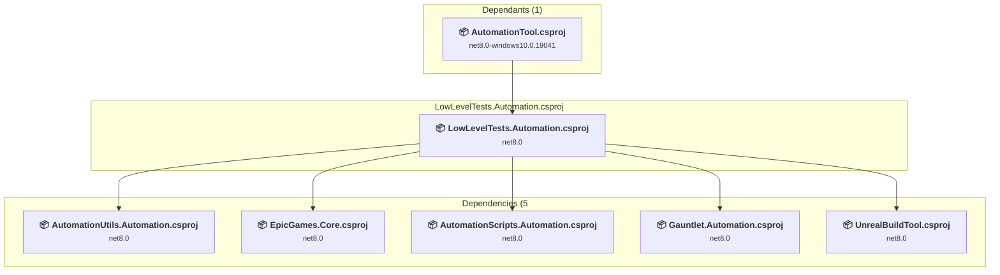

### API Compatibility

| Category | Count | Impact |
| :--- | :---: | :--- |
| 🔴 Binary Incompatible | 0 | High - Require code changes |
| 🟡 Source Incompatible | 0 | Medium - Needs re-compilation and potential conflicting API error fixing |
| 🔵 Behavioral change | 0 | Low - Behavioral changes that may require testing at runtime |
| ✅ Compatible | 1512 |  |
| ***Total APIs Analyzed*** | ***1512*** |  |

#### Project Package References

| Package | Type | Current Version | Suggested Version | Description |
| :--- | :---: | :---: | :---: | :--- |
| Microsoft.CSharp | Explicit | 4.7.0 |  | ✅Compatible |
| MySql.Data | Explicit | 6.10.9 |  | ✅Compatible |

<a id="f:unrealengine_574ue_57enginesourceprogramsautomationtoolmacmacautomationcsproj"></a>
### F:\UnrealEngine_5.7.4\UE_5.7\Engine\Source\Programs\AutomationTool\Mac\Mac.Automation.csproj

#### Project Info

- **Current Target Framework:** net8.0
- **Proposed Target Framework:** net10.0
- **SDK-style**: True
- **Project Kind:** ClassLibrary
- **Dependencies**: 4
- **Dependants**: 2
- **Number of Files**: 3
- **Number of Files with Incidents**: 2
- **Lines of Code**: 729
- **Estimated LOC to modify**: 1+ (at least 0.1% of the project)

#### Dependency Graph

Legend:
📦 SDK-style project
⚙️ Classic project

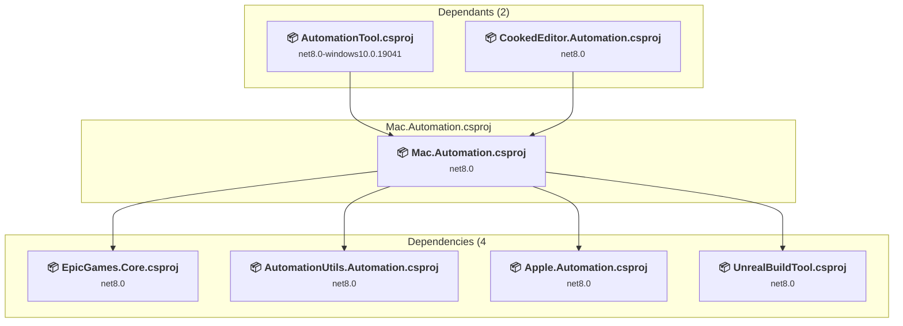

### API Compatibility

| Category | Count | Impact |
| :--- | :---: | :--- |
| 🔴 Binary Incompatible | 0 | High - Require code changes |
| 🟡 Source Incompatible | 0 | Medium - Needs re-compilation and potential conflicting API error fixing |
| 🔵 Behavioral change | 1 | Low - Behavioral changes that may require testing at runtime |
| ✅ Compatible | 589 |  |
| ***Total APIs Analyzed*** | ***590*** |  |

#### Project Package References

| Package | Type | Current Version | Suggested Version | Description |
| :--- | :---: | :---: | :---: | :--- |
| Microsoft.CSharp | Explicit | 4.7.0 |  | ✅Compatible |

<a id="f:unrealengine_574ue_57enginesourceprogramsautomationtoolmutablemutableautomationcsproj"></a>
### F:\UnrealEngine_5.7.4\UE_5.7\Engine\Source\Programs\AutomationTool\Mutable\Mutable.Automation.csproj

#### Project Info

- **Current Target Framework:** net8.0
- **Proposed Target Framework:** net10.0
- **SDK-style**: True
- **Project Kind:** ClassLibrary
- **Dependencies**: 1
- **Dependants**: 1
- **Number of Files**: 4
- **Number of Files with Incidents**: 1
- **Lines of Code**: 85
- **Estimated LOC to modify**: 0+ (at least 0.0% of the project)

#### Dependency Graph

Legend:
📦 SDK-style project
⚙️ Classic project

```mermaid
flowchart TB
    subgraph upstream["Dependants (1)"]
        P15["<b>📦&nbsp;AutomationTool.csproj</b><br/><small>net8.0-windows10.0.19041</small>"]
        click P15 "#f:unrealengine_574ue_57enginesourceprogramsautomationtoolautomationtoolcsproj"
    end
    subgraph current["Mutable.Automation.csproj"]
        MAIN["<b>📦&nbsp;Mutable.Automation.csproj</b><br/><small>net8.0</small>"]
        click MAIN "#f:unrealengine_574ue_57enginesourceprogramsautomationtoolmutablemutableautomationcsproj"
    end
    subgraph downstream["Dependencies (1"]
        P20["<b>📦&nbsp;Gauntlet.Automation.csproj</b><br/><small>net8.0</small>"]
        click P20 "#f:unrealengine_574ue_57enginesourceprogramsautomationtoolgauntletgauntletautomationcsproj"
    end
    P15 --> MAIN
    MAIN --> P20

```

### API Compatibility

| Category | Count | Impact |
| :--- | :---: | :--- |
| 🔴 Binary Incompatible | 0 | High - Require code changes |
| 🟡 Source Incompatible | 0 | Medium - Needs re-compilation and potential conflicting API error fixing |
| 🔵 Behavioral change | 0 | Low - Behavioral changes that may require testing at runtime |
| ✅ Compatible | 43 |  |
| ***Total APIs Analyzed*** | ***43*** |  |

#### Project Package References

| Package | Type | Current Version | Suggested Version | Description |
| :--- | :---: | :---: | :---: | :--- |

<a id="f:unrealengine_574ue_57enginesourceprogramsautomationtooloneskylocalizationoneskylocalizationautomationcsproj"></a>
### F:\UnrealEngine_5.7.4\UE_5.7\Engine\Source\Programs\AutomationTool\OneSkyLocalization\OneSkyLocalization.Automation.csproj

#### Project Info

- **Current Target Framework:** net8.0
- **Proposed Target Framework:** net10.0
- **SDK-style**: True
- **Project Kind:** ClassLibrary
- **Dependencies**: 4
- **Dependants**: 2
- **Number of Files**: 4
- **Number of Files with Incidents**: 1
- **Lines of Code**: 473
- **Estimated LOC to modify**: 0+ (at least 0.0% of the project)

#### Dependency Graph

Legend:
📦 SDK-style project
⚙️ Classic project

```mermaid
flowchart TB
    subgraph upstream["Dependants (2)"]
        P15["<b>📦&nbsp;AutomationTool.csproj</b><br/><small>net8.0-windows10.0.19041</small>"]
        P20["<b>📦&nbsp;Gauntlet.Automation.csproj</b><br/><small>net8.0</small>"]
        click P15 "#f:unrealengine_574ue_57enginesourceprogramsautomationtoolautomationtoolcsproj"
        click P20 "#f:unrealengine_574ue_57enginesourceprogramsautomationtoolgauntletgauntletautomationcsproj"
    end
    subgraph current["OneSkyLocalization.Automation.csproj"]
        MAIN["<b>📦&nbsp;OneSkyLocalization.Automation.csproj</b><br/><small>net8.0</small>"]
        click MAIN "#f:unrealengine_574ue_57enginesourceprogramsautomationtooloneskylocalizationoneskylocalizationautomationcsproj"
    end
    subgraph downstream["Dependencies (4"]
        P42["<b>📦&nbsp;EpicGames.Core.csproj</b><br/><small>net8.0</small>"]
        P25["<b>📦&nbsp;Localization.Automation.csproj</b><br/><small>net8.0</small>"]
        P16["<b>📦&nbsp;AutomationUtils.Automation.csproj</b><br/><small>net8.0</small>"]
        P68["<b>📦&nbsp;UnrealBuildTool.csproj</b><br/><small>net8.0</small>"]
        click P42 "#f:unrealengine_574ue_57enginesourceprogramssharedepicgamescoreepicgamescorecsproj"
        click P25 "#f:unrealengine_574ue_57enginesourceprogramsautomationtoollocalizationlocalizationautomationcsproj"
        click P16 "#f:unrealengine_574ue_57enginesourceprogramsautomationtoolautomationutilsautomationutilsautomationcsproj"
        click P68 "#f:unrealengine_574ue_57enginesourceprogramsunrealbuildtoolunrealbuildtoolcsproj"
    end
    P15 --> MAIN
    P20 --> MAIN
    MAIN --> P42
    MAIN --> P25
    MAIN --> P16
    MAIN --> P68

```

### API Compatibility

| Category | Count | Impact |
| :--- | :---: | :--- |
| 🔴 Binary Incompatible | 0 | High - Require code changes |
| 🟡 Source Incompatible | 0 | Medium - Needs re-compilation and potential conflicting API error fixing |
| 🔵 Behavioral change | 0 | Low - Behavioral changes that may require testing at runtime |
| ✅ Compatible | 429 |  |
| ***Total APIs Analyzed*** | ***429*** |  |

#### Project Package References

| Package | Type | Current Version | Suggested Version | Description |
| :--- | :---: | :---: | :---: | :--- |
| Microsoft.CSharp | Explicit | 4.7.0 |  | ✅Compatible |

<a id="f:unrealengine_574ue_57enginesourceprogramsautomationtoolscriptsautomationscriptsautomationcsproj"></a>
### F:\UnrealEngine_5.7.4\UE_5.7\Engine\Source\Programs\AutomationTool\Scripts\AutomationScripts.Automation.csproj

#### Project Info

- **Current Target Framework:** net8.0
- **Proposed Target Framework:** net10.0
- **SDK-style**: True
- **Project Kind:** ClassLibrary
- **Dependencies**: 6
- **Dependants**: 7
- **Number of Files**: 86
- **Number of Files with Incidents**: 9
- **Lines of Code**: 29451
- **Estimated LOC to modify**: 24+ (at least 0.1% of the project)

#### Dependency Graph

Legend:
📦 SDK-style project
⚙️ Classic project

```mermaid
flowchart TB
    subgraph upstream["Dependants (7)"]
        P10["<b>📦&nbsp;VisionOS.Automation.csproj</b><br/><small>net8.0</small>"]
        P13["<b>📦&nbsp;Android.Automation.csproj</b><br/><small>net8.0</small>"]
        P15["<b>📦&nbsp;AutomationTool.csproj</b><br/><small>net8.0-windows10.0.19041</small>"]
        P18["<b>📦&nbsp;CookedEditor.Automation.csproj</b><br/><small>net8.0</small>"]
        P20["<b>📦&nbsp;Gauntlet.Automation.csproj</b><br/><small>net8.0</small>"]
        P21["<b>📦&nbsp;Insights.Automation.csproj</b><br/><small>net8.0</small>"]
        P26["<b>📦&nbsp;LowLevelTests.Automation.csproj</b><br/><small>net8.0</small>"]
        click P10 "#f:unrealengine_574ue_57engineplatformsvisionossourceprogramsautomationtoolvisionosautomationcsproj"
        click P13 "#f:unrealengine_574ue_57enginesourceprogramsautomationtoolandroidandroidautomationcsproj"
        click P15 "#f:unrealengine_574ue_57enginesourceprogramsautomationtoolautomationtoolcsproj"
        click P18 "#f:unrealengine_574ue_57enginesourceprogramsautomationtoolcookededitorcookededitorautomationcsproj"
        click P20 "#f:unrealengine_574ue_57enginesourceprogramsautomationtoolgauntletgauntletautomationcsproj"
        click P21 "#f:unrealengine_574ue_57enginesourceprogramsautomationtoolinsightsinsightsautomationcsproj"
        click P26 "#f:unrealengine_574ue_57enginesourceprogramsautomationtoollowleveltestslowleveltestsautomationcsproj"
    end
    subgraph current["AutomationScripts.Automation.csproj"]
        MAIN["<b>📦&nbsp;AutomationScripts.Automation.csproj</b><br/><small>net8.0</small>"]
        click MAIN "#f:unrealengine_574ue_57enginesourceprogramsautomationtoolscriptsautomationscriptsautomationcsproj"
    end
    subgraph downstream["Dependencies (6"]
        P56["<b>📦&nbsp;EpicGames.ProjectStore.csproj</b><br/><small>net8.0</small>"]
        P42["<b>📦&nbsp;EpicGames.Core.csproj</b><br/><small>net8.0</small>"]
        P40["<b>📦&nbsp;EpicGames.Build.csproj</b><br/><small>net8.0</small>"]
        P25["<b>📦&nbsp;Localization.Automation.csproj</b><br/><small>net8.0</small>"]
        P16["<b>📦&nbsp;AutomationUtils.Automation.csproj</b><br/><small>net8.0</small>"]
        P68["<b>📦&nbsp;UnrealBuildTool.csproj</b><br/><small>net8.0</small>"]
        click P56 "#f:unrealengine_574ue_57enginesourceprogramssharedepicgamesprojectstoreepicgamesprojectstorecsproj"
        click P42 "#f:unrealengine_574ue_57enginesourceprogramssharedepicgamescoreepicgamescorecsproj"
        click P40 "#f:unrealengine_574ue_57enginesourceprogramssharedepicgamesbuildepicgamesbuildcsproj"
        click P25 "#f:unrealengine_574ue_57enginesourceprogramsautomationtoollocalizationlocalizationautomationcsproj"
        click P16 "#f:unrealengine_574ue_57enginesourceprogramsautomationtoolautomationutilsautomationutilsautomationcsproj"
        click P68 "#f:unrealengine_574ue_57enginesourceprogramsunrealbuildtoolunrealbuildtoolcsproj"
    end
    P10 --> MAIN
    P13 --> MAIN
    P15 --> MAIN
    P18 --> MAIN
    P20 --> MAIN
    P21 --> MAIN
    P26 --> MAIN
    MAIN --> P56
    MAIN --> P42
    MAIN --> P40
    MAIN --> P25
    MAIN --> P16
    MAIN --> P68

```

### API Compatibility

| Category | Count | Impact |
| :--- | :---: | :--- |
| 🔴 Binary Incompatible | 0 | High - Require code changes |
| 🟡 Source Incompatible | 11 | Medium - Needs re-compilation and potential conflicting API error fixing |
| 🔵 Behavioral change | 13 | Low - Behavioral changes that may require testing at runtime |
| ✅ Compatible | 21731 |  |
| ***Total APIs Analyzed*** | ***21755*** |  |

#### Project Package References

| Package | Type | Current Version | Suggested Version | Description |
| :--- | :---: | :---: | :---: | :--- |
| AWSSDK.S3 | Explicit | 3.3.113.2 |  | ✅Compatible |
| Microsoft.CSharp | Explicit | 4.7.0 |  | ✅Compatible |
| Microsoft.VisualStudio.OLE.Interop | Explicit | 17.14.40260 |  | ✅Compatible |

<a id="f:unrealengine_574ue_57enginesourceprogramsautomationtoolsmartlinglocalizationsmartlinglocalizationautomationcsproj"></a>
### F:\UnrealEngine_5.7.4\UE_5.7\Engine\Source\Programs\AutomationTool\SmartlingLocalization\SmartlingLocalization.Automation.csproj

#### Project Info

- **Current Target Framework:** net8.0
- **Proposed Target Framework:** net10.0
- **SDK-style**: True
- **Project Kind:** ClassLibrary
- **Dependencies**: 4
- **Dependants**: 1
- **Number of Files**: 2
- **Number of Files with Incidents**: 2
- **Lines of Code**: 607
- **Estimated LOC to modify**: 7+ (at least 1.2% of the project)

#### Dependency Graph

Legend:
📦 SDK-style project
⚙️ Classic project

```mermaid
flowchart TB
    subgraph upstream["Dependants (1)"]
        P15["<b>📦&nbsp;AutomationTool.csproj</b><br/><small>net8.0-windows10.0.19041</small>"]
        click P15 "#f:unrealengine_574ue_57enginesourceprogramsautomationtoolautomationtoolcsproj"
    end
    subgraph current["SmartlingLocalization.Automation.csproj"]
        MAIN["<b>📦&nbsp;SmartlingLocalization.Automation.csproj</b><br/><small>net8.0</small>"]
        click MAIN "#f:unrealengine_574ue_57enginesourceprogramsautomationtoolsmartlinglocalizationsmartlinglocalizationautomationcsproj"
    end
    subgraph downstream["Dependencies (4"]
        P42["<b>📦&nbsp;EpicGames.Core.csproj</b><br/><small>net8.0</small>"]
        P25["<b>📦&nbsp;Localization.Automation.csproj</b><br/><small>net8.0</small>"]
        P16["<b>📦&nbsp;AutomationUtils.Automation.csproj</b><br/><small>net8.0</small>"]
        P68["<b>📦&nbsp;UnrealBuildTool.csproj</b><br/><small>net8.0</small>"]
        click P42 "#f:unrealengine_574ue_57enginesourceprogramssharedepicgamescoreepicgamescorecsproj"
        click P25 "#f:unrealengine_574ue_57enginesourceprogramsautomationtoollocalizationlocalizationautomationcsproj"
        click P16 "#f:unrealengine_574ue_57enginesourceprogramsautomationtoolautomationutilsautomationutilsautomationcsproj"
        click P68 "#f:unrealengine_574ue_57enginesourceprogramsunrealbuildtoolunrealbuildtoolcsproj"
    end
    P15 --> MAIN
    MAIN --> P42
    MAIN --> P25
    MAIN --> P16
    MAIN --> P68

```

### API Compatibility

| Category | Count | Impact |
| :--- | :---: | :--- |
| 🔴 Binary Incompatible | 0 | High - Require code changes |
| 🟡 Source Incompatible | 1 | Medium - Needs re-compilation and potential conflicting API error fixing |
| 🔵 Behavioral change | 6 | Low - Behavioral changes that may require testing at runtime |
| ✅ Compatible | 666 |  |
| ***Total APIs Analyzed*** | ***673*** |  |

#### Project Package References

| Package | Type | Current Version | Suggested Version | Description |
| :--- | :---: | :---: | :---: | :--- |
| Microsoft.CSharp | Explicit | 4.7.0 |  | ✅Compatible |

<a id="f:unrealengine_574ue_57enginesourceprogramsautomationtoolsteamdecksteamdeckautomationcsproj"></a>
### F:\UnrealEngine_5.7.4\UE_5.7\Engine\Source\Programs\AutomationTool\SteamDeck\SteamDeck.Automation.csproj

#### Project Info

- **Current Target Framework:** net8.0
- **Proposed Target Framework:** net10.0
- **SDK-style**: True
- **Project Kind:** ClassLibrary
- **Dependencies**: 3
- **Dependants**: 3
- **Number of Files**: 2
- **Number of Files with Incidents**: 2
- **Lines of Code**: 401
- **Estimated LOC to modify**: 1+ (at least 0.2% of the project)

#### Dependency Graph

Legend:
📦 SDK-style project
⚙️ Classic project

```mermaid
flowchart TB
    subgraph upstream["Dependants (3)"]
        P15["<b>📦&nbsp;AutomationTool.csproj</b><br/><small>net8.0-windows10.0.19041</small>"]
        P23["<b>📦&nbsp;Linux.Automation.csproj</b><br/><small>net8.0</small>"]
        P35["<b>📦&nbsp;Win.Automation.csproj</b><br/><small>net8.0</small>"]
        click P15 "#f:unrealengine_574ue_57enginesourceprogramsautomationtoolautomationtoolcsproj"
        click P23 "#f:unrealengine_574ue_57enginesourceprogramsautomationtoollinuxlinuxautomationcsproj"
        click P35 "#f:unrealengine_574ue_57enginesourceprogramsautomationtoolwinwinautomationcsproj"
    end
    subgraph current["SteamDeck.Automation.csproj"]
        MAIN["<b>📦&nbsp;SteamDeck.Automation.csproj</b><br/><small>net8.0</small>"]
        click MAIN "#f:unrealengine_574ue_57enginesourceprogramsautomationtoolsteamdecksteamdeckautomationcsproj"
    end
    subgraph downstream["Dependencies (3"]
        P42["<b>📦&nbsp;EpicGames.Core.csproj</b><br/><small>net8.0</small>"]
        P16["<b>📦&nbsp;AutomationUtils.Automation.csproj</b><br/><small>net8.0</small>"]
        P68["<b>📦&nbsp;UnrealBuildTool.csproj</b><br/><small>net8.0</small>"]
        click P42 "#f:unrealengine_574ue_57enginesourceprogramssharedepicgamescoreepicgamescorecsproj"
        click P16 "#f:unrealengine_574ue_57enginesourceprogramsautomationtoolautomationutilsautomationutilsautomationcsproj"
        click P68 "#f:unrealengine_574ue_57enginesourceprogramsunrealbuildtoolunrealbuildtoolcsproj"
    end
    P15 --> MAIN
    P23 --> MAIN
    P35 --> MAIN
    MAIN --> P42
    MAIN --> P16
    MAIN --> P68

```

### API Compatibility

| Category | Count | Impact |
| :--- | :---: | :--- |
| 🔴 Binary Incompatible | 0 | High - Require code changes |
| 🟡 Source Incompatible | 0 | Medium - Needs re-compilation and potential conflicting API error fixing |
| 🔵 Behavioral change | 1 | Low - Behavioral changes that may require testing at runtime |
| ✅ Compatible | 231 |  |
| ***Total APIs Analyzed*** | ***232*** |  |

#### Project Package References

| Package | Type | Current Version | Suggested Version | Description |
| :--- | :---: | :---: | :---: | :--- |
| Microsoft.CSharp | Explicit | 4.7.0 |  | ✅Compatible |

<a id="f:unrealengine_574ue_57enginesourceprogramsautomationtoolturnkeyturnkeyautomationcsproj"></a>
### F:\UnrealEngine_5.7.4\UE_5.7\Engine\Source\Programs\AutomationTool\Turnkey\Turnkey.Automation.csproj

#### Project Info

- **Current Target Framework:** net8.0
- **Proposed Target Framework:** net10.0
- **SDK-style**: True
- **Project Kind:** ClassLibrary
- **Dependencies**: 5
- **Dependants**: 1
- **Number of Files**: 42
- **Number of Files with Incidents**: 4
- **Lines of Code**: 8412
- **Estimated LOC to modify**: 10+ (at least 0.1% of the project)

#### Dependency Graph

Legend:
📦 SDK-style project
⚙️ Classic project

```mermaid
flowchart TB
    subgraph upstream["Dependants (1)"]
        P15["<b>📦&nbsp;AutomationTool.csproj</b><br/><small>net8.0-windows10.0.19041</small>"]
        click P15 "#f:unrealengine_574ue_57enginesourceprogramsautomationtoolautomationtoolcsproj"
    end
    subgraph current["Turnkey.Automation.csproj"]
        MAIN["<b>📦&nbsp;Turnkey.Automation.csproj</b><br/><small>net8.0</small>"]
        click MAIN "#f:unrealengine_574ue_57enginesourceprogramsautomationtoolturnkeyturnkeyautomationcsproj"
    end
    subgraph downstream["Dependencies (5"]
        P20["<b>📦&nbsp;Gauntlet.Automation.csproj</b><br/><small>net8.0</small>"]
        P42["<b>📦&nbsp;EpicGames.Core.csproj</b><br/><small>net8.0</small>"]
        P40["<b>📦&nbsp;EpicGames.Build.csproj</b><br/><small>net8.0</small>"]
        P16["<b>📦&nbsp;AutomationUtils.Automation.csproj</b><br/><small>net8.0</small>"]
        P68["<b>📦&nbsp;UnrealBuildTool.csproj</b><br/><small>net8.0</small>"]
        click P20 "#f:unrealengine_574ue_57enginesourceprogramsautomationtoolgauntletgauntletautomationcsproj"
        click P42 "#f:unrealengine_574ue_57enginesourceprogramssharedepicgamescoreepicgamescorecsproj"
        click P40 "#f:unrealengine_574ue_57enginesourceprogramssharedepicgamesbuildepicgamesbuildcsproj"
        click P16 "#f:unrealengine_574ue_57enginesourceprogramsautomationtoolautomationutilsautomationutilsautomationcsproj"
        click P68 "#f:unrealengine_574ue_57enginesourceprogramsunrealbuildtoolunrealbuildtoolcsproj"
    end
    P15 --> MAIN
    MAIN --> P20
    MAIN --> P42
    MAIN --> P40
    MAIN --> P16
    MAIN --> P68

```

### API Compatibility

| Category | Count | Impact |
| :--- | :---: | :--- |
| 🔴 Binary Incompatible | 0 | High - Require code changes |
| 🟡 Source Incompatible | 1 | Medium - Needs re-compilation and potential conflicting API error fixing |
| 🔵 Behavioral change | 9 | Low - Behavioral changes that may require testing at runtime |
| ✅ Compatible | 5442 |  |
| ***Total APIs Analyzed*** | ***5452*** |  |

#### Project Package References

| Package | Type | Current Version | Suggested Version | Description |
| :--- | :---: | :---: | :---: | :--- |
| Google.Apis.Drive.v3 | Explicit | 1.33.1.1232 |  | ✅Compatible |
| Microsoft.CSharp | Explicit | 4.7.0 |  | ✅Compatible |
| System.IO.FileSystem.AccessControl | Explicit | 4.7.0 |  | NuGet package functionality is included with framework reference |

<a id="f:unrealengine_574ue_57enginesourceprogramsautomationtooltvostvosautomationcsproj"></a>
### F:\UnrealEngine_5.7.4\UE_5.7\Engine\Source\Programs\AutomationTool\TVOS\TVOS.Automation.csproj

#### Project Info

- **Current Target Framework:** net8.0
- **Proposed Target Framework:** net10.0
- **SDK-style**: True
- **Project Kind:** ClassLibrary
- **Dependencies**: 4
- **Dependants**: 1
- **Number of Files**: 3
- **Number of Files with Incidents**: 1
- **Lines of Code**: 214
- **Estimated LOC to modify**: 0+ (at least 0.0% of the project)

#### Dependency Graph

Legend:
📦 SDK-style project
⚙️ Classic project

```mermaid
flowchart TB
    subgraph upstream["Dependants (1)"]
        P15["<b>📦&nbsp;AutomationTool.csproj</b><br/><small>net8.0-windows10.0.19041</small>"]
        click P15 "#f:unrealengine_574ue_57enginesourceprogramsautomationtoolautomationtoolcsproj"
    end
    subgraph current["TVOS.Automation.csproj"]
        MAIN["<b>📦&nbsp;TVOS.Automation.csproj</b><br/><small>net8.0</small>"]
        click MAIN "#f:unrealengine_574ue_57enginesourceprogramsautomationtooltvostvosautomationcsproj"
    end
    subgraph downstream["Dependencies (4"]
        P42["<b>📦&nbsp;EpicGames.Core.csproj</b><br/><small>net8.0</small>"]
        P16["<b>📦&nbsp;AutomationUtils.Automation.csproj</b><br/><small>net8.0</small>"]
        P22["<b>📦&nbsp;IOS.Automation.csproj</b><br/><small>net8.0</small>"]
        P68["<b>📦&nbsp;UnrealBuildTool.csproj</b><br/><small>net8.0</small>"]
        click P42 "#f:unrealengine_574ue_57enginesourceprogramssharedepicgamescoreepicgamescorecsproj"
        click P16 "#f:unrealengine_574ue_57enginesourceprogramsautomationtoolautomationutilsautomationutilsautomationcsproj"
        click P22 "#f:unrealengine_574ue_57enginesourceprogramsautomationtooliosiosautomationcsproj"
        click P68 "#f:unrealengine_574ue_57enginesourceprogramsunrealbuildtoolunrealbuildtoolcsproj"
    end
    P15 --> MAIN
    MAIN --> P42
    MAIN --> P16
    MAIN --> P22
    MAIN --> P68

```

### API Compatibility

| Category | Count | Impact |
| :--- | :---: | :--- |
| 🔴 Binary Incompatible | 0 | High - Require code changes |
| 🟡 Source Incompatible | 0 | Medium - Needs re-compilation and potential conflicting API error fixing |
| 🔵 Behavioral change | 0 | Low - Behavioral changes that may require testing at runtime |
| ✅ Compatible | 107 |  |
| ***Total APIs Analyzed*** | ***107*** |  |

#### Project Package References

| Package | Type | Current Version | Suggested Version | Description |
| :--- | :---: | :---: | :---: | :--- |
| Microsoft.CSharp | Explicit | 4.7.0 |  | ✅Compatible |

<a id="f:unrealengine_574ue_57enginesourceprogramsautomationtoolwinwinautomationcsproj"></a>
### F:\UnrealEngine_5.7.4\UE_5.7\Engine\Source\Programs\AutomationTool\Win\Win.Automation.csproj

#### Project Info

- **Current Target Framework:** net8.0
- **Proposed Target Framework:** net10.0
- **SDK-style**: True
- **Project Kind:** ClassLibrary
- **Dependencies**: 5
- **Dependants**: 2
- **Number of Files**: 5
- **Number of Files with Incidents**: 2
- **Lines of Code**: 1524
- **Estimated LOC to modify**: 1+ (at least 0.1% of the project)

#### Dependency Graph

Legend:
📦 SDK-style project
⚙️ Classic project

```mermaid
flowchart TB
    subgraph upstream["Dependants (2)"]
        P15["<b>📦&nbsp;AutomationTool.csproj</b><br/><small>net8.0-windows10.0.19041</small>"]
        P18["<b>📦&nbsp;CookedEditor.Automation.csproj</b><br/><small>net8.0</small>"]
        click P15 "#f:unrealengine_574ue_57enginesourceprogramsautomationtoolautomationtoolcsproj"
        click P18 "#f:unrealengine_574ue_57enginesourceprogramsautomationtoolcookededitorcookededitorautomationcsproj"
    end
    subgraph current["Win.Automation.csproj"]
        MAIN["<b>📦&nbsp;Win.Automation.csproj</b><br/><small>net8.0</small>"]
        click MAIN "#f:unrealengine_574ue_57enginesourceprogramsautomationtoolwinwinautomationcsproj"
    end
    subgraph downstream["Dependencies (5"]
        P17["<b>📦&nbsp;BuildGraph.Automation.csproj</b><br/><small>net8.0</small>"]
        P32["<b>📦&nbsp;SteamDeck.Automation.csproj</b><br/><small>net8.0</small>"]
        P42["<b>📦&nbsp;EpicGames.Core.csproj</b><br/><small>net8.0</small>"]
        P16["<b>📦&nbsp;AutomationUtils.Automation.csproj</b><br/><small>net8.0</small>"]
        P68["<b>📦&nbsp;UnrealBuildTool.csproj</b><br/><small>net8.0</small>"]
        click P17 "#f:unrealengine_574ue_57enginesourceprogramsautomationtoolbuildgraphbuildgraphautomationcsproj"
        click P32 "#f:unrealengine_574ue_57enginesourceprogramsautomationtoolsteamdecksteamdeckautomationcsproj"
        click P42 "#f:unrealengine_574ue_57enginesourceprogramssharedepicgamescoreepicgamescorecsproj"
        click P16 "#f:unrealengine_574ue_57enginesourceprogramsautomationtoolautomationutilsautomationutilsautomationcsproj"
        click P68 "#f:unrealengine_574ue_57enginesourceprogramsunrealbuildtoolunrealbuildtoolcsproj"
    end
    P15 --> MAIN
    P18 --> MAIN
    MAIN --> P17
    MAIN --> P32
    MAIN --> P42
    MAIN --> P16
    MAIN --> P68

```

### API Compatibility

| Category | Count | Impact |
| :--- | :---: | :--- |
| 🔴 Binary Incompatible | 0 | High - Require code changes |
| 🟡 Source Incompatible | 0 | Medium - Needs re-compilation and potential conflicting API error fixing |
| 🔵 Behavioral change | 1 | Low - Behavioral changes that may require testing at runtime |
| ✅ Compatible | 1267 |  |
| ***Total APIs Analyzed*** | ***1268*** |  |

#### Project Package References

| Package | Type | Current Version | Suggested Version | Description |
| :--- | :---: | :---: | :---: | :--- |
| Microsoft.CSharp | Explicit | 4.7.0 |  | ✅Compatible |

<a id="f:unrealengine_574ue_57enginesourceprogramsautomationtoolxloclocalizationxloclocalizationautomationcsproj"></a>
### F:\UnrealEngine_5.7.4\UE_5.7\Engine\Source\Programs\AutomationTool\XLocLocalization\XLocLocalization.Automation.csproj

#### Project Info

- **Current Target Framework:** net8.0
- **Proposed Target Framework:** net10.0
- **SDK-style**: True
- **Project Kind:** ClassLibrary
- **Dependencies**: 4
- **Dependants**: 2
- **Number of Files**: 4
- **Number of Files with Incidents**: 4
- **Lines of Code**: 3042
- **Estimated LOC to modify**: 56+ (at least 1.8% of the project)

#### Dependency Graph

Legend:
📦 SDK-style project
⚙️ Classic project

```mermaid
flowchart TB
    subgraph upstream["Dependants (2)"]
        P15["<b>📦&nbsp;AutomationTool.csproj</b><br/><small>net8.0-windows10.0.19041</small>"]
        P20["<b>📦&nbsp;Gauntlet.Automation.csproj</b><br/><small>net8.0</small>"]
        click P15 "#f:unrealengine_574ue_57enginesourceprogramsautomationtoolautomationtoolcsproj"
        click P20 "#f:unrealengine_574ue_57enginesourceprogramsautomationtoolgauntletgauntletautomationcsproj"
    end
    subgraph current["XLocLocalization.Automation.csproj"]
        MAIN["<b>📦&nbsp;XLocLocalization.Automation.csproj</b><br/><small>net8.0</small>"]
        click MAIN "#f:unrealengine_574ue_57enginesourceprogramsautomationtoolxloclocalizationxloclocalizationautomationcsproj"
    end
    subgraph downstream["Dependencies (4"]
        P42["<b>📦&nbsp;EpicGames.Core.csproj</b><br/><small>net8.0</small>"]
        P25["<b>📦&nbsp;Localization.Automation.csproj</b><br/><small>net8.0</small>"]
        P16["<b>📦&nbsp;AutomationUtils.Automation.csproj</b><br/><small>net8.0</small>"]
        P68["<b>📦&nbsp;UnrealBuildTool.csproj</b><br/><small>net8.0</small>"]
        click P42 "#f:unrealengine_574ue_57enginesourceprogramssharedepicgamescoreepicgamescorecsproj"
        click P25 "#f:unrealengine_574ue_57enginesourceprogramsautomationtoollocalizationlocalizationautomationcsproj"
        click P16 "#f:unrealengine_574ue_57enginesourceprogramsautomationtoolautomationutilsautomationutilsautomationcsproj"
        click P68 "#f:unrealengine_574ue_57enginesourceprogramsunrealbuildtoolunrealbuildtoolcsproj"
    end
    P15 --> MAIN
    P20 --> MAIN
    MAIN --> P42
    MAIN --> P25
    MAIN --> P16
    MAIN --> P68

```

### API Compatibility

| Category | Count | Impact |
| :--- | :---: | :--- |
| 🔴 Binary Incompatible | 0 | High - Require code changes |
| 🟡 Source Incompatible | 52 | Medium - Needs re-compilation and potential conflicting API error fixing |
| 🔵 Behavioral change | 4 | Low - Behavioral changes that may require testing at runtime |
| ✅ Compatible | 1848 |  |
| ***Total APIs Analyzed*** | ***1904*** |  |

#### Project Package References

| Package | Type | Current Version | Suggested Version | Description |
| :--- | :---: | :---: | :---: | :--- |
| Microsoft.CSharp | Explicit | 4.7.0 |  | ✅Compatible |
| System.ServiceModel.Http | Explicit | 4.10.3 |  | ✅Compatible |

#### Project Technologies and Features

| Technology | Issues | Percentage | Migration Path |
| :--- | :---: | :---: | :--- |
| WCF Client APIs | 51 | 91.1% | WCF client-side APIs for building service clients that communicate with WCF services. These APIs are available as exact equivalents via NuGet packages - add System.ServiceModel.* NuGet packages (System.ServiceModel.Http, System.ServiceModel.Primitives, System.ServiceModel.NetTcp, etc.) |

<a id="f:unrealengine_574ue_57enginesourceprogramsautomationtoollauncherautomationtoollaunchercsproj"></a>
### F:\UnrealEngine_5.7.4\UE_5.7\Engine\Source\Programs\AutomationToolLauncher\AutomationToolLauncher.csproj

#### Project Info

- **Current Target Framework:** net6.0
- **Proposed Target Framework:** net10.0
- **SDK-style**: True
- **Project Kind:** DotNetCoreApp
- **Dependencies**: 0
- **Dependants**: 0
- **Number of Files**: 3
- **Number of Files with Incidents**: 1
- **Lines of Code**: 87
- **Estimated LOC to modify**: 0+ (at least 0.0% of the project)

#### Dependency Graph

Legend:
📦 SDK-style project
⚙️ Classic project

```mermaid
flowchart TB
    subgraph current["AutomationToolLauncher.csproj"]
        MAIN["<b>📦&nbsp;AutomationToolLauncher.csproj</b><br/><small>net6.0</small>"]
        click MAIN "#f:unrealengine_574ue_57enginesourceprogramsautomationtoollauncherautomationtoollaunchercsproj"
    end

```

### API Compatibility

| Category | Count | Impact |
| :--- | :---: | :--- |
| 🔴 Binary Incompatible | 0 | High - Require code changes |
| 🟡 Source Incompatible | 0 | Medium - Needs re-compilation and potential conflicting API error fixing |
| 🔵 Behavioral change | 0 | Low - Behavioral changes that may require testing at runtime |
| ✅ Compatible | 49 |  |
| ***Total APIs Analyzed*** | ***49*** |  |

#### Project Package References

| Package | Type | Current Version | Suggested Version | Description |
| :--- | :---: | :---: | :---: | :--- |

<a id="f:unrealengine_574ue_57enginesourceprogramssharedepicgamesaspnetepicgamesaspnetcsproj"></a>
### F:\UnrealEngine_5.7.4\UE_5.7\Engine\Source\Programs\Shared\EpicGames.AspNet\EpicGames.AspNet.csproj

#### Project Info

- **Current Target Framework:** net8.0
- **Proposed Target Framework:** net10.0
- **SDK-style**: True
- **Project Kind:** AspNetCore
- **Dependencies**: 2
- **Dependants**: 0
- **Number of Files**: 5
- **Number of Files with Incidents**: 1
- **Lines of Code**: 486
- **Estimated LOC to modify**: 0+ (at least 0.0% of the project)

#### Dependency Graph

Legend:
📦 SDK-style project
⚙️ Classic project

```mermaid
flowchart TB
    subgraph current["EpicGames.AspNet.csproj"]
        MAIN["<b>📦&nbsp;EpicGames.AspNet.csproj</b><br/><small>net8.0</small>"]
        click MAIN "#f:unrealengine_574ue_57enginesourceprogramssharedepicgamesaspnetepicgamesaspnetcsproj"
    end
    subgraph downstream["Dependencies (2"]
        P42["<b>📦&nbsp;EpicGames.Core.csproj</b><br/><small>net8.0</small>"]
        P61["<b>📦&nbsp;EpicGames.Serialization.csproj</b><br/><small>net8.0</small>"]
        click P42 "#f:unrealengine_574ue_57enginesourceprogramssharedepicgamescoreepicgamescorecsproj"
        click P61 "#f:unrealengine_574ue_57enginesourceprogramssharedepicgamesserializationepicgamesserializationcsproj"
    end
    MAIN --> P42
    MAIN --> P61

```

### API Compatibility

| Category | Count | Impact |
| :--- | :---: | :--- |
| 🔴 Binary Incompatible | 0 | High - Require code changes |
| 🟡 Source Incompatible | 0 | Medium - Needs re-compilation and potential conflicting API error fixing |
| 🔵 Behavioral change | 0 | Low - Behavioral changes that may require testing at runtime |
| ✅ Compatible | 446 |  |
| ***Total APIs Analyzed*** | ***446*** |  |

#### Project Package References

| Package | Type | Current Version | Suggested Version | Description |
| :--- | :---: | :---: | :---: | :--- |
| Microsoft.CSharp | Explicit | 4.7.0 |  | ✅Compatible |
| System.Text.Json | Explicit | 8.0.6 | 10.0.6 | NuGet package upgrade is recommended |

<a id="f:unrealengine_574ue_57enginesourceprogramssharedepicgamesbuildepicgamesbuildcsproj"></a>
### F:\UnrealEngine_5.7.4\UE_5.7\Engine\Source\Programs\Shared\EpicGames.Build\EpicGames.Build.csproj

#### Project Info

- **Current Target Framework:** net8.0
- **Proposed Target Framework:** net10.0
- **SDK-style**: True
- **Project Kind:** ClassLibrary
- **Dependencies**: 3
- **Dependants**: 10
- **Number of Files**: 23
- **Number of Files with Incidents**: 3
- **Lines of Code**: 7921
- **Estimated LOC to modify**: 8+ (at least 0.1% of the project)

#### Dependency Graph

Legend:
📦 SDK-style project
⚙️ Classic project

```mermaid
flowchart TB
    subgraph upstream["Dependants (10)"]
        P1["<b>📦&nbsp;Chess3DDemoModuleRules.csproj</b><br/><small>net8.0</small>"]
        P8["<b>📦&nbsp;UE5ProgramRules.csproj</b><br/><small>net8.0</small>"]
        P9["<b>📦&nbsp;UE5Rules.csproj</b><br/><small>net8.0</small>"]
        P15["<b>📦&nbsp;AutomationTool.csproj</b><br/><small>net8.0-windows10.0.19041</small>"]
        P16["<b>📦&nbsp;AutomationUtils.Automation.csproj</b><br/><small>net8.0</small>"]
        P30["<b>📦&nbsp;AutomationScripts.Automation.csproj</b><br/><small>net8.0</small>"]
        P33["<b>📦&nbsp;Turnkey.Automation.csproj</b><br/><small>net8.0</small>"]
        P56["<b>📦&nbsp;EpicGames.ProjectStore.csproj</b><br/><small>net8.0</small>"]
        P66["<b>📦&nbsp;EpicGames.UHT.csproj</b><br/><small>net8.0</small>"]
        P68["<b>📦&nbsp;UnrealBuildTool.csproj</b><br/><small>net8.0</small>"]
        click P1 "#intermediatebuildbuildrulesprojectschess3ddemomoduleruleschess3ddemomodulerulescsproj"
        click P8 "#f:unrealengine_574ue_57engineintermediatebuildbuildrulesprojectsue5programrulesue5programrulescsproj"
        click P9 "#f:unrealengine_574ue_57engineintermediatebuildbuildrulesprojectsue5rulesue5rulescsproj"
        click P15 "#f:unrealengine_574ue_57enginesourceprogramsautomationtoolautomationtoolcsproj"
        click P16 "#f:unrealengine_574ue_57enginesourceprogramsautomationtoolautomationutilsautomationutilsautomationcsproj"
        click P30 "#f:unrealengine_574ue_57enginesourceprogramsautomationtoolscriptsautomationscriptsautomationcsproj"
        click P33 "#f:unrealengine_574ue_57enginesourceprogramsautomationtoolturnkeyturnkeyautomationcsproj"
        click P56 "#f:unrealengine_574ue_57enginesourceprogramssharedepicgamesprojectstoreepicgamesprojectstorecsproj"
        click P66 "#f:unrealengine_574ue_57enginesourceprogramssharedepicgamesuhtepicgamesuhtcsproj"
        click P68 "#f:unrealengine_574ue_57enginesourceprogramsunrealbuildtoolunrealbuildtoolcsproj"
    end
    subgraph current["EpicGames.Build.csproj"]
        MAIN["<b>📦&nbsp;EpicGames.Build.csproj</b><br/><small>net8.0</small>"]
        click MAIN "#f:unrealengine_574ue_57enginesourceprogramssharedepicgamesbuildepicgamesbuildcsproj"
    end
    subgraph downstream["Dependencies (3"]
        P42["<b>📦&nbsp;EpicGames.Core.csproj</b><br/><small>net8.0</small>"]
        P48["<b>📦&nbsp;EpicGames.MsBuild.csproj</b><br/><small>net8.0</small>"]
        P46["<b>📦&nbsp;EpicGames.IoHash.csproj</b><br/><small>net8.0</small>"]
        click P42 "#f:unrealengine_574ue_57enginesourceprogramssharedepicgamescoreepicgamescorecsproj"
        click P48 "#f:unrealengine_574ue_57enginesourceprogramssharedepicgamesmsbuildepicgamesmsbuildcsproj"
        click P46 "#f:unrealengine_574ue_57enginesourceprogramssharedepicgamesiohashepicgamesiohashcsproj"
    end
    P1 --> MAIN
    P8 --> MAIN
    P9 --> MAIN
    P15 --> MAIN
    P16 --> MAIN
    P30 --> MAIN
    P33 --> MAIN
    P56 --> MAIN
    P66 --> MAIN
    P68 --> MAIN
    MAIN --> P42
    MAIN --> P48
    MAIN --> P46

```

### API Compatibility

| Category | Count | Impact |
| :--- | :---: | :--- |
| 🔴 Binary Incompatible | 0 | High - Require code changes |
| 🟡 Source Incompatible | 0 | Medium - Needs re-compilation and potential conflicting API error fixing |
| 🔵 Behavioral change | 8 | Low - Behavioral changes that may require testing at runtime |
| ✅ Compatible | 5517 |  |
| ***Total APIs Analyzed*** | ***5525*** |  |

#### Project Package References

| Package | Type | Current Version | Suggested Version | Description |
| :--- | :---: | :---: | :---: | :--- |
| Microsoft.CSharp | Explicit | 4.7.0 |  | ✅Compatible |
| Microsoft.Extensions.FileSystemGlobbing | Explicit | 8.0.0 | 10.0.6 | NuGet package upgrade is recommended |
| System.Security.Permissions | Explicit | 8.0.0 |  | ✅Compatible |

<a id="f:unrealengine_574ue_57enginesourceprogramssharedepicgamesbuildgraphtestsepicgamesbuildgraphtestscsproj"></a>
### F:\UnrealEngine_5.7.4\UE_5.7\Engine\Source\Programs\Shared\EpicGames.BuildGraph.Tests\EpicGames.BuildGraph.Tests.csproj

#### Project Info

- **Current Target Framework:** net8.0
- **Proposed Target Framework:** net10.0
- **SDK-style**: True
- **Project Kind:** DotNetCoreApp
- **Dependencies**: 1
- **Dependants**: 0
- **Number of Files**: 6
- **Number of Files with Incidents**: 1
- **Lines of Code**: 817
- **Estimated LOC to modify**: 0+ (at least 0.0% of the project)

#### Dependency Graph

Legend:
📦 SDK-style project
⚙️ Classic project

```mermaid
flowchart TB
    subgraph current["EpicGames.BuildGraph.Tests.csproj"]
        MAIN["<b>📦&nbsp;EpicGames.BuildGraph.Tests.csproj</b><br/><small>net8.0</small>"]
        click MAIN "#f:unrealengine_574ue_57enginesourceprogramssharedepicgamesbuildgraphtestsepicgamesbuildgraphtestscsproj"
    end
    subgraph downstream["Dependencies (1"]
        P39["<b>📦&nbsp;EpicGames.BuildGraph.csproj</b><br/><small>net8.0</small>"]
        click P39 "#f:unrealengine_574ue_57enginesourceprogramssharedepicgamesbuildgraphepicgamesbuildgraphcsproj"
    end
    MAIN --> P39

```

### API Compatibility

| Category | Count | Impact |
| :--- | :---: | :--- |
| 🔴 Binary Incompatible | 0 | High - Require code changes |
| 🟡 Source Incompatible | 0 | Medium - Needs re-compilation and potential conflicting API error fixing |
| 🔵 Behavioral change | 0 | Low - Behavioral changes that may require testing at runtime |
| ✅ Compatible | 1096 |  |
| ***Total APIs Analyzed*** | ***1096*** |  |

#### Project Package References

| Package | Type | Current Version | Suggested Version | Description |
| :--- | :---: | :---: | :---: | :--- |
| coverlet.collector | Explicit | 6.0.4 |  | ✅Compatible |
| Microsoft.NET.Test.Sdk | Explicit | 17.14.1 |  | ✅Compatible |
| MSTest.TestAdapter | Explicit | 3.6.4 |  | ✅Compatible |
| MSTest.TestFramework | Explicit | 3.6.4 |  | ✅Compatible |
| System.Text.Json | Explicit | 8.0.6 |  | ✅Compatible |

<a id="f:unrealengine_574ue_57enginesourceprogramssharedepicgamesbuildgraphepicgamesbuildgraphcsproj"></a>
### F:\UnrealEngine_5.7.4\UE_5.7\Engine\Source\Programs\Shared\EpicGames.BuildGraph\EpicGames.BuildGraph.csproj

#### Project Info

- **Current Target Framework:** net8.0
- **Proposed Target Framework:** net10.0
- **SDK-style**: True
- **Project Kind:** ClassLibrary
- **Dependencies**: 2
- **Dependants**: 2
- **Number of Files**: 34
- **Number of Files with Incidents**: 1
- **Lines of Code**: 7587
- **Estimated LOC to modify**: 0+ (at least 0.0% of the project)

#### Dependency Graph

Legend:
📦 SDK-style project
⚙️ Classic project

```mermaid
flowchart TB
    subgraph upstream["Dependants (2)"]
        P17["<b>📦&nbsp;BuildGraph.Automation.csproj</b><br/><small>net8.0</small>"]
        P38["<b>📦&nbsp;EpicGames.BuildGraph.Tests.csproj</b><br/><small>net8.0</small>"]
        click P17 "#f:unrealengine_574ue_57enginesourceprogramsautomationtoolbuildgraphbuildgraphautomationcsproj"
        click P38 "#f:unrealengine_574ue_57enginesourceprogramssharedepicgamesbuildgraphtestsepicgamesbuildgraphtestscsproj"
    end
    subgraph current["EpicGames.BuildGraph.csproj"]
        MAIN["<b>📦&nbsp;EpicGames.BuildGraph.csproj</b><br/><small>net8.0</small>"]
        click MAIN "#f:unrealengine_574ue_57enginesourceprogramssharedepicgamesbuildgraphepicgamesbuildgraphcsproj"
    end
    subgraph downstream["Dependencies (2"]
        P42["<b>📦&nbsp;EpicGames.Core.csproj</b><br/><small>net8.0</small>"]
        P61["<b>📦&nbsp;EpicGames.Serialization.csproj</b><br/><small>net8.0</small>"]
        click P42 "#f:unrealengine_574ue_57enginesourceprogramssharedepicgamescoreepicgamescorecsproj"
        click P61 "#f:unrealengine_574ue_57enginesourceprogramssharedepicgamesserializationepicgamesserializationcsproj"
    end
    P17 --> MAIN
    P38 --> MAIN
    MAIN --> P42
    MAIN --> P61

```

### API Compatibility

| Category | Count | Impact |
| :--- | :---: | :--- |
| 🔴 Binary Incompatible | 0 | High - Require code changes |
| 🟡 Source Incompatible | 0 | Medium - Needs re-compilation and potential conflicting API error fixing |
| 🔵 Behavioral change | 0 | Low - Behavioral changes that may require testing at runtime |
| ✅ Compatible | 3388 |  |
| ***Total APIs Analyzed*** | ***3388*** |  |

#### Project Package References

| Package | Type | Current Version | Suggested Version | Description |
| :--- | :---: | :---: | :---: | :--- |

<a id="f:unrealengine_574ue_57enginesourceprogramssharedepicgamescoretestsepicgamescoretestscsproj"></a>
### F:\UnrealEngine_5.7.4\UE_5.7\Engine\Source\Programs\Shared\EpicGames.Core.Tests\EpicGames.Core.Tests.csproj

#### Project Info

- **Current Target Framework:** net8.0
- **Proposed Target Framework:** net10.0
- **SDK-style**: True
- **Project Kind:** DotNetCoreApp
- **Dependencies**: 1
- **Dependants**: 0
- **Number of Files**: 19
- **Number of Files with Incidents**: 4
- **Lines of Code**: 2022
- **Estimated LOC to modify**: 5+ (at least 0.2% of the project)

#### Dependency Graph

Legend:
📦 SDK-style project
⚙️ Classic project

```mermaid
flowchart TB
    subgraph current["EpicGames.Core.Tests.csproj"]
        MAIN["<b>📦&nbsp;EpicGames.Core.Tests.csproj</b><br/><small>net8.0</small>"]
        click MAIN "#f:unrealengine_574ue_57enginesourceprogramssharedepicgamescoretestsepicgamescoretestscsproj"
    end
    subgraph downstream["Dependencies (1"]
        P42["<b>📦&nbsp;EpicGames.Core.csproj</b><br/><small>net8.0</small>"]
        click P42 "#f:unrealengine_574ue_57enginesourceprogramssharedepicgamescoreepicgamescorecsproj"
    end
    MAIN --> P42

```

### API Compatibility

| Category | Count | Impact |
| :--- | :---: | :--- |
| 🔴 Binary Incompatible | 0 | High - Require code changes |
| 🟡 Source Incompatible | 0 | Medium - Needs re-compilation and potential conflicting API error fixing |
| 🔵 Behavioral change | 5 | Low - Behavioral changes that may require testing at runtime |
| ✅ Compatible | 2571 |  |
| ***Total APIs Analyzed*** | ***2576*** |  |

#### Project Package References

| Package | Type | Current Version | Suggested Version | Description |
| :--- | :---: | :---: | :---: | :--- |
| coverlet.collector | Explicit | 6.0.4 |  | ✅Compatible |
| Microsoft.NET.Test.Sdk | Explicit | 17.14.1 |  | ✅Compatible |
| MSTest.TestAdapter | Explicit | 3.6.4 |  | ✅Compatible |
| MSTest.TestFramework | Explicit | 3.6.4 |  | ✅Compatible |

<a id="f:unrealengine_574ue_57enginesourceprogramssharedepicgamescoreepicgamescorecsproj"></a>
### F:\UnrealEngine_5.7.4\UE_5.7\Engine\Source\Programs\Shared\EpicGames.Core\EpicGames.Core.csproj

#### Project Info

- **Current Target Framework:** net8.0
- **Proposed Target Framework:** net10.0
- **SDK-style**: True
- **Project Kind:** ClassLibrary
- **Dependencies**: 0
- **Dependants**: 38
- **Number of Files**: 136
- **Number of Files with Incidents**: 18
- **Lines of Code**: 37625
- **Estimated LOC to modify**: 71+ (at least 0.2% of the project)

#### Dependency Graph

Legend:
📦 SDK-style project
⚙️ Classic project

```mermaid
flowchart TB
    subgraph upstream["Dependants (38)"]
        P10["<b>📦&nbsp;VisionOS.Automation.csproj</b><br/><small>net8.0</small>"]
        P13["<b>📦&nbsp;Android.Automation.csproj</b><br/><small>net8.0</small>"]
        P14["<b>📦&nbsp;Apple.Automation.csproj</b><br/><small>net8.0</small>"]
        P15["<b>📦&nbsp;AutomationTool.csproj</b><br/><small>net8.0-windows10.0.19041</small>"]
        P16["<b>📦&nbsp;AutomationUtils.Automation.csproj</b><br/><small>net8.0</small>"]
        P17["<b>📦&nbsp;BuildGraph.Automation.csproj</b><br/><small>net8.0</small>"]
        P18["<b>📦&nbsp;CookedEditor.Automation.csproj</b><br/><small>net8.0</small>"]
        P19["<b>📦&nbsp;CrowdinLocalization.Automation.csproj</b><br/><small>net8.0</small>"]
        P20["<b>📦&nbsp;Gauntlet.Automation.csproj</b><br/><small>net8.0</small>"]
        P21["<b>📦&nbsp;Insights.Automation.csproj</b><br/><small>net8.0</small>"]
        P22["<b>📦&nbsp;IOS.Automation.csproj</b><br/><small>net8.0</small>"]
        P23["<b>📦&nbsp;Linux.Automation.csproj</b><br/><small>net8.0</small>"]
        P24["<b>📦&nbsp;LiveLinkHub.Automation.csproj</b><br/><small>net8.0</small>"]
        P25["<b>📦&nbsp;Localization.Automation.csproj</b><br/><small>net8.0</small>"]
        P26["<b>📦&nbsp;LowLevelTests.Automation.csproj</b><br/><small>net8.0</small>"]
        P27["<b>📦&nbsp;Mac.Automation.csproj</b><br/><small>net8.0</small>"]
        P29["<b>📦&nbsp;OneSkyLocalization.Automation.csproj</b><br/><small>net8.0</small>"]
        P30["<b>📦&nbsp;AutomationScripts.Automation.csproj</b><br/><small>net8.0</small>"]
        P31["<b>📦&nbsp;SmartlingLocalization.Automation.csproj</b><br/><small>net8.0</small>"]
        P32["<b>📦&nbsp;SteamDeck.Automation.csproj</b><br/><small>net8.0</small>"]
        P33["<b>📦&nbsp;Turnkey.Automation.csproj</b><br/><small>net8.0</small>"]
        P34["<b>📦&nbsp;TVOS.Automation.csproj</b><br/><small>net8.0</small>"]
        P35["<b>📦&nbsp;Win.Automation.csproj</b><br/><small>net8.0</small>"]
        P36["<b>📦&nbsp;XLocLocalization.Automation.csproj</b><br/><small>net8.0</small>"]
        P37["<b>📦&nbsp;EpicGames.AspNet.csproj</b><br/><small>net8.0</small>"]
        P39["<b>📦&nbsp;EpicGames.BuildGraph.csproj</b><br/><small>net8.0</small>"]
        P40["<b>📦&nbsp;EpicGames.Build.csproj</b><br/><small>net8.0</small>"]
        P41["<b>📦&nbsp;EpicGames.Core.Tests.csproj</b><br/><small>net8.0</small>"]
        P43["<b>📦&nbsp;EpicGames.Horde.Tests.csproj</b><br/><small>net8.0</small>"]
        P44["<b>📦&nbsp;EpicGames.Horde.csproj</b><br/><small>net8.0</small>"]
        P46["<b>📦&nbsp;EpicGames.IoHash.csproj</b><br/><small>net8.0</small>"]
        P48["<b>📦&nbsp;EpicGames.MsBuild.csproj</b><br/><small>net8.0</small>"]
        P53["<b>📦&nbsp;EpicGames.Perforce.Managed.csproj</b><br/><small>net8.0</small>"]
        P55["<b>📦&nbsp;EpicGames.Perforce.csproj</b><br/><small>net8.0</small>"]
        P56["<b>📦&nbsp;EpicGames.ProjectStore.csproj</b><br/><small>net8.0</small>"]
        P58["<b>📦&nbsp;EpicGames.Redis.csproj</b><br/><small>net8.0</small>"]
        P66["<b>📦&nbsp;EpicGames.UHT.csproj</b><br/><small>net8.0</small>"]
        P68["<b>📦&nbsp;UnrealBuildTool.csproj</b><br/><small>net8.0</small>"]
        click P10 "#f:unrealengine_574ue_57engineplatformsvisionossourceprogramsautomationtoolvisionosautomationcsproj"
        click P13 "#f:unrealengine_574ue_57enginesourceprogramsautomationtoolandroidandroidautomationcsproj"
        click P14 "#f:unrealengine_574ue_57enginesourceprogramsautomationtoolappleappleautomationcsproj"
        click P15 "#f:unrealengine_574ue_57enginesourceprogramsautomationtoolautomationtoolcsproj"
        click P16 "#f:unrealengine_574ue_57enginesourceprogramsautomationtoolautomationutilsautomationutilsautomationcsproj"
        click P17 "#f:unrealengine_574ue_57enginesourceprogramsautomationtoolbuildgraphbuildgraphautomationcsproj"
        click P18 "#f:unrealengine_574ue_57enginesourceprogramsautomationtoolcookededitorcookededitorautomationcsproj"
        click P19 "#f:unrealengine_574ue_57enginesourceprogramsautomationtoolcrowdinlocalizationcrowdinlocalizationautomationcsproj"
        click P20 "#f:unrealengine_574ue_57enginesourceprogramsautomationtoolgauntletgauntletautomationcsproj"
        click P21 "#f:unrealengine_574ue_57enginesourceprogramsautomationtoolinsightsinsightsautomationcsproj"
        click P22 "#f:unrealengine_574ue_57enginesourceprogramsautomationtooliosiosautomationcsproj"
        click P23 "#f:unrealengine_574ue_57enginesourceprogramsautomationtoollinuxlinuxautomationcsproj"
        click P24 "#f:unrealengine_574ue_57enginesourceprogramsautomationtoollivelinkhublivelinkhubautomationcsproj"
        click P25 "#f:unrealengine_574ue_57enginesourceprogramsautomationtoollocalizationlocalizationautomationcsproj"
        click P26 "#f:unrealengine_574ue_57enginesourceprogramsautomationtoollowleveltestslowleveltestsautomationcsproj"
        click P27 "#f:unrealengine_574ue_57enginesourceprogramsautomationtoolmacmacautomationcsproj"
        click P29 "#f:unrealengine_574ue_57enginesourceprogramsautomationtooloneskylocalizationoneskylocalizationautomationcsproj"
        click P30 "#f:unrealengine_574ue_57enginesourceprogramsautomationtoolscriptsautomationscriptsautomationcsproj"
        click P31 "#f:unrealengine_574ue_57enginesourceprogramsautomationtoolsmartlinglocalizationsmartlinglocalizationautomationcsproj"
        click P32 "#f:unrealengine_574ue_57enginesourceprogramsautomationtoolsteamdecksteamdeckautomationcsproj"
        click P33 "#f:unrealengine_574ue_57enginesourceprogramsautomationtoolturnkeyturnkeyautomationcsproj"
        click P34 "#f:unrealengine_574ue_57enginesourceprogramsautomationtooltvostvosautomationcsproj"
        click P35 "#f:unrealengine_574ue_57enginesourceprogramsautomationtoolwinwinautomationcsproj"
        click P36 "#f:unrealengine_574ue_57enginesourceprogramsautomationtoolxloclocalizationxloclocalizationautomationcsproj"
        click P37 "#f:unrealengine_574ue_57enginesourceprogramssharedepicgamesaspnetepicgamesaspnetcsproj"
        click P39 "#f:unrealengine_574ue_57enginesourceprogramssharedepicgamesbuildgraphepicgamesbuildgraphcsproj"
        click P40 "#f:unrealengine_574ue_57enginesourceprogramssharedepicgamesbuildepicgamesbuildcsproj"
        click P41 "#f:unrealengine_574ue_57enginesourceprogramssharedepicgamescoretestsepicgamescoretestscsproj"
        click P43 "#f:unrealengine_574ue_57enginesourceprogramssharedepicgameshordetestsepicgameshordetestscsproj"
        click P44 "#f:unrealengine_574ue_57enginesourceprogramssharedepicgameshordeepicgameshordecsproj"
        click P46 "#f:unrealengine_574ue_57enginesourceprogramssharedepicgamesiohashepicgamesiohashcsproj"
        click P48 "#f:unrealengine_574ue_57enginesourceprogramssharedepicgamesmsbuildepicgamesmsbuildcsproj"
        click P53 "#f:unrealengine_574ue_57enginesourceprogramssharedepicgamesperforcemanagedepicgamesperforcemanagedcsproj"
        click P55 "#f:unrealengine_574ue_57enginesourceprogramssharedepicgamesperforceepicgamesperforcecsproj"
        click P56 "#f:unrealengine_574ue_57enginesourceprogramssharedepicgamesprojectstoreepicgamesprojectstorecsproj"
        click P58 "#f:unrealengine_574ue_57enginesourceprogramssharedepicgamesredisepicgamesrediscsproj"
        click P66 "#f:unrealengine_574ue_57enginesourceprogramssharedepicgamesuhtepicgamesuhtcsproj"
        click P68 "#f:unrealengine_574ue_57enginesourceprogramsunrealbuildtoolunrealbuildtoolcsproj"
    end
    subgraph current["EpicGames.Core.csproj"]
        MAIN["<b>📦&nbsp;EpicGames.Core.csproj</b><br/><small>net8.0</small>"]
        click MAIN "#f:unrealengine_574ue_57enginesourceprogramssharedepicgamescoreepicgamescorecsproj"
    end
    P10 --> MAIN
    P13 --> MAIN
    P14 --> MAIN
    P15 --> MAIN
    P16 --> MAIN
    P17 --> MAIN
    P18 --> MAIN
    P19 --> MAIN
    P20 --> MAIN
    P21 --> MAIN
    P22 --> MAIN
    P23 --> MAIN
    P24 --> MAIN
    P25 --> MAIN
    P26 --> MAIN
    P27 --> MAIN
    P29 --> MAIN
    P30 --> MAIN
    P31 --> MAIN
    P32 --> MAIN
    P33 --> MAIN
    P34 --> MAIN
    P35 --> MAIN
    P36 --> MAIN
    P37 --> MAIN
    P39 --> MAIN
    P40 --> MAIN
    P41 --> MAIN
    P43 --> MAIN
    P44 --> MAIN
    P46 --> MAIN
    P48 --> MAIN
    P53 --> MAIN
    P55 --> MAIN
    P56 --> MAIN
    P58 --> MAIN
    P66 --> MAIN
    P68 --> MAIN

```

### API Compatibility

| Category | Count | Impact |
| :--- | :---: | :--- |
| 🔴 Binary Incompatible | 0 | High - Require code changes |
| 🟡 Source Incompatible | 7 | Medium - Needs re-compilation and potential conflicting API error fixing |
| 🔵 Behavioral change | 64 | Low - Behavioral changes that may require testing at runtime |
| ✅ Compatible | 22156 |  |
| ***Total APIs Analyzed*** | ***22227*** |  |

#### Project Package References

| Package | Type | Current Version | Suggested Version | Description |
| :--- | :---: | :---: | :---: | :--- |
| JetBrains.Annotations | Explicit | 2024.3.0 |  | ✅Compatible |
| Microsoft.Extensions.Configuration | Explicit | 8.0.0 | 10.0.6 | NuGet package upgrade is recommended |
| Microsoft.Extensions.Http.Polly | Explicit | 8.0.20 | 10.0.6 | NuGet package upgrade is recommended |
| Microsoft.Extensions.Logging.Console | Explicit | 8.0.1 | 10.0.6 | NuGet package upgrade is recommended |
| Microsoft.Extensions.ObjectPool | Explicit | 8.0.20 | 10.0.6 | NuGet package upgrade is recommended |
| OpenTracing | Explicit | 0.12.1 |  | ⚠️NuGet package is deprecated |
| System.Memory | Explicit | 4.6.3 |  | NuGet package functionality is included with framework reference |
| System.Text.Json | Explicit | 8.0.6 |  | ✅Compatible |

<a id="f:unrealengine_574ue_57enginesourceprogramssharedepicgameshordetestsepicgameshordetestscsproj"></a>
### F:\UnrealEngine_5.7.4\UE_5.7\Engine\Source\Programs\Shared\EpicGames.Horde.Tests\EpicGames.Horde.Tests.csproj

#### Project Info

- **Current Target Framework:** net8.0
- **Proposed Target Framework:** net10.0
- **SDK-style**: True
- **Project Kind:** DotNetCoreApp
- **Dependencies**: 2
- **Dependants**: 0
- **Number of Files**: 30
- **Number of Files with Incidents**: 6
- **Lines of Code**: 4308
- **Estimated LOC to modify**: 39+ (at least 0.9% of the project)

#### Dependency Graph

Legend:
📦 SDK-style project
⚙️ Classic project

```mermaid
flowchart TB
    subgraph current["EpicGames.Horde.Tests.csproj"]
        MAIN["<b>📦&nbsp;EpicGames.Horde.Tests.csproj</b><br/><small>net8.0</small>"]
        click MAIN "#f:unrealengine_574ue_57enginesourceprogramssharedepicgameshordetestsepicgameshordetestscsproj"
    end
    subgraph downstream["Dependencies (2"]
        P44["<b>📦&nbsp;EpicGames.Horde.csproj</b><br/><small>net8.0</small>"]
        P42["<b>📦&nbsp;EpicGames.Core.csproj</b><br/><small>net8.0</small>"]
        click P44 "#f:unrealengine_574ue_57enginesourceprogramssharedepicgameshordeepicgameshordecsproj"
        click P42 "#f:unrealengine_574ue_57enginesourceprogramssharedepicgamescoreepicgamescorecsproj"
    end
    MAIN --> P44
    MAIN --> P42

```

### API Compatibility

| Category | Count | Impact |
| :--- | :---: | :--- |
| 🔴 Binary Incompatible | 4 | High - Require code changes |
| 🟡 Source Incompatible | 22 | Medium - Needs re-compilation and potential conflicting API error fixing |
| 🔵 Behavioral change | 13 | Low - Behavioral changes that may require testing at runtime |
| ✅ Compatible | 4580 |  |
| ***Total APIs Analyzed*** | ***4619*** |  |

#### Project Package References

| Package | Type | Current Version | Suggested Version | Description |
| :--- | :---: | :---: | :---: | :--- |
| coverlet.collector | Explicit | 6.0.4 |  | ✅Compatible |
| Microsoft.NET.Test.Sdk | Explicit | 17.14.1 |  | ✅Compatible |
| MSTest.TestAdapter | Explicit | 3.6.4 |  | ✅Compatible |
| MSTest.TestFramework | Explicit | 3.6.4 |  | ✅Compatible |
| System.Linq.Async | Explicit | 6.0.3 |  | ✅Compatible |

<a id="f:unrealengine_574ue_57enginesourceprogramssharedepicgameshordeepicgameshordecsproj"></a>
### F:\UnrealEngine_5.7.4\UE_5.7\Engine\Source\Programs\Shared\EpicGames.Horde\EpicGames.Horde.csproj

#### Project Info

- **Current Target Framework:** net8.0
- **Proposed Target Framework:** net10.0
- **SDK-style**: True
- **Project Kind:** ClassLibrary
- **Dependencies**: 5
- **Dependants**: 6
- **Number of Files**: 268
- **Number of Files with Incidents**: 36
- **Lines of Code**: 57166
- **Estimated LOC to modify**: 267+ (at least 0.5% of the project)

#### Dependency Graph

Legend:
📦 SDK-style project
⚙️ Classic project

```mermaid
flowchart TB
    subgraph upstream["Dependants (6)"]
        P16["<b>📦&nbsp;AutomationUtils.Automation.csproj</b><br/><small>net8.0</small>"]
        P20["<b>📦&nbsp;Gauntlet.Automation.csproj</b><br/><small>net8.0</small>"]
        P43["<b>📦&nbsp;EpicGames.Horde.Tests.csproj</b><br/><small>net8.0</small>"]
        P56["<b>📦&nbsp;EpicGames.ProjectStore.csproj</b><br/><small>net8.0</small>"]
        P67["<b>📦&nbsp;UnrealBuildTool.Tests.csproj</b><br/><small>net8.0</small>"]
        P68["<b>📦&nbsp;UnrealBuildTool.csproj</b><br/><small>net8.0</small>"]
        click P16 "#f:unrealengine_574ue_57enginesourceprogramsautomationtoolautomationutilsautomationutilsautomationcsproj"
        click P20 "#f:unrealengine_574ue_57enginesourceprogramsautomationtoolgauntletgauntletautomationcsproj"
        click P43 "#f:unrealengine_574ue_57enginesourceprogramssharedepicgameshordetestsepicgameshordetestscsproj"
        click P56 "#f:unrealengine_574ue_57enginesourceprogramssharedepicgamesprojectstoreepicgamesprojectstorecsproj"
        click P67 "#f:unrealengine_574ue_57enginesourceprogramssharedunrealbuildtooltestsunrealbuildtooltestscsproj"
        click P68 "#f:unrealengine_574ue_57enginesourceprogramsunrealbuildtoolunrealbuildtoolcsproj"
    end
    subgraph current["EpicGames.Horde.csproj"]
        MAIN["<b>📦&nbsp;EpicGames.Horde.csproj</b><br/><small>net8.0</small>"]
        click MAIN "#f:unrealengine_574ue_57enginesourceprogramssharedepicgameshordeepicgameshordecsproj"
    end
    subgraph downstream["Dependencies (5"]
        P49["<b>📦&nbsp;EpicGames.OIDC.csproj</b><br/><small>net8.0</small>"]
        P42["<b>📦&nbsp;EpicGames.Core.csproj</b><br/><small>net8.0</small>"]
        P61["<b>📦&nbsp;EpicGames.Serialization.csproj</b><br/><small>net8.0</small>"]
        P50["<b>📦&nbsp;EpicGames.Oodle.csproj</b><br/><small>net8.0</small>"]
        P46["<b>📦&nbsp;EpicGames.IoHash.csproj</b><br/><small>net8.0</small>"]
        click P49 "#f:unrealengine_574ue_57enginesourceprogramssharedepicgamesoidcepicgamesoidccsproj"
        click P42 "#f:unrealengine_574ue_57enginesourceprogramssharedepicgamescoreepicgamescorecsproj"
        click P61 "#f:unrealengine_574ue_57enginesourceprogramssharedepicgamesserializationepicgamesserializationcsproj"
        click P50 "#f:unrealengine_574ue_57enginesourceprogramssharedepicgamesoodleepicgamesoodlecsproj"
        click P46 "#f:unrealengine_574ue_57enginesourceprogramssharedepicgamesiohashepicgamesiohashcsproj"
    end
    P16 --> MAIN
    P20 --> MAIN
    P43 --> MAIN
    P56 --> MAIN
    P67 --> MAIN
    P68 --> MAIN
    MAIN --> P49
    MAIN --> P42
    MAIN --> P61
    MAIN --> P50
    MAIN --> P46

```

### API Compatibility

| Category | Count | Impact |
| :--- | :---: | :--- |
| 🔴 Binary Incompatible | 3 | High - Require code changes |
| 🟡 Source Incompatible | 30 | Medium - Needs re-compilation and potential conflicting API error fixing |
| 🔵 Behavioral change | 234 | Low - Behavioral changes that may require testing at runtime |
| ✅ Compatible | 37747 |  |
| ***Total APIs Analyzed*** | ***38014*** |  |

#### Project Package References

| Package | Type | Current Version | Suggested Version | Description |
| :--- | :---: | :---: | :---: | :--- |
| BitFaster.Caching | Explicit | 2.4.1 |  | ✅Compatible |
| Dapper | Explicit | 2.1.66 |  | ✅Compatible |
| Google.Protobuf | Explicit | 3.25.8 |  | ✅Compatible |
| Grpc.Net.Client | Explicit | 2.59.0 |  | ✅Compatible |
| Grpc.Tools | Explicit | 2.59.0 |  | ✅Compatible |
| K4os.Compression.LZ4 | Explicit | 1.2.16 |  | ✅Compatible |
| Microsoft.Data.Sqlite | Explicit | 8.0.20 | 10.0.6 | NuGet package upgrade is recommended |
| Microsoft.Extensions.Caching.Abstractions | Explicit | 8.0.0 | 10.0.6 | NuGet package upgrade is recommended |
| Microsoft.Extensions.Caching.Memory | Explicit | 8.0.1 | 10.0.6 | NuGet package upgrade is recommended |
| Microsoft.VisualStudio.Threading.Analyzers | Explicit | 17.14.15 |  | ✅Compatible |
| System.IO.Pipelines | Explicit | 8.0.0 | 10.0.6 | NuGet package upgrade is recommended |
| System.Linq.Async | Explicit | 6.0.3 |  | ✅Compatible |
| ZstdSharp.Port | Explicit | 0.8.6 |  | ✅Compatible |

<a id="f:unrealengine_574ue_57enginesourceprogramssharedepicgamesiohashtestsepicgamesiohashtestscsproj"></a>
### F:\UnrealEngine_5.7.4\UE_5.7\Engine\Source\Programs\Shared\EpicGames.IoHash.Tests\EpicGames.IoHash.Tests.csproj

#### Project Info

- **Current Target Framework:** net8.0
- **Proposed Target Framework:** net10.0
- **SDK-style**: True
- **Project Kind:** DotNetCoreApp
- **Dependencies**: 1
- **Dependants**: 0
- **Number of Files**: 4
- **Number of Files with Incidents**: 1
- **Lines of Code**: 129
- **Estimated LOC to modify**: 0+ (at least 0.0% of the project)

#### Dependency Graph

Legend:
📦 SDK-style project
⚙️ Classic project

```mermaid
flowchart TB
    subgraph current["EpicGames.IoHash.Tests.csproj"]
        MAIN["<b>📦&nbsp;EpicGames.IoHash.Tests.csproj</b><br/><small>net8.0</small>"]
        click MAIN "#f:unrealengine_574ue_57enginesourceprogramssharedepicgamesiohashtestsepicgamesiohashtestscsproj"
    end
    subgraph downstream["Dependencies (1"]
        P46["<b>📦&nbsp;EpicGames.IoHash.csproj</b><br/><small>net8.0</small>"]
        click P46 "#f:unrealengine_574ue_57enginesourceprogramssharedepicgamesiohashepicgamesiohashcsproj"
    end
    MAIN --> P46

```

### API Compatibility

| Category | Count | Impact |
| :--- | :---: | :--- |
| 🔴 Binary Incompatible | 0 | High - Require code changes |
| 🟡 Source Incompatible | 0 | Medium - Needs re-compilation and potential conflicting API error fixing |
| 🔵 Behavioral change | 0 | Low - Behavioral changes that may require testing at runtime |
| ✅ Compatible | 190 |  |
| ***Total APIs Analyzed*** | ***190*** |  |

#### Project Package References

| Package | Type | Current Version | Suggested Version | Description |
| :--- | :---: | :---: | :---: | :--- |
| coverlet.collector | Explicit | 6.0.4 |  | ✅Compatible |
| Microsoft.NET.Test.Sdk | Explicit | 17.14.1 |  | ✅Compatible |
| MSTest.TestAdapter | Explicit | 3.6.4 |  | ✅Compatible |
| MSTest.TestFramework | Explicit | 3.6.4 |  | ✅Compatible |

<a id="f:unrealengine_574ue_57enginesourceprogramssharedepicgamesiohashepicgamesiohashcsproj"></a>
### F:\UnrealEngine_5.7.4\UE_5.7\Engine\Source\Programs\Shared\EpicGames.IoHash\EpicGames.IoHash.csproj

#### Project Info

- **Current Target Framework:** net8.0
- **Proposed Target Framework:** net10.0
- **SDK-style**: True
- **Project Kind:** ClassLibrary
- **Dependencies**: 1
- **Dependants**: 7
- **Number of Files**: 3
- **Number of Files with Incidents**: 1
- **Lines of Code**: 711
- **Estimated LOC to modify**: 0+ (at least 0.0% of the project)

#### Dependency Graph

Legend:
📦 SDK-style project
⚙️ Classic project

```mermaid
flowchart TB
    subgraph upstream["Dependants (7)"]
        P40["<b>📦&nbsp;EpicGames.Build.csproj</b><br/><small>net8.0</small>"]
        P44["<b>📦&nbsp;EpicGames.Horde.csproj</b><br/><small>net8.0</small>"]
        P45["<b>📦&nbsp;EpicGames.IoHash.Tests.csproj</b><br/><small>net8.0</small>"]
        P53["<b>📦&nbsp;EpicGames.Perforce.Managed.csproj</b><br/><small>net8.0</small>"]
        P60["<b>📦&nbsp;EpicGames.Serialization.Tests.csproj</b><br/><small>net8.0</small>"]
        P61["<b>📦&nbsp;EpicGames.Serialization.csproj</b><br/><small>net8.0</small>"]
        P68["<b>📦&nbsp;UnrealBuildTool.csproj</b><br/><small>net8.0</small>"]
        click P40 "#f:unrealengine_574ue_57enginesourceprogramssharedepicgamesbuildepicgamesbuildcsproj"
        click P44 "#f:unrealengine_574ue_57enginesourceprogramssharedepicgameshordeepicgameshordecsproj"
        click P45 "#f:unrealengine_574ue_57enginesourceprogramssharedepicgamesiohashtestsepicgamesiohashtestscsproj"
        click P53 "#f:unrealengine_574ue_57enginesourceprogramssharedepicgamesperforcemanagedepicgamesperforcemanagedcsproj"
        click P60 "#f:unrealengine_574ue_57enginesourceprogramssharedepicgamesserializationtestsepicgamesserializationtestscsproj"
        click P61 "#f:unrealengine_574ue_57enginesourceprogramssharedepicgamesserializationepicgamesserializationcsproj"
        click P68 "#f:unrealengine_574ue_57enginesourceprogramsunrealbuildtoolunrealbuildtoolcsproj"
    end
    subgraph current["EpicGames.IoHash.csproj"]
        MAIN["<b>📦&nbsp;EpicGames.IoHash.csproj</b><br/><small>net8.0</small>"]
        click MAIN "#f:unrealengine_574ue_57enginesourceprogramssharedepicgamesiohashepicgamesiohashcsproj"
    end
    subgraph downstream["Dependencies (1"]
        P42["<b>📦&nbsp;EpicGames.Core.csproj</b><br/><small>net8.0</small>"]
        click P42 "#f:unrealengine_574ue_57enginesourceprogramssharedepicgamescoreepicgamescorecsproj"
    end
    P40 --> MAIN
    P44 --> MAIN
    P45 --> MAIN
    P53 --> MAIN
    P60 --> MAIN
    P61 --> MAIN
    P68 --> MAIN
    MAIN --> P42

```

### API Compatibility

| Category | Count | Impact |
| :--- | :---: | :--- |
| 🔴 Binary Incompatible | 0 | High - Require code changes |
| 🟡 Source Incompatible | 0 | Medium - Needs re-compilation and potential conflicting API error fixing |
| 🔵 Behavioral change | 0 | Low - Behavioral changes that may require testing at runtime |
| ✅ Compatible | 369 |  |
| ***Total APIs Analyzed*** | ***369*** |  |

#### Project Package References

| Package | Type | Current Version | Suggested Version | Description |
| :--- | :---: | :---: | :---: | :--- |
| Blake3 | Explicit | 1.1.0 |  | ✅Compatible |
| System.Memory | Explicit | 4.6.3 |  | ✅Compatible |

<a id="f:unrealengine_574ue_57enginesourceprogramssharedepicgamesmongodbepicgamesmongodbcsproj"></a>
### F:\UnrealEngine_5.7.4\UE_5.7\Engine\Source\Programs\Shared\EpicGames.MongoDB\EpicGames.MongoDB.csproj

#### Project Info

- **Current Target Framework:** net8.0
- **Proposed Target Framework:** net10.0
- **SDK-style**: True
- **Project Kind:** ClassLibrary
- **Dependencies**: 0
- **Dependants**: 0
- **Number of Files**: 5
- **Number of Files with Incidents**: 1
- **Lines of Code**: 671
- **Estimated LOC to modify**: 0+ (at least 0.0% of the project)

#### Dependency Graph

Legend:
📦 SDK-style project
⚙️ Classic project

```mermaid
flowchart TB
    subgraph current["EpicGames.MongoDB.csproj"]
        MAIN["<b>📦&nbsp;EpicGames.MongoDB.csproj</b><br/><small>net8.0</small>"]
        click MAIN "#f:unrealengine_574ue_57enginesourceprogramssharedepicgamesmongodbepicgamesmongodbcsproj"
    end

```

### API Compatibility

| Category | Count | Impact |
| :--- | :---: | :--- |
| 🔴 Binary Incompatible | 0 | High - Require code changes |
| 🟡 Source Incompatible | 0 | Medium - Needs re-compilation and potential conflicting API error fixing |
| 🔵 Behavioral change | 0 | Low - Behavioral changes that may require testing at runtime |
| ✅ Compatible | 496 |  |
| ***Total APIs Analyzed*** | ***496*** |  |

#### Project Package References

| Package | Type | Current Version | Suggested Version | Description |
| :--- | :---: | :---: | :---: | :--- |
| MongoDB.Driver | Explicit | 2.19.2 |  | ✅Compatible |

<a id="f:unrealengine_574ue_57enginesourceprogramssharedepicgamesmsbuildepicgamesmsbuildcsproj"></a>
### F:\UnrealEngine_5.7.4\UE_5.7\Engine\Source\Programs\Shared\EpicGames.MsBuild\EpicGames.MsBuild.csproj

#### Project Info

- **Current Target Framework:** net8.0
- **Proposed Target Framework:** net10.0
- **SDK-style**: True
- **Project Kind:** ClassLibrary
- **Dependencies**: 1
- **Dependants**: 1
- **Number of Files**: 2
- **Number of Files with Incidents**: 2
- **Lines of Code**: 627
- **Estimated LOC to modify**: 3+ (at least 0.5% of the project)

#### Dependency Graph

Legend:
📦 SDK-style project
⚙️ Classic project

```mermaid
flowchart TB
    subgraph upstream["Dependants (1)"]
        P40["<b>📦&nbsp;EpicGames.Build.csproj</b><br/><small>net8.0</small>"]
        click P40 "#f:unrealengine_574ue_57enginesourceprogramssharedepicgamesbuildepicgamesbuildcsproj"
    end
    subgraph current["EpicGames.MsBuild.csproj"]
        MAIN["<b>📦&nbsp;EpicGames.MsBuild.csproj</b><br/><small>net8.0</small>"]
        click MAIN "#f:unrealengine_574ue_57enginesourceprogramssharedepicgamesmsbuildepicgamesmsbuildcsproj"
    end
    subgraph downstream["Dependencies (1"]
        P42["<b>📦&nbsp;EpicGames.Core.csproj</b><br/><small>net8.0</small>"]
        click P42 "#f:unrealengine_574ue_57enginesourceprogramssharedepicgamescoreepicgamescorecsproj"
    end
    P40 --> MAIN
    MAIN --> P42

```

### API Compatibility

| Category | Count | Impact |
| :--- | :---: | :--- |
| 🔴 Binary Incompatible | 0 | High - Require code changes |
| 🟡 Source Incompatible | 1 | Medium - Needs re-compilation and potential conflicting API error fixing |
| 🔵 Behavioral change | 2 | Low - Behavioral changes that may require testing at runtime |
| ✅ Compatible | 783 |  |
| ***Total APIs Analyzed*** | ***786*** |  |

#### Project Package References

| Package | Type | Current Version | Suggested Version | Description |
| :--- | :---: | :---: | :---: | :--- |
| Microsoft.Build | Explicit | 17.11.48 |  | ✅Compatible |
| Microsoft.Build.Locator | Explicit | 1.9.1 |  | ✅Compatible |
| System.Drawing.Common | Explicit | 8.0.20 |  | ✅Compatible |

<a id="f:unrealengine_574ue_57enginesourceprogramssharedepicgamesoidcepicgamesoidccsproj"></a>
### F:\UnrealEngine_5.7.4\UE_5.7\Engine\Source\Programs\Shared\EpicGames.OIDC\EpicGames.OIDC.csproj

#### Project Info

- **Current Target Framework:** net8.0
- **Proposed Target Framework:** net10.0
- **SDK-style**: True
- **Project Kind:** ClassLibrary
- **Dependencies**: 0
- **Dependants**: 2
- **Number of Files**: 9
- **Number of Files with Incidents**: 6
- **Lines of Code**: 2074
- **Estimated LOC to modify**: 42+ (at least 2.0% of the project)

#### Dependency Graph

Legend:
📦 SDK-style project
⚙️ Classic project

```mermaid
flowchart TB
    subgraph upstream["Dependants (2)"]
        P44["<b>📦&nbsp;EpicGames.Horde.csproj</b><br/><small>net8.0</small>"]
        P68["<b>📦&nbsp;UnrealBuildTool.csproj</b><br/><small>net8.0</small>"]
        click P44 "#f:unrealengine_574ue_57enginesourceprogramssharedepicgameshordeepicgameshordecsproj"
        click P68 "#f:unrealengine_574ue_57enginesourceprogramsunrealbuildtoolunrealbuildtoolcsproj"
    end
    subgraph current["EpicGames.OIDC.csproj"]
        MAIN["<b>📦&nbsp;EpicGames.OIDC.csproj</b><br/><small>net8.0</small>"]
        click MAIN "#f:unrealengine_574ue_57enginesourceprogramssharedepicgamesoidcepicgamesoidccsproj"
    end
    P44 --> MAIN
    P68 --> MAIN

```

### API Compatibility

| Category | Count | Impact |
| :--- | :---: | :--- |
| 🔴 Binary Incompatible | 0 | High - Require code changes |
| 🟡 Source Incompatible | 1 | Medium - Needs re-compilation and potential conflicting API error fixing |
| 🔵 Behavioral change | 41 | Low - Behavioral changes that may require testing at runtime |
| ✅ Compatible | 3600 |  |
| ***Total APIs Analyzed*** | ***3642*** |  |

#### Project Package References

| Package | Type | Current Version | Suggested Version | Description |
| :--- | :---: | :---: | :---: | :--- |
| IdentityModel.OidcClient | Explicit | 6.0.0 |  | ✅Compatible |
| Microsoft.Extensions.Configuration.Binder | Explicit | 8.0.2 | 10.0.6 | NuGet package upgrade is recommended |
| Microsoft.Extensions.Configuration.Json | Explicit | 8.0.1 | 10.0.6 | NuGet package upgrade is recommended |
| Microsoft.Extensions.Options | Explicit | 8.0.2 | 10.0.6 | NuGet package upgrade is recommended |
| System.Text.Json | Explicit | 8.0.6 |  | ✅Compatible |

<a id="f:unrealengine_574ue_57enginesourceprogramssharedepicgamesoodleepicgamesoodlecsproj"></a>
### F:\UnrealEngine_5.7.4\UE_5.7\Engine\Source\Programs\Shared\EpicGames.Oodle\EpicGames.Oodle.csproj

#### Project Info

- **Current Target Framework:** net8.0
- **Proposed Target Framework:** net10.0
- **SDK-style**: True
- **Project Kind:** ClassLibrary
- **Dependencies**: 0
- **Dependants**: 2
- **Number of Files**: 2
- **Number of Files with Incidents**: 2
- **Lines of Code**: 386
- **Estimated LOC to modify**: 1+ (at least 0.3% of the project)

#### Dependency Graph

Legend:
📦 SDK-style project
⚙️ Classic project

```mermaid
flowchart TB
    subgraph upstream["Dependants (2)"]
        P44["<b>📦&nbsp;EpicGames.Horde.csproj</b><br/><small>net8.0</small>"]
        P61["<b>📦&nbsp;EpicGames.Serialization.csproj</b><br/><small>net8.0</small>"]
        click P44 "#f:unrealengine_574ue_57enginesourceprogramssharedepicgameshordeepicgameshordecsproj"
        click P61 "#f:unrealengine_574ue_57enginesourceprogramssharedepicgamesserializationepicgamesserializationcsproj"
    end
    subgraph current["EpicGames.Oodle.csproj"]
        MAIN["<b>📦&nbsp;EpicGames.Oodle.csproj</b><br/><small>net8.0</small>"]
        click MAIN "#f:unrealengine_574ue_57enginesourceprogramssharedepicgamesoodleepicgamesoodlecsproj"
    end
    P44 --> MAIN
    P61 --> MAIN

```

### API Compatibility

| Category | Count | Impact |
| :--- | :---: | :--- |
| 🔴 Binary Incompatible | 0 | High - Require code changes |
| 🟡 Source Incompatible | 0 | Medium - Needs re-compilation and potential conflicting API error fixing |
| 🔵 Behavioral change | 1 | Low - Behavioral changes that may require testing at runtime |
| ✅ Compatible | 157 |  |
| ***Total APIs Analyzed*** | ***158*** |  |

#### Project Package References

| Package | Type | Current Version | Suggested Version | Description |
| :--- | :---: | :---: | :---: | :--- |

<a id="f:unrealengine_574ue_57enginesourceprogramssharedepicgamesperforcefixtureepicgamesperforcefixturecsproj"></a>
### F:\UnrealEngine_5.7.4\UE_5.7\Engine\Source\Programs\Shared\EpicGames.Perforce.Fixture\EpicGames.Perforce.Fixture.csproj

#### Project Info

- **Current Target Framework:** net8.0
- **Proposed Target Framework:** net10.0
- **SDK-style**: True
- **Project Kind:** DotNetCoreApp
- **Dependencies**: 1
- **Dependants**: 1
- **Number of Files**: 5
- **Number of Files with Incidents**: 3
- **Lines of Code**: 559
- **Estimated LOC to modify**: 6+ (at least 1.1% of the project)

#### Dependency Graph

Legend:
📦 SDK-style project
⚙️ Classic project

```mermaid
flowchart TB
    subgraph upstream["Dependants (1)"]
        P52["<b>📦&nbsp;EpicGames.Perforce.Managed.Tests.csproj</b><br/><small>net8.0</small>"]
        click P52 "#f:unrealengine_574ue_57enginesourceprogramssharedepicgamesperforcemanagedtestsepicgamesperforcemanagedtestscsproj"
    end
    subgraph current["EpicGames.Perforce.Fixture.csproj"]
        MAIN["<b>📦&nbsp;EpicGames.Perforce.Fixture.csproj</b><br/><small>net8.0</small>"]
        click MAIN "#f:unrealengine_574ue_57enginesourceprogramssharedepicgamesperforcefixtureepicgamesperforcefixturecsproj"
    end
    subgraph downstream["Dependencies (1"]
        P53["<b>📦&nbsp;EpicGames.Perforce.Managed.csproj</b><br/><small>net8.0</small>"]
        click P53 "#f:unrealengine_574ue_57enginesourceprogramssharedepicgamesperforcemanagedepicgamesperforcemanagedcsproj"
    end
    P52 --> MAIN
    MAIN --> P53

```

### API Compatibility

| Category | Count | Impact |
| :--- | :---: | :--- |
| 🔴 Binary Incompatible | 1 | High - Require code changes |
| 🟡 Source Incompatible | 0 | Medium - Needs re-compilation and potential conflicting API error fixing |
| 🔵 Behavioral change | 5 | Low - Behavioral changes that may require testing at runtime |
| ✅ Compatible | 564 |  |
| ***Total APIs Analyzed*** | ***570*** |  |

#### Project Package References

| Package | Type | Current Version | Suggested Version | Description |
| :--- | :---: | :---: | :---: | :--- |
| coverlet.collector | Explicit | 6.0.4 |  | ✅Compatible |
| Microsoft.Extensions.Logging.Console | Explicit | 8.0.1 |  | ✅Compatible |
| Microsoft.NET.Test.Sdk | Explicit | 17.14.1 |  | ✅Compatible |
| MSTest.TestAdapter | Explicit | 3.6.4 |  | ✅Compatible |
| MSTest.TestFramework | Explicit | 3.6.4 |  | ✅Compatible |
| System.Text.Json | Explicit | 8.0.6 |  | ✅Compatible |

<a id="f:unrealengine_574ue_57enginesourceprogramssharedepicgamesperforcemanagedtestsepicgamesperforcemanagedtestscsproj"></a>
### F:\UnrealEngine_5.7.4\UE_5.7\Engine\Source\Programs\Shared\EpicGames.Perforce.Managed.Tests\EpicGames.Perforce.Managed.Tests.csproj

#### Project Info

- **Current Target Framework:** net8.0
- **Proposed Target Framework:** net10.0
- **SDK-style**: True
- **Project Kind:** DotNetCoreApp
- **Dependencies**: 2
- **Dependants**: 0
- **Number of Files**: 6
- **Number of Files with Incidents**: 2
- **Lines of Code**: 471
- **Estimated LOC to modify**: 2+ (at least 0.4% of the project)

#### Dependency Graph

Legend:
📦 SDK-style project
⚙️ Classic project

```mermaid
flowchart TB
    subgraph current["EpicGames.Perforce.Managed.Tests.csproj"]
        MAIN["<b>📦&nbsp;EpicGames.Perforce.Managed.Tests.csproj</b><br/><small>net8.0</small>"]
        click MAIN "#f:unrealengine_574ue_57enginesourceprogramssharedepicgamesperforcemanagedtestsepicgamesperforcemanagedtestscsproj"
    end
    subgraph downstream["Dependencies (2"]
        P51["<b>📦&nbsp;EpicGames.Perforce.Fixture.csproj</b><br/><small>net8.0</small>"]
        P53["<b>📦&nbsp;EpicGames.Perforce.Managed.csproj</b><br/><small>net8.0</small>"]
        click P51 "#f:unrealengine_574ue_57enginesourceprogramssharedepicgamesperforcefixtureepicgamesperforcefixturecsproj"
        click P53 "#f:unrealengine_574ue_57enginesourceprogramssharedepicgamesperforcemanagedepicgamesperforcemanagedcsproj"
    end
    MAIN --> P51
    MAIN --> P53

```

### API Compatibility

| Category | Count | Impact |
| :--- | :---: | :--- |
| 🔴 Binary Incompatible | 2 | High - Require code changes |
| 🟡 Source Incompatible | 0 | Medium - Needs re-compilation and potential conflicting API error fixing |
| 🔵 Behavioral change | 0 | Low - Behavioral changes that may require testing at runtime |
| ✅ Compatible | 676 |  |
| ***Total APIs Analyzed*** | ***678*** |  |

#### Project Package References

| Package | Type | Current Version | Suggested Version | Description |
| :--- | :---: | :---: | :---: | :--- |
| coverlet.collector | Explicit | 6.0.4 |  | ✅Compatible |
| Microsoft.NET.Test.Sdk | Explicit | 17.14.1 |  | ✅Compatible |
| MSTest.TestAdapter | Explicit | 3.6.4 |  | ✅Compatible |
| MSTest.TestFramework | Explicit | 3.6.4 |  | ✅Compatible |

<a id="f:unrealengine_574ue_57enginesourceprogramssharedepicgamesperforcemanagedepicgamesperforcemanagedcsproj"></a>
### F:\UnrealEngine_5.7.4\UE_5.7\Engine\Source\Programs\Shared\EpicGames.Perforce.Managed\EpicGames.Perforce.Managed.csproj

#### Project Info

- **Current Target Framework:** net8.0
- **Proposed Target Framework:** net10.0
- **SDK-style**: True
- **Project Kind:** ClassLibrary
- **Dependencies**: 4
- **Dependants**: 3
- **Number of Files**: 13
- **Number of Files with Incidents**: 2
- **Lines of Code**: 4289
- **Estimated LOC to modify**: 7+ (at least 0.2% of the project)

#### Dependency Graph

Legend:
📦 SDK-style project
⚙️ Classic project

```mermaid
flowchart TB
    subgraph upstream["Dependants (3)"]
        P51["<b>📦&nbsp;EpicGames.Perforce.Fixture.csproj</b><br/><small>net8.0</small>"]
        P52["<b>📦&nbsp;EpicGames.Perforce.Managed.Tests.csproj</b><br/><small>net8.0</small>"]
        P54["<b>📦&nbsp;EpicGames.Perforce.Tests.csproj</b><br/><small>net8.0</small>"]
        click P51 "#f:unrealengine_574ue_57enginesourceprogramssharedepicgamesperforcefixtureepicgamesperforcefixturecsproj"
        click P52 "#f:unrealengine_574ue_57enginesourceprogramssharedepicgamesperforcemanagedtestsepicgamesperforcemanagedtestscsproj"
        click P54 "#f:unrealengine_574ue_57enginesourceprogramssharedepicgamesperforcetestsepicgamesperforcetestscsproj"
    end
    subgraph current["EpicGames.Perforce.Managed.csproj"]
        MAIN["<b>📦&nbsp;EpicGames.Perforce.Managed.csproj</b><br/><small>net8.0</small>"]
        click MAIN "#f:unrealengine_574ue_57enginesourceprogramssharedepicgamesperforcemanagedepicgamesperforcemanagedcsproj"
    end
    subgraph downstream["Dependencies (4"]
        P42["<b>📦&nbsp;EpicGames.Core.csproj</b><br/><small>net8.0</small>"]
        P55["<b>📦&nbsp;EpicGames.Perforce.csproj</b><br/><small>net8.0</small>"]
        P61["<b>📦&nbsp;EpicGames.Serialization.csproj</b><br/><small>net8.0</small>"]
        P46["<b>📦&nbsp;EpicGames.IoHash.csproj</b><br/><small>net8.0</small>"]
        click P42 "#f:unrealengine_574ue_57enginesourceprogramssharedepicgamescoreepicgamescorecsproj"
        click P55 "#f:unrealengine_574ue_57enginesourceprogramssharedepicgamesperforceepicgamesperforcecsproj"
        click P61 "#f:unrealengine_574ue_57enginesourceprogramssharedepicgamesserializationepicgamesserializationcsproj"
        click P46 "#f:unrealengine_574ue_57enginesourceprogramssharedepicgamesiohashepicgamesiohashcsproj"
    end
    P51 --> MAIN
    P52 --> MAIN
    P54 --> MAIN
    MAIN --> P42
    MAIN --> P55
    MAIN --> P61
    MAIN --> P46

```

### API Compatibility

| Category | Count | Impact |
| :--- | :---: | :--- |
| 🔴 Binary Incompatible | 5 | High - Require code changes |
| 🟡 Source Incompatible | 1 | Medium - Needs re-compilation and potential conflicting API error fixing |
| 🔵 Behavioral change | 1 | Low - Behavioral changes that may require testing at runtime |
| ✅ Compatible | 3391 |  |
| ***Total APIs Analyzed*** | ***3398*** |  |

#### Project Package References

| Package | Type | Current Version | Suggested Version | Description |
| :--- | :---: | :---: | :---: | :--- |
| OpenTelemetry | Explicit | 1.8.1 |  | ✅Compatible |

<a id="f:unrealengine_574ue_57enginesourceprogramssharedepicgamesperforcetestsepicgamesperforcetestscsproj"></a>
### F:\UnrealEngine_5.7.4\UE_5.7\Engine\Source\Programs\Shared\EpicGames.Perforce.Tests\EpicGames.Perforce.Tests.csproj

#### Project Info

- **Current Target Framework:** net8.0
- **Proposed Target Framework:** net10.0
- **SDK-style**: True
- **Project Kind:** DotNetCoreApp
- **Dependencies**: 1
- **Dependants**: 0
- **Number of Files**: 6
- **Number of Files with Incidents**: 1
- **Lines of Code**: 245
- **Estimated LOC to modify**: 0+ (at least 0.0% of the project)

#### Dependency Graph

Legend:
📦 SDK-style project
⚙️ Classic project

```mermaid
flowchart TB
    subgraph current["EpicGames.Perforce.Tests.csproj"]
        MAIN["<b>📦&nbsp;EpicGames.Perforce.Tests.csproj</b><br/><small>net8.0</small>"]
        click MAIN "#f:unrealengine_574ue_57enginesourceprogramssharedepicgamesperforcetestsepicgamesperforcetestscsproj"
    end
    subgraph downstream["Dependencies (1"]
        P53["<b>📦&nbsp;EpicGames.Perforce.Managed.csproj</b><br/><small>net8.0</small>"]
        click P53 "#f:unrealengine_574ue_57enginesourceprogramssharedepicgamesperforcemanagedepicgamesperforcemanagedcsproj"
    end
    MAIN --> P53

```

### API Compatibility

| Category | Count | Impact |
| :--- | :---: | :--- |
| 🔴 Binary Incompatible | 0 | High - Require code changes |
| 🟡 Source Incompatible | 0 | Medium - Needs re-compilation and potential conflicting API error fixing |
| 🔵 Behavioral change | 0 | Low - Behavioral changes that may require testing at runtime |
| ✅ Compatible | 256 |  |
| ***Total APIs Analyzed*** | ***256*** |  |

#### Project Package References

| Package | Type | Current Version | Suggested Version | Description |
| :--- | :---: | :---: | :---: | :--- |
| coverlet.collector | Explicit | 6.0.4 |  | ✅Compatible |
| Microsoft.NET.Test.Sdk | Explicit | 17.14.1 |  | ✅Compatible |
| MSTest.TestAdapter | Explicit | 3.6.4 |  | ✅Compatible |
| MSTest.TestFramework | Explicit | 3.6.4 |  | ✅Compatible |

<a id="f:unrealengine_574ue_57enginesourceprogramssharedepicgamesperforceepicgamesperforcecsproj"></a>
### F:\UnrealEngine_5.7.4\UE_5.7\Engine\Source\Programs\Shared\EpicGames.Perforce\EpicGames.Perforce.csproj

#### Project Info

- **Current Target Framework:** net8.0
- **Proposed Target Framework:** net10.0
- **SDK-style**: True
- **Project Kind:** ClassLibrary
- **Dependencies**: 1
- **Dependants**: 2
- **Number of Files**: 112
- **Number of Files with Incidents**: 5
- **Lines of Code**: 14804
- **Estimated LOC to modify**: 23+ (at least 0.2% of the project)

#### Dependency Graph

Legend:
📦 SDK-style project
⚙️ Classic project

```mermaid
flowchart TB
    subgraph upstream["Dependants (2)"]
        P16["<b>📦&nbsp;AutomationUtils.Automation.csproj</b><br/><small>net8.0</small>"]
        P53["<b>📦&nbsp;EpicGames.Perforce.Managed.csproj</b><br/><small>net8.0</small>"]
        click P16 "#f:unrealengine_574ue_57enginesourceprogramsautomationtoolautomationutilsautomationutilsautomationcsproj"
        click P53 "#f:unrealengine_574ue_57enginesourceprogramssharedepicgamesperforcemanagedepicgamesperforcemanagedcsproj"
    end
    subgraph current["EpicGames.Perforce.csproj"]
        MAIN["<b>📦&nbsp;EpicGames.Perforce.csproj</b><br/><small>net8.0</small>"]
        click MAIN "#f:unrealengine_574ue_57enginesourceprogramssharedepicgamesperforceepicgamesperforcecsproj"
    end
    subgraph downstream["Dependencies (1"]
        P42["<b>📦&nbsp;EpicGames.Core.csproj</b><br/><small>net8.0</small>"]
        click P42 "#f:unrealengine_574ue_57enginesourceprogramssharedepicgamescoreepicgamescorecsproj"
    end
    P16 --> MAIN
    P53 --> MAIN
    MAIN --> P42

```

### API Compatibility

| Category | Count | Impact |
| :--- | :---: | :--- |
| 🔴 Binary Incompatible | 19 | High - Require code changes |
| 🟡 Source Incompatible | 4 | Medium - Needs re-compilation and potential conflicting API error fixing |
| 🔵 Behavioral change | 0 | Low - Behavioral changes that may require testing at runtime |
| ✅ Compatible | 7781 |  |
| ***Total APIs Analyzed*** | ***7804*** |  |

#### Project Package References

| Package | Type | Current Version | Suggested Version | Description |
| :--- | :---: | :---: | :---: | :--- |
| System.Linq.Async | Explicit | 6.0.3 |  | ✅Compatible |

<a id="f:unrealengine_574ue_57enginesourceprogramssharedepicgamesprojectstoreepicgamesprojectstorecsproj"></a>
### F:\UnrealEngine_5.7.4\UE_5.7\Engine\Source\Programs\Shared\EpicGames.ProjectStore\EpicGames.ProjectStore.csproj

#### Project Info

- **Current Target Framework:** net8.0
- **Proposed Target Framework:** net10.0
- **SDK-style**: True
- **Project Kind:** ClassLibrary
- **Dependencies**: 3
- **Dependants**: 3
- **Number of Files**: 2
- **Number of Files with Incidents**: 2
- **Lines of Code**: 1104
- **Estimated LOC to modify**: 12+ (at least 1.1% of the project)

#### Dependency Graph

Legend:
📦 SDK-style project
⚙️ Classic project

```mermaid
flowchart TB
    subgraph upstream["Dependants (3)"]
        P16["<b>📦&nbsp;AutomationUtils.Automation.csproj</b><br/><small>net8.0</small>"]
        P17["<b>📦&nbsp;BuildGraph.Automation.csproj</b><br/><small>net8.0</small>"]
        P30["<b>📦&nbsp;AutomationScripts.Automation.csproj</b><br/><small>net8.0</small>"]
        click P16 "#f:unrealengine_574ue_57enginesourceprogramsautomationtoolautomationutilsautomationutilsautomationcsproj"
        click P17 "#f:unrealengine_574ue_57enginesourceprogramsautomationtoolbuildgraphbuildgraphautomationcsproj"
        click P30 "#f:unrealengine_574ue_57enginesourceprogramsautomationtoolscriptsautomationscriptsautomationcsproj"
    end
    subgraph current["EpicGames.ProjectStore.csproj"]
        MAIN["<b>📦&nbsp;EpicGames.ProjectStore.csproj</b><br/><small>net8.0</small>"]
        click MAIN "#f:unrealengine_574ue_57enginesourceprogramssharedepicgamesprojectstoreepicgamesprojectstorecsproj"
    end
    subgraph downstream["Dependencies (3"]
        P44["<b>📦&nbsp;EpicGames.Horde.csproj</b><br/><small>net8.0</small>"]
        P42["<b>📦&nbsp;EpicGames.Core.csproj</b><br/><small>net8.0</small>"]
        P40["<b>📦&nbsp;EpicGames.Build.csproj</b><br/><small>net8.0</small>"]
        click P44 "#f:unrealengine_574ue_57enginesourceprogramssharedepicgameshordeepicgameshordecsproj"
        click P42 "#f:unrealengine_574ue_57enginesourceprogramssharedepicgamescoreepicgamescorecsproj"
        click P40 "#f:unrealengine_574ue_57enginesourceprogramssharedepicgamesbuildepicgamesbuildcsproj"
    end
    P16 --> MAIN
    P17 --> MAIN
    P30 --> MAIN
    MAIN --> P44
    MAIN --> P42
    MAIN --> P40

```

### API Compatibility

| Category | Count | Impact |
| :--- | :---: | :--- |
| 🔴 Binary Incompatible | 0 | High - Require code changes |
| 🟡 Source Incompatible | 0 | Medium - Needs re-compilation and potential conflicting API error fixing |
| 🔵 Behavioral change | 12 | Low - Behavioral changes that may require testing at runtime |
| ✅ Compatible | 825 |  |
| ***Total APIs Analyzed*** | ***837*** |  |

#### Project Package References

| Package | Type | Current Version | Suggested Version | Description |
| :--- | :---: | :---: | :---: | :--- |

<a id="f:unrealengine_574ue_57enginesourceprogramssharedepicgamesredistestsepicgamesredistestscsproj"></a>
### F:\UnrealEngine_5.7.4\UE_5.7\Engine\Source\Programs\Shared\EpicGames.Redis.Tests\EpicGames.Redis.Tests.csproj

#### Project Info

- **Current Target Framework:** net8.0
- **Proposed Target Framework:** net10.0
- **SDK-style**: True
- **Project Kind:** DotNetCoreApp
- **Dependencies**: 1
- **Dependants**: 0
- **Number of Files**: 4
- **Number of Files with Incidents**: 1
- **Lines of Code**: 163
- **Estimated LOC to modify**: 0+ (at least 0.0% of the project)

#### Dependency Graph

Legend:
📦 SDK-style project
⚙️ Classic project

```mermaid
flowchart TB
    subgraph current["EpicGames.Redis.Tests.csproj"]
        MAIN["<b>📦&nbsp;EpicGames.Redis.Tests.csproj</b><br/><small>net8.0</small>"]
        click MAIN "#f:unrealengine_574ue_57enginesourceprogramssharedepicgamesredistestsepicgamesredistestscsproj"
    end
    subgraph downstream["Dependencies (1"]
        P58["<b>📦&nbsp;EpicGames.Redis.csproj</b><br/><small>net8.0</small>"]
        click P58 "#f:unrealengine_574ue_57enginesourceprogramssharedepicgamesredisepicgamesrediscsproj"
    end
    MAIN --> P58

```

### API Compatibility

| Category | Count | Impact |
| :--- | :---: | :--- |
| 🔴 Binary Incompatible | 0 | High - Require code changes |
| 🟡 Source Incompatible | 0 | Medium - Needs re-compilation and potential conflicting API error fixing |
| 🔵 Behavioral change | 0 | Low - Behavioral changes that may require testing at runtime |
| ✅ Compatible | 96 |  |
| ***Total APIs Analyzed*** | ***96*** |  |

#### Project Package References

| Package | Type | Current Version | Suggested Version | Description |
| :--- | :---: | :---: | :---: | :--- |
| coverlet.collector | Explicit | 6.0.4 |  | ✅Compatible |
| Microsoft.NET.Test.Sdk | Explicit | 17.14.1 |  | ✅Compatible |
| MSTest.TestAdapter | Explicit | 3.6.4 |  | ✅Compatible |
| MSTest.TestFramework | Explicit | 3.6.4 |  | ✅Compatible |

<a id="f:unrealengine_574ue_57enginesourceprogramssharedepicgamesredisepicgamesrediscsproj"></a>
### F:\UnrealEngine_5.7.4\UE_5.7\Engine\Source\Programs\Shared\EpicGames.Redis\EpicGames.Redis.csproj

#### Project Info

- **Current Target Framework:** net8.0
- **Proposed Target Framework:** net10.0
- **SDK-style**: True
- **Project Kind:** ClassLibrary
- **Dependencies**: 2
- **Dependants**: 1
- **Number of Files**: 22
- **Number of Files with Incidents**: 1
- **Lines of Code**: 3535
- **Estimated LOC to modify**: 0+ (at least 0.0% of the project)

#### Dependency Graph

Legend:
📦 SDK-style project
⚙️ Classic project

```mermaid
flowchart TB
    subgraph upstream["Dependants (1)"]
        P57["<b>📦&nbsp;EpicGames.Redis.Tests.csproj</b><br/><small>net8.0</small>"]
        click P57 "#f:unrealengine_574ue_57enginesourceprogramssharedepicgamesredistestsepicgamesredistestscsproj"
    end
    subgraph current["EpicGames.Redis.csproj"]
        MAIN["<b>📦&nbsp;EpicGames.Redis.csproj</b><br/><small>net8.0</small>"]
        click MAIN "#f:unrealengine_574ue_57enginesourceprogramssharedepicgamesredisepicgamesrediscsproj"
    end
    subgraph downstream["Dependencies (2"]
        P42["<b>📦&nbsp;EpicGames.Core.csproj</b><br/><small>net8.0</small>"]
        P61["<b>📦&nbsp;EpicGames.Serialization.csproj</b><br/><small>net8.0</small>"]
        click P42 "#f:unrealengine_574ue_57enginesourceprogramssharedepicgamescoreepicgamescorecsproj"
        click P61 "#f:unrealengine_574ue_57enginesourceprogramssharedepicgamesserializationepicgamesserializationcsproj"
    end
    P57 --> MAIN
    MAIN --> P42
    MAIN --> P61

```

### API Compatibility

| Category | Count | Impact |
| :--- | :---: | :--- |
| 🔴 Binary Incompatible | 0 | High - Require code changes |
| 🟡 Source Incompatible | 0 | Medium - Needs re-compilation and potential conflicting API error fixing |
| 🔵 Behavioral change | 0 | Low - Behavioral changes that may require testing at runtime |
| ✅ Compatible | 2762 |  |
| ***Total APIs Analyzed*** | ***2762*** |  |

#### Project Package References

| Package | Type | Current Version | Suggested Version | Description |
| :--- | :---: | :---: | :---: | :--- |
| Google.Protobuf | Explicit | 3.25.8 |  | ✅Compatible |
| protobuf-net | Explicit | 3.2.56 |  | ✅Compatible |
| StackExchange.Redis | Explicit | 2.8.58 |  | ✅Compatible |

<a id="f:unrealengine_574ue_57enginesourceprogramssharedepicgamesscriptbuildepicgamesscriptbuildcsproj"></a>
### F:\UnrealEngine_5.7.4\UE_5.7\Engine\Source\Programs\Shared\EpicGames.ScriptBuild\EpicGames.ScriptBuild.csproj

#### Project Info

- **Current Target Framework:** net8.0
- **Proposed Target Framework:** net10.0
- **SDK-style**: True
- **Project Kind:** ClassLibrary
- **Dependencies**: 0
- **Dependants**: 0
- **Number of Files**: 1
- **Number of Files with Incidents**: 1
- **Lines of Code**: 24
- **Estimated LOC to modify**: 0+ (at least 0.0% of the project)

#### Dependency Graph

Legend:
📦 SDK-style project
⚙️ Classic project

```mermaid
flowchart TB
    subgraph current["EpicGames.ScriptBuild.csproj"]
        MAIN["<b>📦&nbsp;EpicGames.ScriptBuild.csproj</b><br/><small>net8.0</small>"]
        click MAIN "#f:unrealengine_574ue_57enginesourceprogramssharedepicgamesscriptbuildepicgamesscriptbuildcsproj"
    end

```

### API Compatibility

| Category | Count | Impact |
| :--- | :---: | :--- |
| 🔴 Binary Incompatible | 0 | High - Require code changes |
| 🟡 Source Incompatible | 0 | Medium - Needs re-compilation and potential conflicting API error fixing |
| 🔵 Behavioral change | 0 | Low - Behavioral changes that may require testing at runtime |
| ✅ Compatible | 0 |  |
| ***Total APIs Analyzed*** | ***0*** |  |

#### Project Package References

| Package | Type | Current Version | Suggested Version | Description |
| :--- | :---: | :---: | :---: | :--- |

<a id="f:unrealengine_574ue_57enginesourceprogramssharedepicgamesserializationtestsepicgamesserializationtestscsproj"></a>
### F:\UnrealEngine_5.7.4\UE_5.7\Engine\Source\Programs\Shared\EpicGames.Serialization.Tests\EpicGames.Serialization.Tests.csproj

#### Project Info

- **Current Target Framework:** net8.0
- **Proposed Target Framework:** net10.0
- **SDK-style**: True
- **Project Kind:** DotNetCoreApp
- **Dependencies**: 2
- **Dependants**: 0
- **Number of Files**: 8
- **Number of Files with Incidents**: 1
- **Lines of Code**: 2467
- **Estimated LOC to modify**: 0+ (at least 0.0% of the project)

#### Dependency Graph

Legend:
📦 SDK-style project
⚙️ Classic project

```mermaid
flowchart TB
    subgraph current["EpicGames.Serialization.Tests.csproj"]
        MAIN["<b>📦&nbsp;EpicGames.Serialization.Tests.csproj</b><br/><small>net8.0</small>"]
        click MAIN "#f:unrealengine_574ue_57enginesourceprogramssharedepicgamesserializationtestsepicgamesserializationtestscsproj"
    end
    subgraph downstream["Dependencies (2"]
        P61["<b>📦&nbsp;EpicGames.Serialization.csproj</b><br/><small>net8.0</small>"]
        P46["<b>📦&nbsp;EpicGames.IoHash.csproj</b><br/><small>net8.0</small>"]
        click P61 "#f:unrealengine_574ue_57enginesourceprogramssharedepicgamesserializationepicgamesserializationcsproj"
        click P46 "#f:unrealengine_574ue_57enginesourceprogramssharedepicgamesiohashepicgamesiohashcsproj"
    end
    MAIN --> P61
    MAIN --> P46

```

### API Compatibility

| Category | Count | Impact |
| :--- | :---: | :--- |
| 🔴 Binary Incompatible | 0 | High - Require code changes |
| 🟡 Source Incompatible | 0 | Medium - Needs re-compilation and potential conflicting API error fixing |
| 🔵 Behavioral change | 0 | Low - Behavioral changes that may require testing at runtime |
| ✅ Compatible | 1962 |  |
| ***Total APIs Analyzed*** | ***1962*** |  |

#### Project Package References

| Package | Type | Current Version | Suggested Version | Description |
| :--- | :---: | :---: | :---: | :--- |
| coverlet.collector | Explicit | 6.0.4 |  | ✅Compatible |
| Microsoft.NET.Test.Sdk | Explicit | 17.14.1 |  | ✅Compatible |
| MSTest.TestAdapter | Explicit | 3.6.4 |  | ✅Compatible |
| MSTest.TestFramework | Explicit | 3.6.4 |  | ✅Compatible |

<a id="f:unrealengine_574ue_57enginesourceprogramssharedepicgamesserializationepicgamesserializationcsproj"></a>
### F:\UnrealEngine_5.7.4\UE_5.7\Engine\Source\Programs\Shared\EpicGames.Serialization\EpicGames.Serialization.csproj

#### Project Info

- **Current Target Framework:** net8.0
- **Proposed Target Framework:** net10.0
- **SDK-style**: True
- **Project Kind:** ClassLibrary
- **Dependencies**: 2
- **Dependants**: 7
- **Number of Files**: 17
- **Number of Files with Incidents**: 5
- **Lines of Code**: 7025
- **Estimated LOC to modify**: 10+ (at least 0.1% of the project)

#### Dependency Graph

Legend:
📦 SDK-style project
⚙️ Classic project

```mermaid
flowchart TB
    subgraph upstream["Dependants (7)"]
        P37["<b>📦&nbsp;EpicGames.AspNet.csproj</b><br/><small>net8.0</small>"]
        P39["<b>📦&nbsp;EpicGames.BuildGraph.csproj</b><br/><small>net8.0</small>"]
        P44["<b>📦&nbsp;EpicGames.Horde.csproj</b><br/><small>net8.0</small>"]
        P53["<b>📦&nbsp;EpicGames.Perforce.Managed.csproj</b><br/><small>net8.0</small>"]
        P58["<b>📦&nbsp;EpicGames.Redis.csproj</b><br/><small>net8.0</small>"]
        P60["<b>📦&nbsp;EpicGames.Serialization.Tests.csproj</b><br/><small>net8.0</small>"]
        P68["<b>📦&nbsp;UnrealBuildTool.csproj</b><br/><small>net8.0</small>"]
        click P37 "#f:unrealengine_574ue_57enginesourceprogramssharedepicgamesaspnetepicgamesaspnetcsproj"
        click P39 "#f:unrealengine_574ue_57enginesourceprogramssharedepicgamesbuildgraphepicgamesbuildgraphcsproj"
        click P44 "#f:unrealengine_574ue_57enginesourceprogramssharedepicgameshordeepicgameshordecsproj"
        click P53 "#f:unrealengine_574ue_57enginesourceprogramssharedepicgamesperforcemanagedepicgamesperforcemanagedcsproj"
        click P58 "#f:unrealengine_574ue_57enginesourceprogramssharedepicgamesredisepicgamesrediscsproj"
        click P60 "#f:unrealengine_574ue_57enginesourceprogramssharedepicgamesserializationtestsepicgamesserializationtestscsproj"
        click P68 "#f:unrealengine_574ue_57enginesourceprogramsunrealbuildtoolunrealbuildtoolcsproj"
    end
    subgraph current["EpicGames.Serialization.csproj"]
        MAIN["<b>📦&nbsp;EpicGames.Serialization.csproj</b><br/><small>net8.0</small>"]
        click MAIN "#f:unrealengine_574ue_57enginesourceprogramssharedepicgamesserializationepicgamesserializationcsproj"
    end
    subgraph downstream["Dependencies (2"]
        P50["<b>📦&nbsp;EpicGames.Oodle.csproj</b><br/><small>net8.0</small>"]
        P46["<b>📦&nbsp;EpicGames.IoHash.csproj</b><br/><small>net8.0</small>"]
        click P50 "#f:unrealengine_574ue_57enginesourceprogramssharedepicgamesoodleepicgamesoodlecsproj"
        click P46 "#f:unrealengine_574ue_57enginesourceprogramssharedepicgamesiohashepicgamesiohashcsproj"
    end
    P37 --> MAIN
    P39 --> MAIN
    P44 --> MAIN
    P53 --> MAIN
    P58 --> MAIN
    P60 --> MAIN
    P68 --> MAIN
    MAIN --> P50
    MAIN --> P46

```

### API Compatibility

| Category | Count | Impact |
| :--- | :---: | :--- |
| 🔴 Binary Incompatible | 0 | High - Require code changes |
| 🟡 Source Incompatible | 4 | Medium - Needs re-compilation and potential conflicting API error fixing |
| 🔵 Behavioral change | 6 | Low - Behavioral changes that may require testing at runtime |
| ✅ Compatible | 4447 |  |
| ***Total APIs Analyzed*** | ***4457*** |  |

#### Project Package References

| Package | Type | Current Version | Suggested Version | Description |
| :--- | :---: | :---: | :---: | :--- |
| System.IO.Hashing | Explicit | 8.0.0 | 10.0.6 | NuGet package upgrade is recommended |

<a id="f:unrealengine_574ue_57enginesourceprogramssharedepicgamesslackepicgamesslackcsproj"></a>
### F:\UnrealEngine_5.7.4\UE_5.7\Engine\Source\Programs\Shared\EpicGames.Slack\EpicGames.Slack.csproj

#### Project Info

- **Current Target Framework:** net8.0
- **Proposed Target Framework:** net10.0
- **SDK-style**: True
- **Project Kind:** ClassLibrary
- **Dependencies**: 0
- **Dependants**: 0
- **Number of Files**: 26
- **Number of Files with Incidents**: 5
- **Lines of Code**: 2244
- **Estimated LOC to modify**: 22+ (at least 1.0% of the project)

#### Dependency Graph

Legend:
📦 SDK-style project
⚙️ Classic project

```mermaid
flowchart TB
    subgraph current["EpicGames.Slack.csproj"]
        MAIN["<b>📦&nbsp;EpicGames.Slack.csproj</b><br/><small>net8.0</small>"]
        click MAIN "#f:unrealengine_574ue_57enginesourceprogramssharedepicgamesslackepicgamesslackcsproj"
    end

```

### API Compatibility

| Category | Count | Impact |
| :--- | :---: | :--- |
| 🔴 Binary Incompatible | 0 | High - Require code changes |
| 🟡 Source Incompatible | 0 | Medium - Needs re-compilation and potential conflicting API error fixing |
| 🔵 Behavioral change | 22 | Low - Behavioral changes that may require testing at runtime |
| ✅ Compatible | 1377 |  |
| ***Total APIs Analyzed*** | ***1399*** |  |

#### Project Package References

| Package | Type | Current Version | Suggested Version | Description |
| :--- | :---: | :---: | :---: | :--- |
| Microsoft.Extensions.Logging.Abstractions | Explicit | 8.0.3 | 10.0.6 | NuGet package upgrade is recommended |

<a id="f:unrealengine_574ue_57enginesourceprogramssharedepicgamestracingtestsepicgamestracingtestscsproj"></a>
### F:\UnrealEngine_5.7.4\UE_5.7\Engine\Source\Programs\Shared\EpicGames.Tracing.Tests\EpicGames.Tracing.Tests.csproj

#### Project Info

- **Current Target Framework:** net8.0
- **Proposed Target Framework:** net10.0
- **SDK-style**: True
- **Project Kind:** DotNetCoreApp
- **Dependencies**: 1
- **Dependants**: 0
- **Number of Files**: 8
- **Number of Files with Incidents**: 1
- **Lines of Code**: 1110
- **Estimated LOC to modify**: 0+ (at least 0.0% of the project)

#### Dependency Graph

Legend:
📦 SDK-style project
⚙️ Classic project

```mermaid
flowchart TB
    subgraph current["EpicGames.Tracing.Tests.csproj"]
        MAIN["<b>📦&nbsp;EpicGames.Tracing.Tests.csproj</b><br/><small>net8.0</small>"]
        click MAIN "#f:unrealengine_574ue_57enginesourceprogramssharedepicgamestracingtestsepicgamestracingtestscsproj"
    end
    subgraph downstream["Dependencies (1"]
        P64["<b>📦&nbsp;EpicGames.Tracing.csproj</b><br/><small>net8.0</small>"]
        click P64 "#f:unrealengine_574ue_57enginesourceprogramssharedepicgamestracingepicgamestracingcsproj"
    end
    MAIN --> P64

```

### API Compatibility

| Category | Count | Impact |
| :--- | :---: | :--- |
| 🔴 Binary Incompatible | 0 | High - Require code changes |
| 🟡 Source Incompatible | 0 | Medium - Needs re-compilation and potential conflicting API error fixing |
| 🔵 Behavioral change | 0 | Low - Behavioral changes that may require testing at runtime |
| ✅ Compatible | 1314 |  |
| ***Total APIs Analyzed*** | ***1314*** |  |

#### Project Package References

| Package | Type | Current Version | Suggested Version | Description |
| :--- | :---: | :---: | :---: | :--- |
| coverlet.collector | Explicit | 6.0.4 |  | ✅Compatible |
| Microsoft.NET.Test.Sdk | Explicit | 17.14.1 |  | ✅Compatible |
| MSTest.TestAdapter | Explicit | 3.6.4 |  | ✅Compatible |
| MSTest.TestFramework | Explicit | 3.6.4 |  | ✅Compatible |

<a id="f:unrealengine_574ue_57enginesourceprogramssharedepicgamestracingepicgamestracingcsproj"></a>
### F:\UnrealEngine_5.7.4\UE_5.7\Engine\Source\Programs\Shared\EpicGames.Tracing\EpicGames.Tracing.csproj

#### Project Info

- **Current Target Framework:** net8.0
- **Proposed Target Framework:** net10.0
- **SDK-style**: True
- **Project Kind:** ClassLibrary
- **Dependencies**: 0
- **Dependants**: 1
- **Number of Files**: 14
- **Number of Files with Incidents**: 1
- **Lines of Code**: 1951
- **Estimated LOC to modify**: 0+ (at least 0.0% of the project)

#### Dependency Graph

Legend:
📦 SDK-style project
⚙️ Classic project

```mermaid
flowchart TB
    subgraph upstream["Dependants (1)"]
        P63["<b>📦&nbsp;EpicGames.Tracing.Tests.csproj</b><br/><small>net8.0</small>"]
        click P63 "#f:unrealengine_574ue_57enginesourceprogramssharedepicgamestracingtestsepicgamestracingtestscsproj"
    end
    subgraph current["EpicGames.Tracing.csproj"]
        MAIN["<b>📦&nbsp;EpicGames.Tracing.csproj</b><br/><small>net8.0</small>"]
        click MAIN "#f:unrealengine_574ue_57enginesourceprogramssharedepicgamestracingepicgamestracingcsproj"
    end
    P63 --> MAIN

```

### API Compatibility

| Category | Count | Impact |
| :--- | :---: | :--- |
| 🔴 Binary Incompatible | 0 | High - Require code changes |
| 🟡 Source Incompatible | 0 | Medium - Needs re-compilation and potential conflicting API error fixing |
| 🔵 Behavioral change | 0 | Low - Behavioral changes that may require testing at runtime |
| ✅ Compatible | 1732 |  |
| ***Total APIs Analyzed*** | ***1732*** |  |

#### Project Package References

| Package | Type | Current Version | Suggested Version | Description |
| :--- | :---: | :---: | :---: | :--- |

<a id="f:unrealengine_574ue_57enginesourceprogramssharedepicgamesubaepicgamesubacsproj"></a>
### F:\UnrealEngine_5.7.4\UE_5.7\Engine\Source\Programs\Shared\EpicGames.UBA\EpicGames.UBA.csproj

#### Project Info

- **Current Target Framework:** net8.0
- **Proposed Target Framework:** net10.0
- **SDK-style**: True
- **Project Kind:** ClassLibrary
- **Dependencies**: 0
- **Dependants**: 1
- **Number of Files**: 22
- **Number of Files with Incidents**: 1
- **Lines of Code**: 2645
- **Estimated LOC to modify**: 0+ (at least 0.0% of the project)

#### Dependency Graph

Legend:
📦 SDK-style project
⚙️ Classic project

```mermaid
flowchart TB
    subgraph upstream["Dependants (1)"]
        P68["<b>📦&nbsp;UnrealBuildTool.csproj</b><br/><small>net8.0</small>"]
        click P68 "#f:unrealengine_574ue_57enginesourceprogramsunrealbuildtoolunrealbuildtoolcsproj"
    end
    subgraph current["EpicGames.UBA.csproj"]
        MAIN["<b>📦&nbsp;EpicGames.UBA.csproj</b><br/><small>net8.0</small>"]
        click MAIN "#f:unrealengine_574ue_57enginesourceprogramssharedepicgamesubaepicgamesubacsproj"
    end
    P68 --> MAIN

```

### API Compatibility

| Category | Count | Impact |
| :--- | :---: | :--- |
| 🔴 Binary Incompatible | 0 | High - Require code changes |
| 🟡 Source Incompatible | 0 | Medium - Needs re-compilation and potential conflicting API error fixing |
| 🔵 Behavioral change | 0 | Low - Behavioral changes that may require testing at runtime |
| ✅ Compatible | 2167 |  |
| ***Total APIs Analyzed*** | ***2167*** |  |

#### Project Package References

| Package | Type | Current Version | Suggested Version | Description |
| :--- | :---: | :---: | :---: | :--- |
| Microsoft.CSharp | Explicit | 4.7.0 |  | ✅Compatible |
| Microsoft.Extensions.Logging | Explicit | 8.0.1 | 10.0.6 | NuGet package upgrade is recommended |

<a id="f:unrealengine_574ue_57enginesourceprogramssharedepicgamesuhtepicgamesuhtcsproj"></a>
### F:\UnrealEngine_5.7.4\UE_5.7\Engine\Source\Programs\Shared\EpicGames.UHT\EpicGames.UHT.csproj

#### Project Info

- **Current Target Framework:** net8.0
- **Proposed Target Framework:** net10.0
- **SDK-style**: True
- **Project Kind:** ClassLibrary
- **Dependencies**: 2
- **Dependants**: 1
- **Number of Files**: 134
- **Number of Files with Incidents**: 2
- **Lines of Code**: 53581
- **Estimated LOC to modify**: 7+ (at least 0.0% of the project)

#### Dependency Graph

Legend:
📦 SDK-style project
⚙️ Classic project

```mermaid
flowchart TB
    subgraph upstream["Dependants (1)"]
        P68["<b>📦&nbsp;UnrealBuildTool.csproj</b><br/><small>net8.0</small>"]
        click P68 "#f:unrealengine_574ue_57enginesourceprogramsunrealbuildtoolunrealbuildtoolcsproj"
    end
    subgraph current["EpicGames.UHT.csproj"]
        MAIN["<b>📦&nbsp;EpicGames.UHT.csproj</b><br/><small>net8.0</small>"]
        click MAIN "#f:unrealengine_574ue_57enginesourceprogramssharedepicgamesuhtepicgamesuhtcsproj"
    end
    subgraph downstream["Dependencies (2"]
        P42["<b>📦&nbsp;EpicGames.Core.csproj</b><br/><small>net8.0</small>"]
        P40["<b>📦&nbsp;EpicGames.Build.csproj</b><br/><small>net8.0</small>"]
        click P42 "#f:unrealengine_574ue_57enginesourceprogramssharedepicgamescoreepicgamescorecsproj"
        click P40 "#f:unrealengine_574ue_57enginesourceprogramssharedepicgamesbuildepicgamesbuildcsproj"
    end
    P68 --> MAIN
    MAIN --> P42
    MAIN --> P40

```

### API Compatibility

| Category | Count | Impact |
| :--- | :---: | :--- |
| 🔴 Binary Incompatible | 0 | High - Require code changes |
| 🟡 Source Incompatible | 0 | Medium - Needs re-compilation and potential conflicting API error fixing |
| 🔵 Behavioral change | 7 | Low - Behavioral changes that may require testing at runtime |
| ✅ Compatible | 29635 |  |
| ***Total APIs Analyzed*** | ***29642*** |  |

#### Project Package References

| Package | Type | Current Version | Suggested Version | Description |
| :--- | :---: | :---: | :---: | :--- |
| Microsoft.CSharp | Explicit | 4.7.0 |  | ✅Compatible |

<a id="f:unrealengine_574ue_57enginesourceprogramssharedunrealbuildtooltestsunrealbuildtooltestscsproj"></a>
### F:\UnrealEngine_5.7.4\UE_5.7\Engine\Source\Programs\Shared\UnrealBuildTool.Tests\UnrealBuildTool.Tests.csproj

#### Project Info

- **Current Target Framework:** net8.0
- **Proposed Target Framework:** net10.0
- **SDK-style**: True
- **Project Kind:** DotNetCoreApp
- **Dependencies**: 2
- **Dependants**: 0
- **Number of Files**: 23
- **Number of Files with Incidents**: 1
- **Lines of Code**: 3842
- **Estimated LOC to modify**: 0+ (at least 0.0% of the project)

#### Dependency Graph

Legend:
📦 SDK-style project
⚙️ Classic project

```mermaid
flowchart TB
    subgraph current["UnrealBuildTool.Tests.csproj"]
        MAIN["<b>📦&nbsp;UnrealBuildTool.Tests.csproj</b><br/><small>net8.0</small>"]
        click MAIN "#f:unrealengine_574ue_57enginesourceprogramssharedunrealbuildtooltestsunrealbuildtooltestscsproj"
    end
    subgraph downstream["Dependencies (2"]
        P44["<b>📦&nbsp;EpicGames.Horde.csproj</b><br/><small>net8.0</small>"]
        P68["<b>📦&nbsp;UnrealBuildTool.csproj</b><br/><small>net8.0</small>"]
        click P44 "#f:unrealengine_574ue_57enginesourceprogramssharedepicgameshordeepicgameshordecsproj"
        click P68 "#f:unrealengine_574ue_57enginesourceprogramsunrealbuildtoolunrealbuildtoolcsproj"
    end
    MAIN --> P44
    MAIN --> P68

```

### API Compatibility

| Category | Count | Impact |
| :--- | :---: | :--- |
| 🔴 Binary Incompatible | 0 | High - Require code changes |
| 🟡 Source Incompatible | 0 | Medium - Needs re-compilation and potential conflicting API error fixing |
| 🔵 Behavioral change | 0 | Low - Behavioral changes that may require testing at runtime |
| ✅ Compatible | 4410 |  |
| ***Total APIs Analyzed*** | ***4410*** |  |

#### Project Package References

| Package | Type | Current Version | Suggested Version | Description |
| :--- | :---: | :---: | :---: | :--- |
| coverlet.collector | Explicit | 6.0.4 |  | ✅Compatible |
| Microsoft.NET.Test.Sdk | Explicit | 17.14.1 |  | ✅Compatible |
| MSTest.TestAdapter | Explicit | 3.6.4 |  | ✅Compatible |
| MSTest.TestFramework | Explicit | 3.6.4 |  | ✅Compatible |

<a id="f:unrealengine_574ue_57enginesourceprogramsunrealbuildtoolunrealbuildtoolcsproj"></a>
### F:\UnrealEngine_5.7.4\UE_5.7\Engine\Source\Programs\UnrealBuildTool\UnrealBuildTool.csproj

#### Project Info

- **Current Target Framework:** net8.0
- **Proposed Target Framework:** net10.0
- **SDK-style**: True
- **Project Kind:** DotNetCoreApp
- **Dependencies**: 8
- **Dependants**: 28
- **Number of Files**: 288
- **Number of Files with Incidents**: 24
- **Lines of Code**: 161317
- **Estimated LOC to modify**: 98+ (at least 0.1% of the project)

#### Dependency Graph

Legend:
📦 SDK-style project
⚙️ Classic project

```mermaid
flowchart TB
    subgraph upstream["Dependants (28)"]
        P1["<b>📦&nbsp;Chess3DDemoModuleRules.csproj</b><br/><small>net8.0</small>"]
        P8["<b>📦&nbsp;UE5ProgramRules.csproj</b><br/><small>net8.0</small>"]
        P9["<b>📦&nbsp;UE5Rules.csproj</b><br/><small>net8.0</small>"]
        P10["<b>📦&nbsp;VisionOS.Automation.csproj</b><br/><small>net8.0</small>"]
        P13["<b>📦&nbsp;Android.Automation.csproj</b><br/><small>net8.0</small>"]
        P14["<b>📦&nbsp;Apple.Automation.csproj</b><br/><small>net8.0</small>"]
        P15["<b>📦&nbsp;AutomationTool.csproj</b><br/><small>net8.0-windows10.0.19041</small>"]
        P16["<b>📦&nbsp;AutomationUtils.Automation.csproj</b><br/><small>net8.0</small>"]
        P17["<b>📦&nbsp;BuildGraph.Automation.csproj</b><br/><small>net8.0</small>"]
        P18["<b>📦&nbsp;CookedEditor.Automation.csproj</b><br/><small>net8.0</small>"]
        P19["<b>📦&nbsp;CrowdinLocalization.Automation.csproj</b><br/><small>net8.0</small>"]
        P20["<b>📦&nbsp;Gauntlet.Automation.csproj</b><br/><small>net8.0</small>"]
        P21["<b>📦&nbsp;Insights.Automation.csproj</b><br/><small>net8.0</small>"]
        P22["<b>📦&nbsp;IOS.Automation.csproj</b><br/><small>net8.0</small>"]
        P23["<b>📦&nbsp;Linux.Automation.csproj</b><br/><small>net8.0</small>"]
        P24["<b>📦&nbsp;LiveLinkHub.Automation.csproj</b><br/><small>net8.0</small>"]
        P25["<b>📦&nbsp;Localization.Automation.csproj</b><br/><small>net8.0</small>"]
        P26["<b>📦&nbsp;LowLevelTests.Automation.csproj</b><br/><small>net8.0</small>"]
        P27["<b>📦&nbsp;Mac.Automation.csproj</b><br/><small>net8.0</small>"]
        P29["<b>📦&nbsp;OneSkyLocalization.Automation.csproj</b><br/><small>net8.0</small>"]
        P30["<b>📦&nbsp;AutomationScripts.Automation.csproj</b><br/><small>net8.0</small>"]
        P31["<b>📦&nbsp;SmartlingLocalization.Automation.csproj</b><br/><small>net8.0</small>"]
        P32["<b>📦&nbsp;SteamDeck.Automation.csproj</b><br/><small>net8.0</small>"]
        P33["<b>📦&nbsp;Turnkey.Automation.csproj</b><br/><small>net8.0</small>"]
        P34["<b>📦&nbsp;TVOS.Automation.csproj</b><br/><small>net8.0</small>"]
        P35["<b>📦&nbsp;Win.Automation.csproj</b><br/><small>net8.0</small>"]
        P36["<b>📦&nbsp;XLocLocalization.Automation.csproj</b><br/><small>net8.0</small>"]
        P67["<b>📦&nbsp;UnrealBuildTool.Tests.csproj</b><br/><small>net8.0</small>"]
        click P1 "#intermediatebuildbuildrulesprojectschess3ddemomoduleruleschess3ddemomodulerulescsproj"
        click P8 "#f:unrealengine_574ue_57engineintermediatebuildbuildrulesprojectsue5programrulesue5programrulescsproj"
        click P9 "#f:unrealengine_574ue_57engineintermediatebuildbuildrulesprojectsue5rulesue5rulescsproj"
        click P10 "#f:unrealengine_574ue_57engineplatformsvisionossourceprogramsautomationtoolvisionosautomationcsproj"
        click P13 "#f:unrealengine_574ue_57enginesourceprogramsautomationtoolandroidandroidautomationcsproj"
        click P14 "#f:unrealengine_574ue_57enginesourceprogramsautomationtoolappleappleautomationcsproj"
        click P15 "#f:unrealengine_574ue_57enginesourceprogramsautomationtoolautomationtoolcsproj"
        click P16 "#f:unrealengine_574ue_57enginesourceprogramsautomationtoolautomationutilsautomationutilsautomationcsproj"
        click P17 "#f:unrealengine_574ue_57enginesourceprogramsautomationtoolbuildgraphbuildgraphautomationcsproj"
        click P18 "#f:unrealengine_574ue_57enginesourceprogramsautomationtoolcookededitorcookededitorautomationcsproj"
        click P19 "#f:unrealengine_574ue_57enginesourceprogramsautomationtoolcrowdinlocalizationcrowdinlocalizationautomationcsproj"
        click P20 "#f:unrealengine_574ue_57enginesourceprogramsautomationtoolgauntletgauntletautomationcsproj"
        click P21 "#f:unrealengine_574ue_57enginesourceprogramsautomationtoolinsightsinsightsautomationcsproj"
        click P22 "#f:unrealengine_574ue_57enginesourceprogramsautomationtooliosiosautomationcsproj"
        click P23 "#f:unrealengine_574ue_57enginesourceprogramsautomationtoollinuxlinuxautomationcsproj"
        click P24 "#f:unrealengine_574ue_57enginesourceprogramsautomationtoollivelinkhublivelinkhubautomationcsproj"
        click P25 "#f:unrealengine_574ue_57enginesourceprogramsautomationtoollocalizationlocalizationautomationcsproj"
        click P26 "#f:unrealengine_574ue_57enginesourceprogramsautomationtoollowleveltestslowleveltestsautomationcsproj"
        click P27 "#f:unrealengine_574ue_57enginesourceprogramsautomationtoolmacmacautomationcsproj"
        click P29 "#f:unrealengine_574ue_57enginesourceprogramsautomationtooloneskylocalizationoneskylocalizationautomationcsproj"
        click P30 "#f:unrealengine_574ue_57enginesourceprogramsautomationtoolscriptsautomationscriptsautomationcsproj"
        click P31 "#f:unrealengine_574ue_57enginesourceprogramsautomationtoolsmartlinglocalizationsmartlinglocalizationautomationcsproj"
        click P32 "#f:unrealengine_574ue_57enginesourceprogramsautomationtoolsteamdecksteamdeckautomationcsproj"
        click P33 "#f:unrealengine_574ue_57enginesourceprogramsautomationtoolturnkeyturnkeyautomationcsproj"
        click P34 "#f:unrealengine_574ue_57enginesourceprogramsautomationtooltvostvosautomationcsproj"
        click P35 "#f:unrealengine_574ue_57enginesourceprogramsautomationtoolwinwinautomationcsproj"
        click P36 "#f:unrealengine_574ue_57enginesourceprogramsautomationtoolxloclocalizationxloclocalizationautomationcsproj"
        click P67 "#f:unrealengine_574ue_57enginesourceprogramssharedunrealbuildtooltestsunrealbuildtooltestscsproj"
    end
    subgraph current["UnrealBuildTool.csproj"]
        MAIN["<b>📦&nbsp;UnrealBuildTool.csproj</b><br/><small>net8.0</small>"]
        click MAIN "#f:unrealengine_574ue_57enginesourceprogramsunrealbuildtoolunrealbuildtoolcsproj"
    end
    subgraph downstream["Dependencies (8"]
        P44["<b>📦&nbsp;EpicGames.Horde.csproj</b><br/><small>net8.0</small>"]
        P40["<b>📦&nbsp;EpicGames.Build.csproj</b><br/><small>net8.0</small>"]
        P46["<b>📦&nbsp;EpicGames.IoHash.csproj</b><br/><small>net8.0</small>"]
        P42["<b>📦&nbsp;EpicGames.Core.csproj</b><br/><small>net8.0</small>"]
        P49["<b>📦&nbsp;EpicGames.OIDC.csproj</b><br/><small>net8.0</small>"]
        P61["<b>📦&nbsp;EpicGames.Serialization.csproj</b><br/><small>net8.0</small>"]
        P66["<b>📦&nbsp;EpicGames.UHT.csproj</b><br/><small>net8.0</small>"]
        P65["<b>📦&nbsp;EpicGames.UBA.csproj</b><br/><small>net8.0</small>"]
        click P44 "#f:unrealengine_574ue_57enginesourceprogramssharedepicgameshordeepicgameshordecsproj"
        click P40 "#f:unrealengine_574ue_57enginesourceprogramssharedepicgamesbuildepicgamesbuildcsproj"
        click P46 "#f:unrealengine_574ue_57enginesourceprogramssharedepicgamesiohashepicgamesiohashcsproj"
        click P42 "#f:unrealengine_574ue_57enginesourceprogramssharedepicgamescoreepicgamescorecsproj"
        click P49 "#f:unrealengine_574ue_57enginesourceprogramssharedepicgamesoidcepicgamesoidccsproj"
        click P61 "#f:unrealengine_574ue_57enginesourceprogramssharedepicgamesserializationepicgamesserializationcsproj"
        click P66 "#f:unrealengine_574ue_57enginesourceprogramssharedepicgamesuhtepicgamesuhtcsproj"
        click P65 "#f:unrealengine_574ue_57enginesourceprogramssharedepicgamesubaepicgamesubacsproj"
    end
    P1 --> MAIN
    P8 --> MAIN
    P9 --> MAIN
    P10 --> MAIN
    P13 --> MAIN
    P14 --> MAIN
    P15 --> MAIN
    P16 --> MAIN
    P17 --> MAIN
    P18 --> MAIN
    P19 --> MAIN
    P20 --> MAIN
    P21 --> MAIN
    P22 --> MAIN
    P23 --> MAIN
    P24 --> MAIN
    P25 --> MAIN
    P26 --> MAIN
    P27 --> MAIN
    P29 --> MAIN
    P30 --> MAIN
    P31 --> MAIN
    P32 --> MAIN
    P33 --> MAIN
    P34 --> MAIN
    P35 --> MAIN
    P36 --> MAIN
    P67 --> MAIN
    MAIN --> P44
    MAIN --> P40
    MAIN --> P46
    MAIN --> P42
    MAIN --> P49
    MAIN --> P61
    MAIN --> P66
    MAIN --> P65

```

### API Compatibility

| Category | Count | Impact |
| :--- | :---: | :--- |
| 🔴 Binary Incompatible | 0 | High - Require code changes |
| 🟡 Source Incompatible | 28 | Medium - Needs re-compilation and potential conflicting API error fixing |
| 🔵 Behavioral change | 70 | Low - Behavioral changes that may require testing at runtime |
| ✅ Compatible | 113492 |  |
| ***Total APIs Analyzed*** | ***113590*** |  |

#### Project Package References

| Package | Type | Current Version | Suggested Version | Description |
| :--- | :---: | :---: | :---: | :--- |
| Microsoft.CodeAnalysis.CSharp | Explicit | 4.13.0 |  | ✅Compatible |
| Microsoft.Extensions.Logging.Console | Explicit | 8.0.1 |  | ✅Compatible |
| Microsoft.VisualStudio.Setup.Configuration.Interop | Explicit | 3.14.2075 |  | ✅Compatible |
| Microsoft.Win32.Registry | Explicit | 5.0.0 |  | NuGet package functionality is included with framework reference |
| Newtonsoft.Json | Explicit | 13.0.4 |  | ✅Compatible |
| OpenTracing | Explicit | 0.12.1 |  | ✅Compatible |
| System.CodeDom | Explicit | 8.0.0 | 10.0.6 | NuGet package upgrade is recommended |
| System.Management | Explicit | 8.0.0 | 10.0.6 | NuGet package upgrade is recommended |
| System.Security.Cryptography.Csp | Explicit | 4.3.0 |  | NuGet package functionality is included with framework reference |
| System.Security.Permissions | Explicit | 8.0.0 |  | ✅Compatible |
| System.ServiceProcess.ServiceController | Explicit | 8.0.1 | 10.0.6 | NuGet package upgrade is recommended |
| System.Text.Encoding.CodePages | Explicit | 8.0.0 |  | ✅Compatible |

#### Project Technologies and Features

| Technology | Issues | Percentage | Migration Path |
| :--- | :---: | :---: | :--- |
| System Management (WMI) | 6 | 6.1% | Windows Management Instrumentation (WMI) APIs for system administration and monitoring that are available via NuGet package System.Management. These APIs provide access to Windows system information but are Windows-only; consider cross-platform alternatives for new code. |

<a id="intermediatebuildbuildrulesprojectschess3ddemomoduleruleschess3ddemomodulerulescsproj"></a>
### Intermediate\Build\BuildRulesProjects\Chess3DDemoModuleRules\Chess3DDemoModuleRules.csproj

#### Project Info

- **Current Target Framework:** net8.0
- **Proposed Target Framework:** net10.0
- **SDK-style**: True
- **Project Kind:** ClassLibrary
- **Dependencies**: 4
- **Dependants**: 0
- **Number of Files**: 3
- **Number of Files with Incidents**: 1
- **Lines of Code**: 56
- **Estimated LOC to modify**: 0+ (at least 0.0% of the project)

#### Dependency Graph

Legend:
📦 SDK-style project
⚙️ Classic project

```mermaid
flowchart TB
    subgraph current["Chess3DDemoModuleRules.csproj"]
        MAIN["<b>📦&nbsp;Chess3DDemoModuleRules.csproj</b><br/><small>net8.0</small>"]
        click MAIN "#intermediatebuildbuildrulesprojectschess3ddemomoduleruleschess3ddemomodulerulescsproj"
    end
    subgraph downstream["Dependencies (4"]
        P68["<b>📦&nbsp;UnrealBuildTool.csproj</b><br/><small>net8.0</small>"]
        P40["<b>📦&nbsp;EpicGames.Build.csproj</b><br/><small>net8.0</small>"]
        P8["<b>📦&nbsp;UE5ProgramRules.csproj</b><br/><small>net8.0</small>"]
        P9["<b>📦&nbsp;UE5Rules.csproj</b><br/><small>net8.0</small>"]
        click P68 "#f:unrealengine_574ue_57enginesourceprogramsunrealbuildtoolunrealbuildtoolcsproj"
        click P40 "#f:unrealengine_574ue_57enginesourceprogramssharedepicgamesbuildepicgamesbuildcsproj"
        click P8 "#f:unrealengine_574ue_57engineintermediatebuildbuildrulesprojectsue5programrulesue5programrulescsproj"
        click P9 "#f:unrealengine_574ue_57engineintermediatebuildbuildrulesprojectsue5rulesue5rulescsproj"
    end
    MAIN --> P68
    MAIN --> P40
    MAIN --> P8
    MAIN --> P9

```

### API Compatibility

| Category | Count | Impact |
| :--- | :---: | :--- |
| 🔴 Binary Incompatible | 0 | High - Require code changes |
| 🟡 Source Incompatible | 0 | Medium - Needs re-compilation and potential conflicting API error fixing |
| 🔵 Behavioral change | 0 | Low - Behavioral changes that may require testing at runtime |
| ✅ Compatible | 38 |  |
| ***Total APIs Analyzed*** | ***38*** |  |

<a id="intermediateprojectfileschess3ddemovcxproj"></a>
### Intermediate\ProjectFiles\Chess3DDemo.vcxproj

#### Project Info

- **Current Target Framework:** ✅
- **SDK-style**: False
- **Project Kind:** ClassicDotNetApp
- **Dependencies**: 0
- **Dependants**: 0
- **Number of Files**: 0
- **Lines of Code**: 0
- **Estimated LOC to modify**: 0+ (at least 0.0% of the project)

#### Dependency Graph

Legend:
📦 SDK-style project
⚙️ Classic project

```mermaid
flowchart TB
    subgraph current["Chess3DDemo.vcxproj"]
        MAIN["<b>⚙️&nbsp;Chess3DDemo.vcxproj</b><br/><small></small>"]
        click MAIN "#intermediateprojectfileschess3ddemovcxproj"
    end

```

### API Compatibility

| Category | Count | Impact |
| :--- | :---: | :--- |
| 🔴 Binary Incompatible | 0 | High - Require code changes |
| 🟡 Source Incompatible | 0 | Medium - Needs re-compilation and potential conflicting API error fixing |
| 🔵 Behavioral change | 0 | Low - Behavioral changes that may require testing at runtime |
| ✅ Compatible | 0 |  |
| ***Total APIs Analyzed*** | ***0*** |  |

<a id="intermediateprojectfilesdotnetperforcelibvcxproj"></a>
### Intermediate\ProjectFiles\DotNetPerforceLib.vcxproj

#### Project Info

- **Current Target Framework:** ✅
- **SDK-style**: False
- **Project Kind:** ClassicDotNetApp
- **Dependencies**: 0
- **Dependants**: 0
- **Number of Files**: 0
- **Lines of Code**: 0
- **Estimated LOC to modify**: 0+ (at least 0.0% of the project)

#### Dependency Graph

Legend:
📦 SDK-style project
⚙️ Classic project

```mermaid
flowchart TB
    subgraph current["DotNetPerforceLib.vcxproj"]
        MAIN["<b>⚙️&nbsp;DotNetPerforceLib.vcxproj</b><br/><small></small>"]
        click MAIN "#intermediateprojectfilesdotnetperforcelibvcxproj"
    end

```

### API Compatibility

| Category | Count | Impact |
| :--- | :---: | :--- |
| 🔴 Binary Incompatible | 0 | High - Require code changes |
| 🟡 Source Incompatible | 0 | Medium - Needs re-compilation and potential conflicting API error fixing |
| 🔵 Behavioral change | 0 | Low - Behavioral changes that may require testing at runtime |
| ✅ Compatible | 0 |  |
| ***Total APIs Analyzed*** | ***0*** |  |

<a id="intermediateprojectfileseventloopunittestsvcxproj"></a>
### Intermediate\ProjectFiles\EventLoopUnitTests.vcxproj

#### Project Info

- **Current Target Framework:** ✅
- **SDK-style**: False
- **Project Kind:** ClassicDotNetApp
- **Dependencies**: 0
- **Dependants**: 0
- **Number of Files**: 0
- **Lines of Code**: 0
- **Estimated LOC to modify**: 0+ (at least 0.0% of the project)

#### Dependency Graph

Legend:
📦 SDK-style project
⚙️ Classic project

```mermaid
flowchart TB
    subgraph current["EventLoopUnitTests.vcxproj"]
        MAIN["<b>⚙️&nbsp;EventLoopUnitTests.vcxproj</b><br/><small></small>"]
        click MAIN "#intermediateprojectfileseventloopunittestsvcxproj"
    end

```

### API Compatibility

| Category | Count | Impact |
| :--- | :---: | :--- |
| 🔴 Binary Incompatible | 0 | High - Require code changes |
| 🟡 Source Incompatible | 0 | Medium - Needs re-compilation and potential conflicting API error fixing |
| 🔵 Behavioral change | 0 | Low - Behavioral changes that may require testing at runtime |
| ✅ Compatible | 0 |  |
| ***Total APIs Analyzed*** | ***0*** |  |

<a id="intermediateprojectfilesiostoreondemandtestsvcxproj"></a>
### Intermediate\ProjectFiles\IoStoreOnDemandTests.vcxproj

#### Project Info

- **Current Target Framework:** ✅
- **SDK-style**: False
- **Project Kind:** ClassicDotNetApp
- **Dependencies**: 0
- **Dependants**: 0
- **Number of Files**: 0
- **Lines of Code**: 0
- **Estimated LOC to modify**: 0+ (at least 0.0% of the project)

#### Dependency Graph

Legend:
📦 SDK-style project
⚙️ Classic project

```mermaid
flowchart TB
    subgraph current["IoStoreOnDemandTests.vcxproj"]
        MAIN["<b>⚙️&nbsp;IoStoreOnDemandTests.vcxproj</b><br/><small></small>"]
        click MAIN "#intermediateprojectfilesiostoreondemandtestsvcxproj"
    end

```

### API Compatibility

| Category | Count | Impact |
| :--- | :---: | :--- |
| 🔴 Binary Incompatible | 0 | High - Require code changes |
| 🟡 Source Incompatible | 0 | Medium - Needs re-compilation and potential conflicting API error fixing |
| 🔵 Behavioral change | 0 | Low - Behavioral changes that may require testing at runtime |
| ✅ Compatible | 0 |  |
| ***Total APIs Analyzed*** | ***0*** |  |

<a id="intermediateprojectfileslivelinkhubvcxproj"></a>
### Intermediate\ProjectFiles\LiveLinkHub.vcxproj

#### Project Info

- **Current Target Framework:** ✅
- **SDK-style**: False
- **Project Kind:** ClassicDotNetApp
- **Dependencies**: 0
- **Dependants**: 0
- **Number of Files**: 0
- **Lines of Code**: 0
- **Estimated LOC to modify**: 0+ (at least 0.0% of the project)

#### Dependency Graph

Legend:
📦 SDK-style project
⚙️ Classic project

```mermaid
flowchart TB
    subgraph current["LiveLinkHub.vcxproj"]
        MAIN["<b>⚙️&nbsp;LiveLinkHub.vcxproj</b><br/><small></small>"]
        click MAIN "#intermediateprojectfileslivelinkhubvcxproj"
    end

```

### API Compatibility

| Category | Count | Impact |
| :--- | :---: | :--- |
| 🔴 Binary Incompatible | 0 | High - Require code changes |
| 🟡 Source Incompatible | 0 | Medium - Needs re-compilation and potential conflicting API error fixing |
| 🔵 Behavioral change | 0 | Low - Behavioral changes that may require testing at runtime |
| ✅ Compatible | 0 |  |
| ***Total APIs Analyzed*** | ***0*** |  |

<a id="intermediateprojectfilesue5vcxproj"></a>
### Intermediate\ProjectFiles\UE5.vcxproj

#### Project Info

- **Current Target Framework:** ✅
- **SDK-style**: False
- **Project Kind:** ClassicDotNetApp
- **Dependencies**: 0
- **Dependants**: 0
- **Number of Files**: 0
- **Lines of Code**: 0
- **Estimated LOC to modify**: 0+ (at least 0.0% of the project)

#### Dependency Graph

Legend:
📦 SDK-style project
⚙️ Classic project

```mermaid
flowchart TB
    subgraph current["UE5.vcxproj"]
        MAIN["<b>⚙️&nbsp;UE5.vcxproj</b><br/><small></small>"]
        click MAIN "#intermediateprojectfilesue5vcxproj"
    end

```

### API Compatibility

| Category | Count | Impact |
| :--- | :---: | :--- |
| 🔴 Binary Incompatible | 0 | High - Require code changes |
| 🟡 Source Incompatible | 0 | Medium - Needs re-compilation and potential conflicting API error fixing |
| 🔵 Behavioral change | 0 | Low - Behavioral changes that may require testing at runtime |
| ✅ Compatible | 0 |  |
| ***Total APIs Analyzed*** | ***0*** |  |

